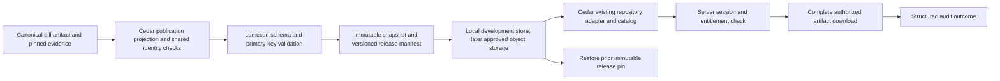

# Havala infrastructure review packet

Updated 2026-09-24 UTC (September 23 local). Review target: repository boundaries, maintainability, release safety,
and the locally proven source-to-download seam. NEED adjudication is not the
reviewer's task. The local bill-table vertical slice passed; no production launch is claimed. Start with
the fixed ranges, source-to-download diagram, sprint closure and ten review questions.

## Review branches and immutable evidence

The original Cedar checkpoint branch was pushed without force at
`cb0e9f11627f790ee756655703a16baecb5253b2` and is preserved. GitHub refused a
new draft because [PR #121](https://github.com/teim-team/cedar-press/pull/121)
had already merged that exact head outside this session. No merge was performed
by this implementation pass. Current continuation branch is
`codex/legislation-release-consumer`, based on upstream
`6d445f460357581981a4b096d5bd53dd0d8d668c`. Excluded dirty data stayed untouched.

The current Cedar review is [draft PR #122](https://github.com/teim-team/cedar-press/pull/122).
Its fixed implementation range starts at `6d445f460357581981a4b096d5bd53dd0d8d668c`.
The implementation head and exact files are listed below; documentation-only updates
follow it. Nothing in this sprint was merged or deployed.

Lumecon review: [draft PR #8](https://github.com/teim-team/Lumecon-data/pull/8),
branch `codex/legislation-storage-safety`, fixed range
`0ae36dda36d650b1b3861173fb122e7603b0dc3f..59026aafe16c50ebc38cb0f4a07b558aa78d5431`.
[Ubuntu CI 35946422118](https://github.com/teim-team/Lumecon-data/actions/runs/35946422118)
passed Python 3.12 and 3.13, including real symlink containment, malformed and
nonexistent paths, immutable overwrite refusal, verified rollback, types, schemas,
dependency audit and package smoke. Python 3.12 reported 434 passed and 90.12%
coverage (floor 88%). Earlier run 35946082199 exposed three CLI tests expecting
empty stderr after structured audit events were added; the tests now validate the
exact audit schema and preserve error-channel checks. The passing head includes
that correction, not a skipped gate.

The two local Windows limitations remain documented: the offline network fixture
intercepts asyncio's local socket setup, and symlink creation raises WinError 1314.
They were not bypassed or weakened. Ubuntu CI is required before storage changes
can merge. No WSL, Docker, Developer Mode or system component was installed.

## Locally passed Legislation vertical slice

The pilot uses the existing canonical 3,069-row bill artifact, existing approved
30-column field map, shared CE checksum/register validation and unchanged bill IDs.
The supported `code/build.py release-pilot legislation` command invokes Lumecon's
existing DatasetContract, ingest_csv, build_release, verify_release and build_catalog.
It does not promote a pointer. Source/register/policy/code hashes are retained in
contract provenance. Cedar's source snapshot is read-only; the small derived
public projection is retained under the isolated local release store.

The existing Cedar repository adapter consumes Lumecon's release-pinned HTTP
manifest and exact `records.jsonl` download contract. It validates catalog integrity,
product schema, publication policy, rights, release identity, primary keys, row count
and complete artifact checksum. It returns the pinned bytes without reserialization.
The authenticated catalog exposes `fullRelease` separately from public samples.
`/press/collections/{collection_id}/full-download?release_id=<digest>` performs
session/tier checks before reading an artifact. The same adapter supports every
declared collection with one approved compatible flagship pin; ancillary tables are
explicitly excluded from this adapter scope. It has no Legislation-specific
paths. Unpinned releases and NEED under its independent hold fail closed.

The real rehearsal runs a Lumecon loopback API with a random development-only
service grant and Cedar's real login/session/entitlement routes. It proves 401,
403, full 3,069-row 200 response, API catalog/version agreement, exact JSONL checksum,
structured audit record, switching to a second valid immutable metadata-version
release and back, byte-identical restored artifact, and unchanged original release
files. No current release pointer, production account, production credential,
canonical source, or published output is modified. Audit means authorized/prepared,
not proof of completed network transfer. Persistent production log collection
and production session/entitlement lifecycle remain launch gates.

Eight historical bill records have no generated source URL; no URLs or IDs were
invented. Names-as-published are null without source excerpts. Votes/actions and
other ancillary tables are excluded explicitly. This validates one local
infrastructure path, not full Legislation coverage or all twelve collections.

Reproduction (PowerShell, existing environments only):

```powershell
$env:PYTHONPATH='C:\Users\esm247\Desktop\Lumecon-data\src'
& 'C:\Users\esm247\Desktop\Lumecon-data\.venv\Scripts\python.exe' -B code/build.py release-pilot legislation --source 'C:\Users\esm247\Desktop\Cedar Press\data\clean\native_bills.csv' --output-root 'C:\Users\esm247\cedar-takeover-checkpoint\legislation-release-store' --as-of 2026-09-23
# Use the exact catalog path printed above:
& 'C:\Users\esm247\Desktop\Lumecon-data\.venv\Scripts\python.exe' -B server/tests/release_download_rehearsal.py --store 'C:\Users\esm247\cedar-takeover-checkpoint\legislation-release-store' --catalog <printed-catalog-path>
py -3 -B -m unittest discover -s server/tests -t server -p test_release_download.py
```

The local rehearsal receipt and audit log stay beside the actual artifacts under
`cedar-takeover-checkpoint/legislation-release-store/`; real data is not uploaded
to CI or committed. CI runs redistributable fictional consumer fixtures, while
Lumecon's Ubuntu suite tests actual filesystem containment and immutable storage.

## Repository and canonical ownership

| Responsibility | Current implementation | Canonical boundary / transition |
|---|---|---|
| Acquisition, raw evidence, staging, reconciliation | Cedar `code/` and ignored data workspace | Lumecon Data after each proven transfer; current Cedar producers remain explicit transitional components |
| Immutable snapshots, typed contracts, release validation | Lumecon `contracts.py`, `pipeline.py`, `storage.py` | Lumecon; reuse existing content-addressed formats |
| Identity namespaces and existing issued registers | Cedar `cedar_ids.py`, delegated CE checksum in `503_identity.py` | One existing identity service; no copied allocator in Lumecon |
| NEED evidence admission | `1133_need_owner_v6_builder_input.py::affiliation_route_is_quarantined` | Canonical known-route exclusion; not a general affirmative-evidence certifier |
| NEED supported command | `code/build.py candidate need` | One command surface; numbered stages remain required components |
| Field publication policy | `cedar_publication.py` and `data/cedar/field_map.json` | One policy contract; do not fork per consumer |
| UI, accounts, entitlements, API and downloads | Cedar `src/`, `server/` | Cedar Press; Lumecon development bearer grants are not subscriber entitlements |
| Product release description | Five tracked files under `data/cedar/` | Existing curated/workspace/history generators; additive fullRelease metadata comes from the approved Lumecon catalog |

Lumecon currently has manual CSV intake, local immutable storage, deterministic
normalization, validation/quarantine, comparisons, explicit promotion, catalogs,
and a read-only API. It has no production acquisition adapters, cloud store,
collection database ingestion, or production object-storage adapter. The read-only API now serves verified exact
JSONL artifacts as well as paged records. Limits are 16 MiB
source and 128 MiB artifact, with in-memory normalization. Cedar PostgreSQL stores
accounts/codes/activity, not collection data. Lumecon's single exact IdentityBinding
does not represent plural optional bill/entity associations; do not coerce them
into a singular cedar_uid or copy another identity implementation.

## Source-to-download path



The complete diagram was exercised locally for the bounded bill table. The current protected endpoint
`GET /press/collections/{id}/download` enforces tier but returns the ten-row
sample through `repository.collection_csv`, with a `-sample.csv` filename.
The additive full-download route now uses the same repository/access boundary;
the existing sample route remains explicitly a sample and is never a full fallback.
Pin immutable release IDs, verify the actual served bytes, and retain Cedar's
citation/schema/field-map contract. No second manifest or release registry.

## Infrastructure gap table

| Area | Evidence / gap | Required local or production completion |
|---|---|---|
| Repository ownership | Producer boundary above; Cedar still performs transformations | Transfer one producer and switch its consumers before retirement |
| Object storage/versioning | Local immutable release and portable key/restore tests pass | S3 backend/versioning remain specified, not deployed; site bucket is not the data store |
| Database/catalog | Existing Cedar metadata and account PostgreSQL; no data catalog database | Use existing catalog adapter; do not add a database solely for demonstration |
| Promotion | Lumecon verify/compare/promote exists | Pin reviewed real release; never follow current pointer per request |
| API | Generic explicit-release adapter and exact-artifact endpoint tested | Real Legislation table verified; other real collections pending |
| Authentication | Signed cookie; PostgreSQL activation available | Signed expiry, revocation/current-tier validation remain missing; restart DB tests now run in disposable Ubuntu CI; production persistence unverified |
| Authorized download | Existing sample route retained; additive full route returns exact pinned JSONL | Anonymous401, wrong-tier403, authorized200 and stale-pin503 pass locally |
| Audit | Structured release-created/reused/selection and download-denial/success/failure events tested | Central retention, monitoring and alerts not deployed; success means prepared, not confirmed transfer |
| Secrets/config | Environment-based config; no AWS CLI/profile available locally | Authorized owner verifies deployment configuration without exposing values |
| CI | Shared Makefile gates; metadata checks and fixtures | Full pinned private-input release job is separate and not run by ordinary CI |
| Rollback | Immutable release model exists | Local valid-pin rollback passed; deployed service rollback untested |
| Backup/DR | Fixture source/release backup restored and hashes verified; missing/corrupt restores refused | Production backup, retention and disaster-recovery rehearsal remain unverified |
| AWS/domain/TLS | HOSTNAMES documents ACM, CloudFront, private S3 site origin, Route53 | Assets are documented, NOT reverified live; do not recreate certificate |
| Monitoring/alerts | No verified operational alert path | Add health/version/release proof and owned delivery-failure alert route before launch |

`docs/HOSTNAMES.md` names the existing cedarpress.ai assets. No AWS account was
queried. Its historical OIDC failure is not a fresh deployment diagnosis.
`deploy.yml` builds once and separates S3/CloudFront from Pages publication.
API deployed hostname/configuration remains unverified. API health lacks a release
or code stamp. Deployment artifact retention is one day; S3 sync deletes removed
assets. Bucket versioning and recoverability are unknown. Server README's blanket
in-memory claim is stale relative to `server/DATABASE.md` and PostgreSQL code.

## Required metadata

All five files were already tracked despite broad `/data/*` ignore rules. Narrow
exceptions and tracking tests now prevent accidental omission; LF attributes
stabilize generated checks on Windows. No duplicate metadata files were created.

| File | Authority / generation | Consumers / freshness |
|---|---|---|
| codebook.json | Curated schema contract; codebook-markdown generates its documentation | Client/server descriptions; check-generated + tracking tests |
| field_map.json | Curated owner publication contract | cedar_publication, docs/guides; field-map and guide --check |
| collections.manifest.json | scripts/import_cedar_manifest.py from workspace descriptors/samples | Client/server catalogs/imports; parity tests; full regeneration requires ignored inputs |
| releases.json | scripts/record-release.mjs preserves release history | Client/API release history; cannot reconstruct history from current data alone |
| samples.published.json | scripts/measure-samples.mjs from Git index and sample bytes | Sample availability/downloads; deterministic freshness check |

Full generator/consumer details remain at `data/cedar/README.md`. Fresh independent
Windows checkout plus explicit reviewed overlay passed seven generated checks,
application build, 58 JS and 43 Python checks earlier. After the owner-policy change,
the five changed metadata/document files were overlaid and both affected freshness
checks passed again. This is clone completeness, not twelve full-data rebuilds.

## Twelve-collection operating model

All source cutoffs remain unmeasured. Counts are measured local baselines, not
coverage certification. Supporting tables retain their own grains. All consume
1137 customer exports / 1135 samples through the manifest importer and Cedar
client/server adapters. A generic full entitled route now exists and the bill-table
release passed a real local rehearsal; this does not certify every component table.

| Collection / flagship | Producer and source | Grain / identity | 2025 / 2026 | Blocker |
|---|---|---|---|---|
| Funding / federal_funding_transactions | 24 + archive/enrichment; USAspending | Assistance transaction key; recipient CE separate | 43,254 / 18,325 action date | Refresh/attribution/additive grain |
| Federal Register / consultation_events | 96 +1089; FR | Document/participant pair; document source key | 8 / 6 notice date | Broad documents separate; discovery/parser coverage |
| Legislation / native_bills | 14 +73/890/1092; Congress/Voteview/curated sources | bill_id; separate actions, rollcalls, member votes; plural CE roles | 207 / 55 introduced | Bill-table local vertical slice passed; ancillary release not proved |
| Deals / deals_classified | 88 +126, overlap153; reviewed source ledgers | Deal_ID, project/event distinction | 105 /103 Event_Year; 99 /102 full dates | Fresh build relies on preserved enrichment; not presumed R7-independent |
| NAGPRA / nagpra_notices | 77 +1077/1084; FR | document_number; separate party/institution tables | 900 /633 publication date | Seven undeclared joined fields, BLOCKED export |
| Native Advocacy and Engagement / native_entity_lobbying_disclosures (one component) | LDA04/05 +65/350/1091 | Filing/attribution, source filing ID | 1,377 /672 filing_year | Broader promised components unvalidated; intake size and nullable attribution contract block next release |
| Prime / prime_contracts | 40 +archive/as-of/corrections; transaction extracts | Transaction key; business/owner roles distinct | 47,599 /55,014 action date | Identity history and nonadditive amounts |
| Subcontracting / subawards | 20 +121/910/911 | Subaward/report key; prime/sub CE separate | 6,306 /2,049 subaward date | Role contract and repeats |
| Native-Owned / native_owned_businesses | 330 +publication/date stages; directories | business_source_id assertion, not unique legal firm | Current register | 523 accuracy holds,19 permission unchecked; R7 blocked |
| Nonprofits / np_orgs | 17 +rulings/linkage; IRS/research | EIN organization; fiscal filings separate | Register/actual filing periods | 6,597 untiered; missing CE not automatic exclusion |
| Natural Resources / resource_revenue | 83 +scope/link; ONRR/state | Source-specific revenue observation | 505 /280 period_start;36 /24 payment_date | Mixed fiscal/calendar grains, suppression |
| NEED / need_enterprises | build candidate need;1072/1102/1177/1130 | Stable enterprise and relationship IDs | Register | Systemic affiliation hold, BLOCKED |

No collection is READY here. Data status NOT TESTED except explicit NEED and
Native-Owned blockers; NAGPRA has a reproduced delivery blocker. Delivery is
NOT TESTED for the other collections; the Legislation flagship delivery seam alone
is locally verified with disclosed limitations. Legislation currently previews bills and
Advocacy disclosures; old mismatch claims are stale. Gaming is Grove only;
Recognition is scrapped. Native-Owned storefront alias `owned` is explicit.
Validation uses existing `build.py plan <collection>` then declared stages;
1137 plan now exercises actual publication joins. Do not run the historical
entire command chains as if they were twelve validated release jobs.

## Consolidation within the touched scope

- Canonical identity owner: cedar_ids delegates CE checksum to 503; 1072 now
  calls that shared service. Shared validators do not certify every legacy caller.
- Canonical known-route admission: 1133 helper. 1130 classifies source evidence;
  1072's broad staged-OWNERV6 hold is a separate defense against legacy bypass,
  not another list of individually approved relationships.
- Canonical NEED entry: build.py candidate need. 1072/1102/1177/1130 are required
  components, not falsely declared wrappers. No duplicate implementation was
  retired without fresh-build/consumer proof; no new numbered production script.
- Transitional 770 FLAGSHIP literal is parsed by import_cedar_manifest.py.
  Switch that importer to cedar_publication's existing contract, then retire the
  compatibility block after parity and fresh-clone checks.
- 1135 independently shapes flagship samples while 1137 shapes customer exports.
  Future cutover derives samples from approved exports; remove duplicate transforms
  only after privacy/schema/count parity and application tests.
- Deals153 versus88 overlap requires caller and unique-evidence reconciliation.
  Existing 521/465/287/502 inventories are diagnostics, not authority; 465 and
  ordinary521 also write. No safe archive candidates newly proved.

Deferred risks: generic 503 stamp can blank existing CEs;1137 shared-name joins
lack semantic-role checking; browser/plural-publication checks remain shape-only;
NEED's historical hub/name allocation must not mint replacement IDs after changes.
These were not expanded into a repository-wide refactor. R7 gates remain blocked;
503 code changes invalidate prior fingerprints by design, not by auto-approval.

## NEED bounds and R7

Pre-hold candidate-c/d preserved 5,820 enterprises,8,690 relationships,6,089
bindings (269 historical-only),367 dual-role rows,zero minted IDs. Outputs were
byte-identical between fixed-context runs. Hub-diagnostic correction changed
1,096 rows in five diagnostic fields; it did not approve affiliations.

Controlled admission comparison: 18,110 source observations; before four-route
guard 5,761 emissions/12,349 refusals; after 1,256/16,854. 4,701 source observations
were quarantined (4,505 net fewer emissions). Later newspaper guard adds 45
formerly surviving admissions to its route exclusion; full proof was not rerun,
so 1,211 is not reported as a reproduced final admission result. The 29-record
survivor diagnostic is purposive, not a statistical precision estimate.
All OWNERV6 formal observations (4,901 across4,714 enterprise IDs) remain held.
No IDs or evidence deleted; no replacement affiliation promoted; active review
and browser decisions preserved.

The browser decision state was recovered from the scoped Edge review storage,
not reconstructed from conversation. It contains 20 events across 19 cards:
one INTERNAL_ONLY decision and 19 REJECT events covering 18 distinct affiliation
cases, including a revision. Notes, drafts and history were preserved. The existing
importer recorded 20 `RECORDED_PENDING_APPLICATION` receipts; a repeat returned
20 `ALREADY_RECORDED` with byte-identical receipt ledger. Canonical relationship
application remains pending; no affirmative replacement information was promoted.

Recovery location: `C:/Users/esm247/cedar-takeover-checkpoint/recovered-browser-decisions/`.
CSV `cedar_need_decisions_recovered.csv` SHA256:
`b0231e8824996eb3aeae6a79ce148627e4445a759798384187ab000cd849fa9c`.
The review generator now supports visible saved/exported counts, completion export,
recovery-state export/import, pending-export warnings and retained revision history.
Five tests and a real Chromium reload/export/recovery exercise passed. The active
`review/cedar_review.html` was deliberately not regenerated while the owner was
reviewing it; new controls take effect upon a deliberate later regeneration.

R7 existing local audit bundle f37240f77e40bf5e390219ae: recorded integrity PASS,
17,282 issued CBs,17,279 active,83 unresolved proposals,G03-G06 blocked.
No redesign/import, no new gate decisions. Generated bundle/pointer/locks excluded.

Safe boundary now: preserve/stage immutable material without serving or adopting
it canonically. Preserve all 17,282 issued CBs, three retired-to-survivor links,
3,350 legacy crosswalks, 19,080 identifier assertions, 8,760 registration pairs,
1,084 Native-business links and 20 business-parent links. Staging is not approval
of these assertions. G03 requires supported dispositions for 83 equivalence cases;
G04 format, G05 name-publication and G06 shipping criteria remain blocked. Merely
excluding the 83 does not authorize a partial canonical import under current gates.
1188 is still an audit, not an importer.

Consumer cutover order: preserve bundle/lineage; satisfy existing gate schemas;
review a transactional importer with typed references and rollback; cut over
business/identifier/relationship consumers; rebuild isolated affected collections;
then publish only approved exports/catalog/API releases. A partial-import contract
change requires explicit review. Downstream routes include NEED1072/1130,
Native-Owned330/615/575, nonprofit17/167 EIN exclusions, Deals126/57 party roles,
prime40A/40B identifier/owner attribution, and subcontracting20 prime/sub roles.
Business registration, Native affiliation and same-legal-object assertions must
remain separate throughout.

## Storage and retention

Read-only Windows discovery: C NTFS 506,332,180,480 bytes total,
15,121,911,808 free; D NTFS 1,000,186,310,656 total,904,739,921,920 free.
C is NVMe SSD; other reported device WDC WD10EALX SATA, media unspecified.
D is reported fixed, not removable; confirm enclosure externally rather than
asserting USB/removability. Sequential archive suitability is plausible, not
benchmarked throughput. No write benchmark or movement was performed.
D root has Archive and _migration_logs; Archive contains tero and other projects.
tero has code/data/graveyard/output/scripts/src. No Cedar/Lumecon-named checkout
was observed at these inspected levels; no unrelated personal-tree scan occurred.

Proposed retention: Git holds code/contracts/small fixtures/product metadata and
release manifests. Lumecon owns canonical processing and version references.
Private versioned object storage holds immutable raw/release artifacts. Database
holds operational accounts/entitlements/catalog indexes, never competing facts.
Internal SSD holds active environments and bounded scratch. D may hold verified
backup/archive copies, never the sole canonical or production store. Every archive
requires relative-path manifest, SHA256,size,source/as-of,rights,producer/release
version,restore instructions and a verified restore sample. Retain issued identity
history and decisions permanently; retain prior releases while citations depend
on them. Do not remove active copies until two independently recoverable copies
and a restore test exist. Cache disposal and retention expiry remain separately
scoped actions; no automatic deletion or migration is authorized here.

## Reproduction and test evidence

Run from Cedar worktree (Windows py -3; Linux python equivalent):

```powershell
py -3 -B -m unittest discover -s server/tests -p test_id_contracts.py
py -3 -B code/1072_migration_test.py
py -3 -B code/1130_need_owner_v6_reconcile_test.py
py -3 -B code/1170_dependency_contract_test.py
py -3 -B code/build_test.py
py -3 -B -m unittest discover -s server/tests -p test_need_review_import.py
py -3 -B -m unittest discover -s server/tests -p test_field_map.py
py -3 -B -m unittest discover -s server/tests -t server -p test_collection.py
node --test src/features/grove/pressDownload.test.js
node --test src/features/grove/handoff.test.js
node scripts/field-map-markdown.mjs --check
node scripts/guides-markdown.mjs --check
git diff --check
```

Focused results: 14 ID,16 migration,51 reconciliation,6 dependency,2 runner,
4 original review-import,21 publication,43 collection and9 legacy download tests passed. These are historical foundation
counts; the newer release-download suite and full CI results follow.
Initial sandbox failures were fixture/subprocess permissions; actual reruns passed.
An initial collection invocation without `-t server` failed import and was corrected.
The full application suite was rerun this sprint. Cedar Ubuntu CI at `9aabf0a`
([run35946723461](https://github.com/teim-team/cedar-press/actions/runs/35946723461))
passed lint, seven generated checks, Node coverage, 180 Playwright smoke tests,
307 Python tests run (276 passed; 31 Postgres-dependent skips), 80% Python coverage and both
dependency audits. Those 31 database tests are NOT RUN, not successful persistence
proof. Local Node:398 passed,0 failed,1 skipped; coverage84.43%lines/83.42%branches/
90.24%functions. A two-line LCOV path-normalization correction makes Windows paths
comparable to Git paths without lowering coverage floors. Local app build passed.

A subsequent negative test reproduced a truncated-upstream HTTP exception bypassing
the failure audit. The bounded correction maps HTTPException to a controlled503
and asserts one redacted unavailable event; focused release tests now total16.
The final-head Ubuntu run is recorded in the closing evidence below.

Linux verification now uses the existing GitHub Actions workflow, not a local
system installation. Both declared Python versions passed. New consumer checks
cover anonymous/wrong-tier denial before fetching, rights/schema/corruption
refusal, NEED hold, explicit full-file metadata, audit and pin rollback.

Current production responsibilities: `code/build.py` adds one command to
the existing runner; `server/cedar_press/repository.py` owns the release adapter;
`server/cedar_press/app.py` owns HTTP authorization and audit outcome. New files are focused tests, a fictional cross-repository contract fixture and
the local real-data `server/tests/release_download_rehearsal.py`. No numbered production script or
new manifest format exists. Two previously changed test files receive formatting
corrections required by the full lint gate; no assertions were weakened.

## Review order and questions

1. Is the producer/product boundary correct, with one identity authority during transfer?
2. Do the Ubuntu containment tests and immutable-store implementation cover the required safety boundary?
3. Is the bounded bill-register scope honest about missing URLs and ancillary tables?
4. Does the implemented pinned download seam preserve entitlements and fail closed?
5. Are publication holds independent of field removal and legacy staging bypass?
6. Are namespace/grain validation and known legacy gaps clearly bounded?
7. Are metadata tracking and freshness gates sufficient across Windows/Linux clones?
8. Are consumer-cutover and retirement conditions concrete enough to prevent permanent duplicates?
9. Which deployment/session/backup gaps must be closed before attendee access?
10. Are excluded generated/private artifacts and the fixed review boundary unambiguous?

## Preserved foundation and exclusions

The identity/NEED/metadata foundation is already in PR121 at
`cb0e9f11627f790ee756655703a16baecb5253b2`. Its historical commits are
`77fa7c086431f838d50ff7fd7648e67bdfd56465` (identity),
`746d3e267f2f45618a47b01d77690fe299a268ba` (NEED admission),
`d7b25d1670e7223da3581c06db268095f59ff0e9` (publication/review consumers),
and `d88709d451345f4c049b9f61292fe41aed646797` (metadata).
They are background for the current fixed infrastructure range below, not a request
to reopen NEED adjudication or re-review every historical script.

Remaining uncommitted Cedar paths are deliberately excluded:

```text
data/spine/cedar_entity_types.csv
docs/NEED_CORROBORATION.json
docs/imports/r7_audit/CURRENT.json
docs/imports/r7_audit/.lock
docs/imports/r7_audit/.lock.owner.json
docs/imports/r7_audit/bundles/f37240f77e40bf5e390219ae/
review/OWNER_DECISION_QUEUE.md
```

Ignored candidates, copied inputs, review HTML/evidence, caches and machine receipts
remain outside the commit range. Original 14 preserved source/test files rehash
identically; tracked dist/customer, dist/review/samples and public assets unchanged.
No remote or deployed outputs were changed. Weekly usage is unavailable to this
session; no remaining quota is invented. 16 GiB RAM and roughly14 GiB free internal
disk constrain builds to one at a time. Read-only agent lanes do not imply parallel builds.

## Native Advocacy and Engagement component evidence

Read-only measurement of the original Windows `data/clean` files on 2026-09-24.
This is the broader **Native Federal Advocacy and Engagement** collection, whose
existing internal collection ID remains `lobbying`. A 27,825-row lobbying release
projection does not certify the entire product. The repository descriptor promises
registered lobbying, agency meetings, tribal consultations, regulatory comments,
congressional testimony and nonprofit lobbying disclosures. The manifest has 39
table entries but `cedar.n_tables` says 35; its September 4 `READY` label and
264,478-row aggregate are not current release acceptance evidence.

The attempt to inspect `https://cedarpress.ai` returned inaccessible through the
web tool. Live wording and correspondence with this repository are **NOT VERIFIED**.

In the table, CE means a nonblank `cedar_uid`, not independently validated identity.
Dates are observed maxima, not certified source cutoffs or acquisition completeness.
Every component below is **NOT TESTED for release readiness** in this bounded
assessment. Generator numbers identify existing implementation routes, not a newly
certified execution graph. Every filename below has the `.csv` extension.

| Table | Rows; grain | Date basis: 2025 / 2026; observed through | Identity/evidence coverage | Source; existing generator |
| --- | --- | --- | --- | --- |
| admin_appeal_decisions | 15,613; decision | decision_date:70 /40;2026-07-28 | native_entity_ids566;PDF/source URL all | IBIA/IBLA;144 |
| admin_appeal_parties | 20,027; decision-party | decision_date:104 /68;2026-07-28 | CE566;PDF/source URL all | IBIA/IBLA;144 |
| admin_appeal_positions | 8; decision-party position | decision_date:0 /0;2009-02-10 | CE8;PDF/source URL8 | IBIA/IBLA;144 |
| advocacy_passthrough | 1,620; grant/recipient advocacy connection | grant_year:30 /0;2025 | funder493,recipient459,CE459;funding URL1,585,lobbying URL220,quote1,572 | Grant/IRS/LDA inputs;111,112 |
| advocacy_passthrough_2026-08-07 | 1,620; dated passthrough snapshot | grant_year:30 /0;2025 | funder493,recipient459,CE459;funding URL1,585,lobbying URL312 | Same source family; historical snapshot producer not independently established |
| agency_attention_vs_advocacy | 22; department aggregate | No event/year field | No entity ID/direct URL;derived lineage required | FR/LDA;78 |
| agency_attention_vs_advocacy_year | 698; department-year | year:22 /22;2026 | No entity ID/direct URL;derived lineage required | FR/LDA;78 |
| earmarks | 1,002; fiscal appropriation/request record | fiscal_year:203 /183;FY2027 maximum | CE1,002;URL/quote all | Congressional earmarks;99 |
| ferc_docket_filings | 102,615; docket filing | filed_date:3,476 /2,064;2026-08-26 | CE1,109;URL all;instrument quote22,818;position quote760 | FERC;133 |
| ferc_docket_parties | 11,563; docket-party | No event date;built2026-08-26 | CE217;URL all | FERC;133 |
| ferc_ex_parte_communications | 713; communication | filed_date:22 /14;2026-08-11 | CE2;quote/URL all;FR URL674 | FERC/FR;133 |
| ferc_ex_parte_parties | 4,246; communication-party | notice_date:57 /39;2026-07-28 | CE9;table-row quote/URL all | FERC/FR;133 |
| ferc_source_coverage | 9; source sweep/probe | checked_date2026-08-26;annual counts N/A | source/URL9 | FERC;133 |
| ferc_tribal_dockets | 307; discovered docket | Query window1990-2026;no observation-year count | applicant entity8;discovery quote307;URL307;seed URL306 | FERC;133 |
| fr_ex_parte_notices | 7,828; notice | publication_date:164 /147;2026-08-31 | No CE field;source/raw-text URL all | Federal Register;154 |
| fr_ex_parte_parties | 116; notice-party | publication_date:0 /8;2026-08-28 | CE0;verbatim quote/URL116 | Federal Register;154 |
| fr_ex_parte_party_entity_links | 9; party-entity link | publication_date:0 /0;2024-10-28 | CE9;source_dataset/source_row_id lineage;no direct URL | Federal Register;154 |
| hearing_appearances | 2,674; hearing-appearance | hearing_date:178 /115;2026-07-21 | CE1,782;source URL/quote all;testimony URL1,019 | Congressional hearings;98,400 |
| hearing_bill_links | 464; hearing-bill link | hearing_date:45 /30;2026-08-05 | No CE;source URL464 | Hearings/bills;98 |
| lobbying_client_attribution | 458; client attribution decision | ruled_date2026-08-06;annual event counts N/A | CE/tribe_id148;no direct URL columns | LDA client rulings;58 |
| lobbying_disclosure_verbosity_year | 27; filing-year aggregate | filing_year:1 /1;2026 | No entity ID/direct URL | LDA;78 |
| lobbying_issue_families_filing | 27,796; filing classification | filing_year:1,377 /643;2026 | filing_uuid all;CE26,484;filing lineage,not direct URL | LDA;78,353 |
| lobbying_issue_family_year | 476; issue family-year | filing_year:17 /17;2026 | No entity ID/direct URL | LDA;78 |
| lobbying_registrant_client_relationships | 1,309; registrant-client pair | first_filing_year49 /20;last_filing_year42 /316;2026 | CE1,287;first/last filing URL all | LDA;180 |
| lobbying_registrant_concentration | 36; scope-level aggregate | No event date;built2026-08-26 | No entity ID/direct URL | LDA;180 |
| lobbying_registrant_identifiers | 525; registrant-identifier assertion | No current annual observation;built2026-08-26 | Registrant ID+typed identifier;990 URL5;source assertion fields | IRS/contracting/reference crosswalks;181 |
| lobbying_registrant_native_ownership_evidence | 27; registrant relationship assertion | No source-date annual measurement;built2026-09-01 | CE27;evidence URL13;evidence_source27 | Source-attributed assertions;182 |
| lobbying_registrants | 653; registrant directory | record_updated19 /342;2026-08-05 | native_ownership_entity_id12;ownership URL10;quote13;source653 | LDA;180 |
| lobbying_target_entities | 116; government target aggregate | No date field | Government target name;no direct URL | LDA;78 |
| lobbying_unmatched_clients | 515; unresolved client | first_year20 /19;last_year14 /132;2026 | competing_entity_ids200;not accepted links;no direct URL | LDA matcher;code/lobbying_pull/05_match_filings_v2.py |
| native_entity_lobbying_disclosures | 27,825; filing | filing_year1,377 /672;2026 | filing_uuid/URL all;CE26,513;withdrawn attribution471 | LDA matcher;58,350-353 corrections |
| nonprofit_schedule_c_coverage | 10; IRS index-year coverage | index_year1 /1;2026;built2026-09-02 | source index URL10 | IRS;99 |
| nonprofit_schedule_c_lobbying | 29,149; tax filing/Schedule C | tax_year2,301 /11;tax_period202604 | CE3,627;source/object URL all | IRS;99 |
| nrc_meeting_participants | 407; meeting-participant | meeting_date5 /2;2026-06-22 | CE10;source URL407;classification quote22 | NRC;145 |
| nrc_public_meetings | 251; meeting | meeting_date17 /15;2026-08-13 | No CE;source URL251;ADAMS URL157;classification quote11 | NRC;145 |
| oira_federal_action_links | 145; meeting-federal action | meeting_date5 /3;2026-04-07 | Meeting ID/RIN/FR document number;no direct URL | OIRA/FR;98 |
| oira_meeting_participants | 1,128; meeting-participant | meeting_date70 /38;2026-05-05 | CE90;source URL/quote all | OIRA;98 |
| oira_meetings | 72; meeting | meeting_date5 /3;2026-05-05 | CE19;source URL/quote all;materials URL39 | OIRA;98 |
| tribe_year_lobbying_panel | 5,001; entity-year aggregate | filing_year201 /201;2026 | CE5,001;derived filing lineage,no direct URL | LDA;351 |

### Promised channels outside the Advocacy manifest table list

These existing canonical files must be mapped explicitly into the broader product's
release contract or disclosed as excluded. They are not missing merely because the
Advocacy manifest omits them, and cannot be counted as delivered without a consumer
path. Their release readiness is also NOT TESTED.

| File | Rows; grain | 2025 /2026 and observed cutoff | Identity/evidence and generator |
| --- | --- | --- | --- |
| regulations_gov_comments.csv | 4,659; regulatory comment record | posted_date477 /415;2026-09-01 | CE4,659;comment_id,attribution_basis,highlighted_excerpt;221_probe_regulations_gov_comments.py |
| consultation_events.csv | 11,402; consultation event/participant record | notice_date8 /6;2026-05-20 | CE10,396;participant name/role,event date basis/source quote;96,1089,1158 |
| section_106_consultation_events.csv | 1,367; Section106 consultation record | notice_date44 /47;2026-09-01 | CE237;document_number,event_class,record_type,participant_role,match_method;130 |
| dear_tribal_leader_letters.csv | 807; letter/document | letter_date47 /27;2026-08-25 | CE0;letter_id,addressed_to_basis,document_url,source_index_url;962_probe_dear_tribal_leader_letters.py |
| fr_consultation_notices.csv | 485; FR consultation notice | publication_date7 /7;2026-08-18 | No CE;document_number,consultation_signal,html_url;existing FR discovery/classification path, exact authoritative generator not reverified here |

### Source-attributed relationship copy corrections for review

These are identified corrections, not frontend edits. Change the authoritative
source descriptor and regenerate metadata through its generator when implementing.

- Prime descriptor: replace "matched to the Native entity that ultimately owns
  the awardee" with "linked to a Native entity where dated evidence supports
  affiliation; source-described ownership and verification limits are preserved."
- NEED method: replace "a STRUCTURE is ownership" with "a structure records a
  source-described organizational relationship; the customer-facing link is
  affiliation unless the approved contract supports a stronger verified claim."
- NEED sources: replace "What each owner publishes about itself" with "Official
  enterprise directories, organizational reports and other cited source assertions."
- Deals method: replace "ownership change is visible in federal contracting" with
  "a change in reported contracting parentage is observed"; require separate
  evidence before calling that a transaction or legal ownership change.
- Native-Owned method already distinguishes affiliation from ownership. Preserve
  it. Treat "Sources whose terms forbid reuse are excluded by every route" as a
  claim requiring checks on the exact release and all served surfaces.
- Registrant ownership-evidence rows must retain precise source assertions and
  observation dates without implying Cedar independently verified present control.

### Interpretation and release limits

All 39 files exist locally; existence does not establish inclusion in a pinned
release. Date counts for directories/relationships use the named first/last fields
and are not annual activity counts. Built/fetched dates do not substitute for source
cutoffs. Derived summaries require release-pinned lineage; absence of a direct URL
is not automatically missing evidence. Nonblank IDs and URLs do not establish
correct attribution or the asserted role. Docket inclusion does not prove Native
participation; a meeting is not its participants; an appeal party is not necessarily
an advocate; consultation is not lobbying. Preserve each channel and role.

The dated passthrough snapshot differs from the current table in supporting URL
coverage; it is not another independent population. FY2027 earmark records must not
be described as completed 2027 activity. Schedule C tax years differ from index and
acquisition years and may legitimately lag. Do not add filings, parties, derived
summaries and duplicate snapshots into one activity total. No source completeness,
rights, schema compatibility, sample representativeness or entitled delivery was
certified by this inventory. Missing publication/consumer contracts remain product
blockers even if the LDA projection independently passes its infrastructure tests.

## Sprint closure: reusable contract and measured release

The bounded infrastructure scope is implemented and tested locally; production
provisioning and full-collection coverage are not complete. This sprint began
2026-09-24 01:53 UTC. Code and tests were pushed only to draft review branches.

**Existing contract, not a new format.** Lumecon DatasetContract schema1 defines
fields/grain/primary key/source provenance; its existing snapshot and release
manifests retain hashes and validation results. Its existing catalog pins a
collection and release. Cedar validates that catalog against its existing field
map and independent publication gate, requests an explicit release ID, and serves
exact verified `records.jsonl` bytes from the existing immutable release directory.
An approved catalog pin selects rollback; neither caller nor rollback rewrites the
prior artifact. The API adapter is collection-agnostic. The transitional canonical
bill-to-publication projection remains in Cedar's existing build.py until a proven
producer transfer and consumer retirement; no whole-repository migration is claimed.

| Legislation fact | Before / after proof |
|---|---|
| Canonical source | 3,069 rows and 3,069 unique issued bill IDs preserved |
| Projection | 39 source columns to 30 existing approved fields; excluded columns follow the field map |
| Date coverage | 207 introduced2025 and55 introduced2026; no refresh/completeness claim |
| Snapshot | `d38902f72f7bdc42f096bbee87c1fa8051021027c1c2ca2960c91946a50f7552` |
| Selected release | `490eba602ae5401165a738f7aad2d0af74cdc06f6eeb4db2564f362790112936` |
| Catalog | `926ad5e964a72a44f85be1397dcc252f91071c45db9ca02c5690913468328163` |
| Exact artifact SHA256 | `fa1df255ebd304b622386b59004c843fe6375de4f94dd39c6532eebfbf78ef5b` |
| Rollback exercise | Select valid `ea36f4554c75cbf669b48bd458a26fa25ef5408d042cd1f4f27fda0714ec57d3`, then restore selected release; original release files unchanged |
| Access/audit | Anonymous401, wrong-tier403, authorized200; explicit stale pin503; redacted timestamped audit events |
| Remaining scope | Eight historic source URLs missing; actions, votes and ancillary tables not included in this bill-table proof |

The local receipt is `C:/Users/esm247/cedar-takeover-checkpoint/legislation-release-store/rehearsal-result.json`.
The store and all real artifacts remain ignored and are not in either PR. Projection
intake now uses `intake/legislation/<content-sha>.csv`, so a second source snapshot
does not overwrite the first. Duplicate immutable releases are verified, not replaced.

### Next three candidates and actual second-collection attempt

1. Native Advocacy and Engagement's **disclosure component only**:27,825rows,
   38approved fields, unique filing keys, all source URLs;26,513populated CE values
   validated against the pinned register,1,312unresolved links preserved. The real
   projection is20,053,457bytes, SHA256
   `5044ee3d2f50985e7b0537ed8937ea9232a8c47da29f42261c040932bf469d3f`.
   Its attempted next intake is blocked by the existing16,777,216-byte source cap
   and nonnullable scalar IdentityBinding. No rows were dropped, limits bypassed,
   fabricated links introduced or alternate manifest invented. A bounded supported
   intake/nullable-attribution extension is required, plus the broader component
   reconciliation above. A fictional second-collection consumer test already proves
   the adapter has no Legislation-only path assumptions; it is not a real release.
2. Natural Resources:11,305unique declared revenue keys;705populated CE links
   validated. Existing publication validation refuses `beneficiary_note` on all
   11,305rows without a declared preserved destination. Keep suppression and mixed
   periods intact; do not strip context to pass. Source cutoffs remain unmeasured.
3. NAGPRA:6,792notices,52standalone approved fields,900/633publication-year rows.
   Seven undeclared joined columns still block full export.619legacy source IDs
   require a precise source-format validator correction, preserving issued IDs.
   It was not selected as the pilot and the gate was not weakened.

### Infrastructure state by evidence level

- **Implemented and tested:** explicit development/staging/production configuration
  validation; existing versioned filesystem layout; schema/identity/publication
  checks; exact artifacts and immutable writes; explicit pins; entitlement denial
  and success fixtures; redacted release/download audit; rollback; fixture backup
  and restore; real Legislation rehearsal; fresh GitHub checkouts and contract parity.
- **Specified but not deployed:** environment-separated private S3 layout and
  conditional immutable creation; Postgres catalog index projected from the same
  manifest; retention and production backup/restore procedure. Existing shipping
  runbook contains operating commands and boundaries, not a new status system.
- **Blocked by credentials/authorization:** live AWS certificate/domain/storage/API
  verification, production provisioning, secrets, deployment and production restore.
  No AWS CLI/profile or AWS environment-variable names were present; nothing was
  provisioned. The reported existing certificate was not recreated.
- **Deferred for reviewed implementation:** persistent session expiry/revocation and
  current-tier enforcement, production monitoring/alerts,
  streaming intake/artifacts above bounded limits, remaining collection components,
  full producer transfer and retirement. NEED/R7 holds remain independent of CI.

Cedar validates `CEDAR_PRESS_ENVIRONMENT` as development/staging/production.
Nondevelopment release access requires HTTPS without loopback, explicit persistent
session secret and service token, Postgres DATABASE_URL, secure cookies, and no
fallback CEDAR_PRESS_ACCOUNTS. This is configuration validation, not proof of a
running database or complete secure production session lifecycle.

### Exact current implementation paths

**Cedar Press fixed implementation range:** `6d445f460357581981a4b096d5bd53dd0d8d668c..8163c2a8ae4980c1b8302659001f7ba48cfd19be`.

`c1fbb72478833bb4aee312048d169a2bc5b20d0d` ? Preserve review drafts and decision history through explicit recovery exports.

```text
code/08_build_review_page.py
server/tests/test_need_review_import.py
```

`c1f35ce72ee9f8fc5910c355f4b969251bf643f4` ? Consume explicit governed release pins through entitled exact-artifact downloads.

```text
code/build.py
server/README.md
server/cedar_press/app.py
server/cedar_press/repository.py
server/tests/fixtures/lumecon_release_contract.json
server/tests/release_download_rehearsal.py
server/tests/test_lumecon_contract.py
server/tests/test_release_download.py
```

`ed4cdde3b8763902c0bd456d8df410e3548d9c03` ? Keep inherited documentation and Python checks reproducible.

```text
docs/ARCHITECTURE.md
server/tests/test_field_map.py
```

`ef4d1ec21a7fda98d3018f2d579cff6e3860d08b` ? Compare native coverage paths with canonical Git paths.

```text
scripts/coverage-gate.mjs
```

`9aabf0a6ed37ddb1c9c01849783f39ab55ca3960` ? Bound environment configuration and version projection intake paths.

```text
code/build.py
server/README.md
server/cedar_press/repository.py
server/tests/test_release_download.py
```

`3546e71fdc2e016c227a0a84f34dab0e996395e0` ? Audit truncated upstream release responses as controlled failures.

```text
server/cedar_press/repository.py
server/tests/test_release_download.py
```

`fd926efbd26993b62b562edc8b643c7b706e8b0c` ? Exercise subscriber persistence contracts on disposable Postgres CI.

```text
.github/workflows/subscriber-storage.yml
```

`b45ef4c5fbdb96304897a5ef82adeb2e170ca72d` ? Supply the optional platform identity fixture in isolated database CI.

```text
.github/workflows/subscriber-storage.yml
```

`8163c2a8ae4980c1b8302659001f7ba48cfd19be` - Verify real database subscriber login, cookie and exact pinned download through the existing adapter; no session dependency override.

```text
server/tests/test_release_download.py
```

**Lumecon Data fixed implementation range:** `0ae36dda36d650b1b3861173fb122e7603b0dc3f..59026aafe16c50ebc38cb0f4a07b558aa78d5431`.

`4752fda72aadb474d401db303fde68def432bbac` ? WIP: preserve immutable storage safety across Windows and Linux.

```text
src/lumecon_data/storage.py
tests/test_storage.py
```

`9b9cddca25a2c5024663d9e3c45c034185a53cd6` ? Serve exact verified release artifacts through the governed API.

```text
src/lumecon_data/api.py
tests/test_api.py
```

`c203faa1d664b7dfdcc0ee77f68b9d0ffaca3a1b` ? Audit immutable release creation and version selection.

```text
src/lumecon_data/pipeline.py
tests/test_pipeline.py
```

`574416e802a11d92178582e04a3b362ecb3ce79f` ? Verify portable versioned keys and hash-checked backup restoration.

```text
tests/test_pipeline.py
```

`59026aafe16c50ebc38cb0f4a07b558aa78d5431` ? Validate structured audit output without weakening CLI error checks.

```text
tests/test_cli.py
```

Documentation changes accompanying this packet are limited to this packet, the
existing shipping runbook, the previously scoped architecture-decision note and
the required architecture census correction. The prior
uncommitted TERMINAL_HANDOFF edit remains outside this sprint's authoritative packet;
it must not be mistaken for the current test/branch authority. Exact exclusions
above remain uncommitted, including R7 generated state and the review queue.

### Reproducible gates

Cedar Ubuntu: `make check`, then the existing Playwright smoke command
`npm run test:smoke` in its configured development fixture. The current workflow
runs these same constituent gates from a clean checkout. Lumecon Ubuntu: use its
existing workflow/Makefile and declared development dependencies; focused tests:

```text
python -m pytest tests/test_storage.py tests/test_pipeline.py tests/test_api.py tests/test_cli.py
python -m unittest discover -s server/tests -t server -p test_release_download.py
python -m unittest discover -s server/tests -t server -p test_lumecon_contract.py
python -m unittest discover -s server/tests -t server -p test_need_review_import.py
```

The first command runs in Lumecon; the remaining commands run in Cedar with its
server development dependencies. Use the real-data reproduction commands earlier
only in the data-capable workspace. Set the catalog argument to the recorded
`catalogs/926ad5e964a72a44f85be1397dcc252f91071c45db9ca02c5690913468328163.json`.
Neither CI nor fictional fixtures certify private-source completeness.

Preservation recheck: all 19 NEED input hashes, 2 publication input hashes and 12 NAGPRA
input hashes match their original checkpoint manifests, with zero missing files.
All 14 preserved original implementation/test files also match. No publication,
canonical-data promotion, frontend edit, AWS mutation, merge or external-drive
movement occurred. Project dependencies were installed only into existing project
environments; no system component was installed.

### Final implementation CI and documentation validation

Cedar implementation head `3546e71fdc2e016c227a0a84f34dab0e996395e0` passed
[Ubuntu CI35947302778](https://github.com/teim-team/cedar-press/actions/runs/35947302778),
including the truncated-response regression. This supersedes the earlier passing
9aabf0a implementation run. Lumecon remains at the passing59026aa range above.
Editing this packet removed one historical path reference, and the local full
suite correctly detected the resulting documentation census change. The existing
architecture table/prose was updated from 361 to 360; no test was weakened.


The additional subscriber-storage workflow uses a disposable Postgres 16 service
with development-only fixture credentials and no production secrets or deployment
permissions. It executes existing subscriber, priorities and release-download tests
and fails if any are skipped. The first run correctly exposed a missing test-owned
optional platform users table; the fixture now supplies that seam, while the
existing standalone test creates a separate database without it. No application
migration or production schema was changed. The corrected 70-test run passed with zero skips:
[subscriber CI35947907029](https://github.com/teim-team/cedar-press/actions/runs/35947907029).
A subsequent test connects a real Postgres subscriber through actual login/cookie
handling to the pinned adapter; its final 71-test run is linked below.

The current Cedar frontend continues to use its established sample behavior.
This branch adds full-release API/catalog metadata and verifies authorized API
bytes; Claude-owned frontend wiring to that full-release control is not claimed
complete. Browser smoke proves existing UI compatibility, not a new full-download
button or real Safari/mobile coverage.


The final database test addition passed: [Ubuntu subscriber run35948052316](https://github.com/teim-team/cedar-press/actions/runs/35948052316),
**71 tests, zero skips**, including real database subscriber login/cookie to exact
pinned bytes, restart persistence and standalone/platform-seam cases. This closes
the missing database-fixture evidence for these existing contracts; it does not
implement signed session expiry, revocation, current-tier refresh or production
backup. The default local/full CI suite still reports those database tests as
skipped when its database variable is absent; the separate job is their evidence.

The latest local full suite before the extra database-only test ran308 tests:
277passed,31skipped,80%coverage. Its earlier seven documentation-census failures
were corrected and the complete rerun passed. The extra focused suite ran17:
16passed,1database skip locally; that test then passed on Ubuntu Postgres.

2026-09-24 02:39 UTC - READY WITH WARNINGS: reusable local release/download foundation and Ubuntu safety/database tests pass; production and full-collection readiness remain gated.
