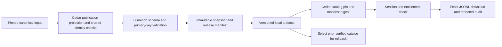

# Havala infrastructure review packet

## Read this first

Two real flagships, Legislation and Natural Resources, pass authorized download
and rollback through the same release-pinned adapter. The shared build preserves
rows, IDs and nullable existing references. Review the infrastructure, ownership
and maintainability; twelve-collection readiness, production deployment and full
frontend delivery remain incomplete. NEED adjudication is supporting evidence.

| What to review | Current measured position |
|---|---|
| Review branches | Cedar [draft PR #122](https://github.com/teim-team/cedar-press/pull/122), `codex/legislation-release-consumer`; Lumecon [draft PR #8](https://github.com/teim-team/Lumecon-data/pull/8), `codex/legislation-storage-safety` |
| Real release proof | Legislation: 3,069 bill IDs/30 fields. Natural Resources: 11,305 source-observation record IDs/38 fields, 705 existing CE references/17 distinct IDs, qualifications preserved. Both: exact JSONL, real login, 401/403/200, redacted audit and immutable rollback |
| CI foundation | Cedar `c0263d8`: application and disposable-Postgres workflows pass, including 77 database-backed checks with no skips and stale-account denial. Lumecon `505a42d`: 464 Ubuntu tests on Python3.12/3.13, 90.8% coverage, real symlink checks; exact receipts below |
| Current batch | Cedar baseline `1c2d1d9`; two frozen-runtime proofs pass with catalog-bound manifest digests, 16 registration/provenance checks and exact source-byte projection. Runtime changes are committed and pushed; no real candidate data is in Git |
| Product boundary | Full API download is exact JSONL; UI/download samples remain CSV. Full-download frontend control and a CSV representation of the pinned release are not implemented; real mobile behavior is untested |
| Holds | NEED publication and R7 G03-G06 stay blocked. Owner decisions are preserved receipts; canonical inputs, issued IDs and published outputs unchanged |

### One authority for each responsibility

| Responsibility | Canonical implementation now | What still must move or close |
|---|---|---|
| Acquisition and collection transforms | Existing Cedar collection stages under `code/`; supported command surface `code/build.py` | Transitional producer ownership transfers to Lumecon only with pinned rebuild, consumer cutover and actual retirement |
| Identity | `code/cedar_ids.py`, CE checksum delegated to `503_identity.py`; existing issued registers | No copied allocator or new cross-repository identity registry; namespace gaps remain explicitly held |
| Publication/evidence decisions | `code/cedar_publication.py`, `data/cedar/field_map.json`; NEED route guard in `1133_need_owner_v6_builder_input.py` | A route surviving exclusion does not earn evidence approval; 1072 and publication hold remain separate safeguards |
| Governed releases/storage | Lumecon `contracts.py`, `pipeline.py`, `storage.py`, `catalog.py` and read-only `api.py`; `catalog.manifest_metadata` is the single public manifest projection | Local immutable storage works; production object-store adapter, retention and monitoring are not deployed |
| Product metadata | Five tracked `data/cedar/` contracts, using their existing curated/import/history generators | Additive `fullRelease` metadata comes from a reviewed Lumecon catalog; it does not replace these contracts |
| Entitlements/downloads | Cedar `server/cedar_press/repository.py` and `app.py`; existing account/activation database | Server grants are separate from subscriber entitlements. Full downloads recheck the current subscriber tier; signed expiry and session revocation remain launch work |
| Frontend | Existing Cedar product UI, owned by the concurrent frontend workstream | Connect the approved full-release affordance without relabeling a sample as full data |



### Operating surface and what remains complicated

| Task | Supported entry point / boundary |
|---|---|
| Inspect/check execution ownership | `python code/build.py plan <collection>` and `python code/521_inventory.py check-scripts`; plans do not certify rebuilds, and discovered writers do not authorize themselves |
| Build a registered release pilot | `python code/build.py release-pilot <legislation or natural-resources> --source <canonical-flagship.csv> --output-root <isolated-store> --as-of <date>`; configuration in `cedar_pipeline.RELEASE_PILOTS`, existing table keys/grain/field map |
| Prove a pinned release through Cedar | `python server/tests/release_download_rehearsal.py --store <store> --catalog <catalog.json>`; local credentials only |
| Verify storage / explicitly select a version | Existing Lumecon `verify`, `compare`, `catalog`, `promote` commands; publication is a separate authorization |
| Add the next collection | [One-page procedure](../data/cedar/README.md#add-a-collection-to-the-governed-release-path); same catalog, field map, release format and adapter |

The existing inventory/contract/reference scan measures **684 Python files under
`code/`**, with mutually exclusive observed roles: **78 active producers,
7 validators/migration/review components, 7 product-consumer/shared components,
5 identified test/fixture components, and 587 unresolved operational roles**.
These static roles are not runtime certification. Mixed tools with self-tests
remain operational components. Inventory coverage increased from 577 to 684 files,
preserving old data-table measurements. Its separate authorization axis has
116 declared dependencies/568 `unresolved_not_authorized` files; it does not measure
the same thing as 587 unresolved roles. No historical/safely removable file was proved.
Tests, comments and generated reports remain recorded references but cannot alone
promote a file into an active runtime classification. Among the 78 producers,
36 still have unresolved I/O literals; these are declared routes, not fully traced builds.

One copied normalizer was removed: 1130 now delegates to 1072 while preserving its
public `norm` API. All 1,916 register-name outputs match. Existing numbered NEED
stages remain required components; **one duplicate-logic cutover, zero whole-file
retirements** is the measured result, not a repository cleanup claim. The public
manifest projection also moved from the API to its catalog owner; API and catalog
now call that one implementation, with the old API definition removed.

Only approved flagships are served; ancillary tables are excluded. Natural
Resources preserves source qualifications verbatim in `research_note`, refusing
conflicts. Suppression, uncertain links and mixed measures remain visible. Two
delivery proofs do not certify source completeness or twelve launch-ready products.

### Gaming and data intake: architecture for review

Updated 2026-09-25. This is the one Gaming and intake section in this packet.
Cedar's server-side checks are in
[GAMING_GROVE_INFRASTRUCTURE_NOTES.md](GAMING_GROVE_INFRASTRUCTURE_NOTES.md).

**Pull requests.** Intake contract `<INTAKE_PR_URL>`. Lumecon Gaming
`<LUMECON_PR_URL>`. Cedar consumer `<CEDAR_PR_URL>`. All three branches are
pushed: Lumecon-data `claude/data-intake-contract` and
`claude/gaming-grove-release`, and cedar-press `claude/gaming-grove-consumer`.
The pre-split Cedar branch `claude/gaming-intelligence` (`75a2f1b`) is
unmodified and not for merge.

**Repository ownership.** Owner directive, 2026-09-24: Lumecon-data is the home
of Lumecon datasets. Cedar Press/Cedar Grove consumes governed releases from it.
No canonical Gaming data, binding register or producer exists in both
repositories, and a Cedar test fails if one reappears.

| Concern | Lumecon-data | cedar-press |
|---|---|---|
| Producers, candidate build, leak gate, data contract (`docs/gaming-contract.md`, `schemas/gaming/`), VP decisions | **Owns** (`src/lumecon_data/gaming/`, `decisions/gaming/`) | Nothing |
| Release and catalog | **Owns**: one `gaming` collection release, one `cedar_grove` catalog entry, `gaming fixture-release` for CI | Nothing is built here |
| Gaming ID blocks and issuance | Proposes ordinals inside Cedar's blocks; reads Cedar's registry snapshot by hash | **Sole issuer**: `cedar_ids.GAMING_BLOCKS`, `code/build.py gaming-issue-ids` |
| Entity, place, NEED and retired-handle registers | Pinned identity snapshot by hash | **Owns** |
| Which release is served | Nothing | **Owns** `data/cedar/grove_release_pin.json` |
| Entitlement, download, audit, presentation | Read-only API with dataset grants | **Owns**: grove/tree entitlement, redacted audit, `gaming/*` field-map entry, checked against the pinned contract |

**Intake contract.** Lumecon-data owns the one governed intake framework. The
authoritative contract is
[`docs/data-intake.md`](https://github.com/teim-team/Lumecon-data/blob/claude/data-intake-contract/docs/data-intake.md)
on `claude/data-intake-contract`. This packet links it and does not restate it.
Cedar adds no intake logic or source registry. Open intake risks for review:

- Cedar's FR pullers `code/10` and `code/342` break the contract: 0.6 s pacing,
  2 workers, up to 6 retries on 429, and a contact email in the User-Agent.
- Only 18 of 93 Press sources have raw hashes. Rights are unresolved for
  USAspending terms, BGOV/HigherGov, ProPublica and Voteview.
- Native-Owned: 3,725 of 4,273 rows are marked publishable while consent is
  unresolved.
- `DatasetContract` allows one source per dataset. Multi-source lineage lives
  in profiles and gate receipts, not yet in release manifests.

**Release lifecycle.** Gaming is ONE multi-component collection release: one
collection manifest with per-component schema, hashes, row counts, rights and
download permission, and one catalog entry. Cedar refuses a per-table catalog.

- **Rehearsal.** Built from the real candidate while IDs are only PROPOSED. It
  is labelled rehearsal and is never customer-eligible. Lumecon serves one only
  under `LUMECON_ENVIRONMENT=review`. Cedar serves one only under
  `CEDAR_GROVE_ENVIRONMENT=review`, and only when `CEDAR_PRESS_ENVIRONMENT` is
  not `production`. In production, that flag, or any unknown value, refuses
  every Grove download.
- **Production.** Built only after Cedar issues the IDs, against the issued
  registry snapshot.
- **Pin.** `grove_release_pin.json` holds `catalog_id`, `catalog_sha256`,
  `collection_id`, `release_id` and `manifest_sha256`. Before serving, the
  server verifies the catalog bytes, the entry, the manifest hash, each
  component's contract against the field map, and the component bytes (size,
  SHA-256, count, keys). Nothing falls back to a sample, branch, `current`
  pointer or local CSV. The production pin is empty today, so the route
  answers 503 "not pinned".
- **Rollback.** Revert the pin PR. The prior release is immutable, so every
  component returns to its prior bytes together.

**CI trust boundary.** Cedar job `gaming-release-consumer`:

- It checks out teim-team/Lumecon-data with `actions/checkout` at the exact
  40-character SHA in `LUMECON_DATA_SHA`, never a branch or `current`. It fails
  unless `git rev-parse HEAD` equals the pin, then installs from that local
  checkout.
- It reads with the secret `LUMECON_DATA_READ_TOKEN`: read-only and scoped to
  that one repository. The token is passed only as the checkout `token` input,
  with `persist-credentials: false`. It is never echoed and never put in a URL.
- It is fail-closed. With the secret absent (a fork, or not configured), the
  first step fails naming it. There is no `if:` skip, and
  `CEDAR_REQUIRE_LUMECON_GAMING=1` makes a skipped consumer test a failure.
- The job has `contents: read` only, runs on `pull_request` (never
  `pull_request_target`), and uses the action SHAs the other workflows pin.
- `gamingConsumerCi.test.js` (node suite) lints each property and shows
  each rule rejecting its own mutation.

**ID authority.** Cedar is the sole issuer. Lumecon writes an append-only
**PROPOSED** bindings artifact (93,824 bindings: OBS 25,433, EVENT 60,716, REL
5,775, SRC 35, CONTRACT 1,865) and never marks an ID issued.

- Issuance is `py -3 code/build.py gaming-issue-ids --proposed <artifact>
  --proposed-sha256 <h> --registry-sha256 <snapshot the proposal used>`.
  Without `--execute` this is a dry run that writes nothing.
- With `--execute --certificate <c> --decision-id <d> --approved-by <name>`, it
  writes the live register once. It refuses a hash mismatch, a stale registry,
  a changed or reassigned binding, or an out-of-block ID. It then prints the
  registry snapshot hash for Lumecon to pin.
- **Not authorized and not run.**

**Payments handling.** The 16 MiB external-source limit is unchanged. Lumecon
partitions an over-limit component deterministically into bounded parts inside
the one collection release; the collection manifest lists every part's
SHA-256 and row count. `gaming_government_payments` (47,528,409 bytes, 53,124
public rows) ships as 6 parts, the largest 16,346,413 bytes. Each part
downloads on its own, and a joined download re-verifies every part hash
before serving. Rollback covers all parts atomically. Cedar does not present
payments today and refuses a multi-part component rather than assembling one;
serving parts through the adapter is the next consumer step when payments is
presented.

**Temporary typing and coverage debt.** Coverage debt is closed: the ported
Gaming producers now meet the repository floor, with no exclusions. Measured
on Windows at 95.26%, the floor was raised from 88% to 93%; Linux CI must
confirm it. Typing debt remains: the six ported producer modules have mypy
overrides for unannotated functions and per-file ignores for nine style rules
(line length, list concatenation, loop names and similar) until they are
typed; new Gaming modules are strict. That exception is
listed in Lumecon's review ledger, together with three producer quirks the
new tests found and did not change.

**Reproduction.**

```bash
# Lumecon-data, at the SHA Cedar pins (LUMECON_DATA_SHA in cedar-press ci.yml)
git clone https://github.com/teim-team/Lumecon-data && cd Lumecon-data
git checkout <LUMECON_DATA_SHA> && test "$(git rev-parse HEAD)" = "<LUMECON_DATA_SHA>"
make setup && make check
uv run --locked --extra api python -m lumecon_data gaming fixture-release --store "$(mktemp -d)/gaming-fixture-store"

# cedar-press, branch claude/gaming-grove-consumer
pip install -e 'server[dev]' httpx2 && pip install '<path-to-Lumecon-data-checkout>[api]'
CEDAR_REQUIRE_LUMECON_GAMING=1 python -m unittest discover -s server/tests -t server -p "test_gaming_*.py"
make test-python
npm ci && npm run lint && npm run test
```

**Merge order.** No PR merges alone, and the CI pair must be green.

1. Intake PR.
2. Lumecon Gaming PR, which carries the intake merge (the two conflict in
   `cli.py`).
3. Update the Cedar consumer PR's `LUMECON_DATA_SHA` to the merged Lumecon
   commit. Merge it once `gaming-release-consumer` is green at that SHA.

Issuance, the production release, the production pin and deployment are
separate, later, owner-authorized steps.

## Evidence appendix: fixed review ranges and CI

| Repository | Fixed verified range | Evidence |
|---|---|---|
| Cedar Press foundation | `6d445f460357581981a4b096d5bd53dd0d8d668c..cdc3b31dc703fd951b64529c4d2075d0987fb920` | [Application CI35948194088](https://github.com/teim-team/cedar-press/actions/runs/35948194088): 398 Node passes/1 skip, 180 Playwright passes, 309 Python tests (277 passed/32 DB skips), 80% coverage, lint/generated/dependency checks. [Postgres CI35948193898](https://github.com/teim-team/cedar-press/actions/runs/35948193898): 71 tests, zero skips, including real subscriber login/cookie to pinned download |
| Lumecon Data verified foundation | `0ae36dda36d650b1b3861173fb122e7603b0dc3f..59026aafe16c50ebc38cb0f4a07b558aa78d5431` | [Ubuntu CI35946422118](https://github.com/teim-team/Lumecon-data/actions/runs/35946422118), Python 3.12/3.13; 434 tests; Python 3.12 coverage 90.12% against 88% floor; schemas/types/dependencies/package pass |
| Earlier Cedar continuation | `1c2d1d9e232e727b60505debaa517f6a5139860b..0678a5013870aeea0d8a26f71c11656d771fc130` | [Application CI35951178975](https://github.com/teim-team/cedar-press/actions/runs/35951178975): 398 Node passes/1 skip, 180 Playwright passes/26 skips, 330 Python checks (298 passed/32 database skips), 80% coverage; lint/generated/dependency gates pass. [Postgres CI35951178969](https://github.com/teim-team/cedar-press/actions/runs/35951178969): 74 tests, zero skips, including both collections through real subscriber login and entitlement checks |
| Earlier Lumecon runtime | `59026aafe16c50ebc38cb0f4a07b558aa78d5431..185802b631a3289597278c77bbd4d34a51f5285a` | [Ubuntu CI35949981368](https://github.com/teim-team/Lumecon-data/actions/runs/35949981368) passed Python3.12/3.13, 456 tests and 90.8% coverage, including nullable `registered_reference`, v4 builds and v3 verification. Earlier stale-version-reference failures were corrected, not skipped |
| Lumecon documentation continuation | `185802b631a3289597278c77bbd4d34a51f5285a..5e7ad162a89ba8f7f172a9c15d0efa9f1d849169` | [Ubuntu CI35950758323](https://github.com/teim-team/Lumecon-data/actions/runs/35950758323) passed all gates on Python 3.12/3.13: 456 tests, 90.8% coverage. Existing README/data-contracts docs explain preservation versus crosswalk approval; no runtime change |
| Earlier digest-bound Cedar runtime | `6d445f460357581981a4b096d5bd53dd0d8d668c..3cf2583af9cd07e52dd1605659a319c242b54a61` | [Application CI35953021899](https://github.com/teim-team/cedar-press/actions/runs/35953021899) and [Postgres CI35953021926](https://github.com/teim-team/cedar-press/actions/runs/35953021926) pass. Local full suite: 337 tests, 305 passed/32 DB skips, 80% coverage; Ubuntu Postgres: 76 passed, no skips. Includes coherent upstream-tampering denial, both collection namespaces and exact bytes |
| Final Cedar runtime | `6d445f460357581981a4b096d5bd53dd0d8d668c..c0263d8fbed32121207c40499ea601abba4d7194` | [Application CI35954050177](https://github.com/teim-team/cedar-press/actions/runs/35954050177) and [Postgres CI35954050274](https://github.com/teim-team/cedar-press/actions/runs/35954050274) pass. Local full suite: 338 tests, 306 passed/32 DB skips, 80% coverage. Ubuntu Postgres: 77 passed, no skips; same-cookie downgrade/deletion denied before fetching data |
| Cedar review documentation | `c0263d8fbed32121207c40499ea601abba4d7194..8f2797797f0f5f3949a4fa73b02e8dd5e41ac3fe` | [Application CI35954460096](https://github.com/teim-team/cedar-press/actions/runs/35954460096) and [Postgres CI35954460047](https://github.com/teim-team/cedar-press/actions/runs/35954460047) pass for the packet and one-page onboarding procedure; runtime unchanged |
| Earlier digest-bound Lumecon runtime | `0ae36dda36d650b1b3861173fb122e7603b0dc3f..2ce2f9a884cb08a013d6a800e1fd34f6547be360` | [Ubuntu CI35952919244](https://github.com/teim-team/Lumecon-data/actions/runs/35952919244), both Python versions: 460 passed, 90.8% coverage, catalog/API projection digest agreement, real storage containment and immutable rollback; all supported gates pass |
| Final Lumecon documentation | `505a42dd1f60d66af7cfbf05b295c4c3b03ce57f..f882fb14ab9179b287222b27b33cb6462378e6e1` | [Ubuntu CI35955263405](https://github.com/teim-team/Lumecon-data/actions/runs/35955263405) passes all gates on both Python versions for the clarified candidate/production README; runtime unchanged |
| Final Lumecon runtime | `0ae36dda36d650b1b3861173fb122e7603b0dc3f..505a42dd1f60d66af7cfbf05b295c4c3b03ce57f` | [Ubuntu CI35954993991](https://github.com/teim-team/Lumecon-data/actions/runs/35954993991), Python3.12/3.13: 464 passed, 90.8% coverage; portable Windows drive/stream refusal added, real symlink tests unchanged |
| Cedar shipping documentation | `8f2797797f0f5f3949a4fa73b02e8dd5e41ac3fe..8d8ab26120bdd940861ac35b84cb7d15b69fda63` | [Application CI35954806347](https://github.com/teim-team/cedar-press/actions/runs/35954806347) and [Postgres CI35954806363](https://github.com/teim-team/cedar-press/actions/runs/35954806363) pass; operating instructions now match the two proofs |

The earlier Cedar foundation at `cb0e9f11627f790ee756655703a16baecb5253b2`
was merged through [PR #121](https://github.com/teim-team/cedar-press/pull/121)
outside this implementation session. Neither current draft PR was merged by this
work. Ubuntu supplies real symlink tests: Windows WinError 1314 and the network
fixture's local asyncio socket limitation were not bypassed. No WSL, Docker, Developer Mode or privileged system installation was performed.
The unintended user-managed Python/virtual-environment change is disclosed below;
it was not a system security-setting change.

Application CI skips database tests when no database is configured; the separate
Postgres workflow is their evidence, not a reinterpretation of skips as passes.
It uses a disposable Postgres 16 service, fixture credentials and no production
secrets or deployment permission. It tests existing persistence contracts; it does
not implement session expiry/revocation or certify production backups. Full downloads now
recheck the existing subscriber store: a deleted account is refused, a downgraded
account cannot use its old tier, and a store failure returns 503 before any artifact
fetch. Both the cookie tier and current tier must allow access, so an upgraded
subscriber signs in again. Other routes retain their existing session behavior.

### Review questions, in priority order

1. Does the producer/product boundary leave one authority for each fact and ID?
2. Are explicit pins, schema/identity checks and exact-byte verification sufficient?
3. Do entitlement denial, stale-pin refusal and audit events fail closed?
4. Are immutable storage, real symlink tests, rollback and restore proof adequate?
5. Does the flagship/ancillary and JSONL/sample-CSV boundary tell the truth?
6. Do the execution guards and consumer cutovers reduce competing write routes?
7. Are the remaining session, deployment, monitoring and recovery gaps concrete?
8. Can the next collection follow the documented procedure without another runner?
9. Are NEED/R7 publication holds independent of passing infrastructure tests?
10. Are excluded data, preserved decisions and the fixed review range unambiguous?

## Evidence appendix: real collection proofs

### Legislation: shared registry-driven flagship (v4)

The pilot uses the existing canonical 3,069-row bill artifact, existing approved
30-column field map, shared CE checksum/register validation and unchanged bill IDs.
The supported `code/build.py release-pilot legislation` command invokes Lumecon's
existing DatasetContract, ingest_csv, build_release, verify_release and build_catalog.
The current proof uses the shared registry-driven command and v4 transform,
including declared record namespaces, minting authorities and pinned source keys.
The delivered JSONL checksum remains identical to the prior v3 artifact. Lumecon
also retains verification compatibility for the prior immutable v3 release.
It does not promote a pointer. Source/register/policy/code hashes are retained in
contract provenance. Cedar's source snapshot is read-only; the small derived
public projection is retained under the isolated local release store.

The existing Cedar repository adapter consumes Lumecon's release-pinned HTTP
manifest and exact `records.jsonl` download contract. It validates catalog integrity,
product schema, publication policy, rights, release identity, primary keys, row count
and complete artifact checksum. It returns the pinned bytes without reserialization.
The authenticated catalog exposes `fullRelease` separately from public samples.
`/press/collections/{collection_id}/full-download?release_id=<digest>` performs
session/tier checks before reading an artifact. The same adapter supports every
declared collection with one approved compatible flagship pin; ancillary tables are
explicitly excluded from this adapter scope. It has no Legislation-specific
paths. Unpinned releases and NEED under its independent hold fail closed.

The real rehearsal runs a Lumecon loopback API with a random development-only
service grant and Cedar's real login/session/entitlement routes. It refuses inherited
`DATABASE_URL` or `CEDAR_PRESS_DB` before starting, so a configured operational
database cannot be touched accidentally. It proves 401,
403, full 3,069-row 200 response, API catalog/version agreement, exact JSONL checksum,
structured audit record, switching to a second valid immutable metadata-version
release and back, byte-identical restored artifact, and unchanged original release
files. Current-run auditing requires exactly eight events with the expected ordered
outcomes, excluding previous-run lines, and checks that credentials and account
identifiers are absent. No current release pointer, production account, production
credential, canonical source, or published output is modified. Audit means authorized/prepared,
not proof of completed network transfer. Persistent production log collection
and production session/entitlement lifecycle remain launch gates.

Eight historical bill records have no generated source URL; no URLs or IDs were
invented. Names-as-published are null without source excerpts. Votes/actions and
other ancillary tables are excluded explicitly. This validates one local
infrastructure path, not full Legislation coverage or all twelve collections.

Reproduction (PowerShell, existing environments only). The Cedar checkout needs
the pinned ignored entity-name and identity-register inputs; a clean Git clone
does not contain all raw data. `--as-of` is an operator-supplied check date, not
the source cutoff. The environment below imports both repositories' packages:

```powershell
Set-Location 'C:\Users\esm247\Desktop\cedar-press-codex'
$env:PYTHONPATH='C:\Users\esm247\Desktop\Lumecon-data\src;C:\Users\esm247\Desktop\cedar-press-codex\server'
& 'C:\Users\esm247\Desktop\Lumecon-data\.venv\Scripts\python.exe' -B code/build.py release-pilot legislation --source 'C:\Users\esm247\Desktop\Cedar Press\data\clean\native_bills.csv' --output-root 'C:\Users\esm247\cedar-takeover-checkpoint\legislation-release-store' --as-of 2026-09-23
# Use the exact catalog path printed above:
& 'C:\Users\esm247\Desktop\Lumecon-data\.venv\Scripts\python.exe' -B server/tests/release_download_rehearsal.py --store 'C:\Users\esm247\cedar-takeover-checkpoint\legislation-release-store' --catalog '<printed-catalog-path>'
& 'C:\Users\esm247\Desktop\Lumecon-data\.venv\Scripts\python.exe' -B -m unittest discover -s server/tests -t server -p test_release_download.py
```

The local rehearsal receipt and audit log stay beside the actual artifacts under
`cedar-takeover-checkpoint/legislation-release-store/`; real data is not uploaded
to CI or committed. CI runs redistributable fictional consumer fixtures, while
Lumecon's Ubuntu suite tests actual filesystem containment and immutable storage.


| Legislation fact | Before / after proof |
|---|---|
| Canonical source | 3,069 rows and 3,069 unique issued bill IDs preserved; SHA256 `2c6e451cebdd05cc955730c7e7cc67016bb6ac454513feeee16ab33bbed7c060` |
| Projection | 39 source columns to 30 existing approved fields; excluded columns follow the field map |
| Date coverage | 207 introduced2025 and55 introduced2026; no refresh/completeness claim |
| Snapshot | `d38902f72f7bdc42f096bbee87c1fa8051021027c1c2ca2960c91946a50f7552` |
| Selected release | `6714cee5257c18b4e6fbc6ded0ff8ebce1a9913b9381e42a42d157de5ba58961` |
| Catalog | `9abb3d35b8f4ecf2efa009b525b7b10a008ef7e76405ed0d86bc7d1ee2708a60` |
| Exact artifact | 3,742,181 JSONL bytes; SHA256 `fa1df255ebd304b622386b59004c843fe6375de4f94dd39c6532eebfbf78ef5b`, unchanged from prior v3 proof |
| Rollback exercise | Select valid `a4f8a773ab534b411e252476c5b77718f07cc150c85c919570f35a4e2957c966`, then restore selected release; original release files unchanged |
| Access/audit | Anonymous401, wrong-tier403, authorized200; explicit stale pin503; redacted timestamped audit events |
| Remaining scope | Eight historic source URLs missing; actions, votes and ancillary tables not included in this bill-table proof |

The local receipt is `C:/Users/esm247/cedar-takeover-checkpoint/legislation-release-store/rehearsal-result.json`.
The store and all real artifacts remain ignored and are not in either PR. Projection
intake now uses `intake/legislation/<content-sha>.csv`, so a second source snapshot
does not overwrite the first. Duplicate immutable releases are verified, not replaced.


### Natural Resources: second real proof using the same adapter

The existing `resource_revenue` flagship passed the shared build and exact-download
path. `resource_revenue_event_id` is the existing source-observation primary key;
its name does not imply that national aggregates, per-headright rates and individual
payments are interchangeable events. No new IDs, identity
matches or affiliation claims were introduced. The existing pro-tier shelf is
respected; the rehearsal authorizes the appropriate pro subscriber.

| Fact | Measured result |
|---|---|
| Rows and fields | 11,305 source rows/keys preserved; 38 approved fields; exact key-set comparison passed |
| Canonical input SHA256 | `9967a3de568cb9d730d0b56323cfad62183510d3f3fd9f591af1d0f25b7af258` |
| Source/identity coverage | 11,305 source URLs; 705 existing CE references covering 17 distinct registered entities; other links remain blank |
| Source qualifications | `beneficiary_note` copied verbatim to approved `research_note`; conflicting nonblank values fail. All 11,305 notes and CE references compared to actual JSONL with zero changes |
| CSV intake | 12,553,172 bytes; internal projection only, not a promised full customer CSV |
| Source snapshot | `b66526ac85755846d13ddca23a291a9d5998913480a646a5a7620bf82a8d6c63` |
| Release | `2309f1097a3a4fab3bdcaab66fac5792426d8826d95ba51fdc6765e7c7b59836` |
| Catalog | `2a82c64231ef0cc6098500ed4677835f6b7b00494c17e62b5317c9757daee013` |
| Exact JSONL | 21,767,478 bytes; SHA256 `d05530d6785d31902261c44b4bab77f93d392f58bd26bb244545c14a7b58b4ef` |
| Rollback | Select valid `4d652d34659a0e5e82ea4bbbf0334af57e6e9d67250167584ab185f7f53c5c1d`, restore selected release; original files unchanged |
| Real consumer proof | Lumecon loopback API, real Cedar login/cookie, anonymous401, wrong-tier403, authorized200, audit and rollback passed |
| Date/scope limits | 505/280 rows by 2025/2026 `period_start`, versus 36/24 by `payment_date`; mixed periods/measures and suppression remain, source cutoff unmeasured |

Receipt: `C:/Users/esm247/cedar-takeover-checkpoint/natural-resources-release-store/rehearsal-result.json`.
This proves another flagship delivery path; it does not refresh the source, prove
its completeness, make incompatible financial measures additive or release its
ancillary tables. The output is an unpublished local candidate.

Populated `period_start` dates span 1880-01-01 through 2026-07-01 (10,813 rows).
Payment dates span 2008-09-22 through 2026-08-21 (495 rows); retrieval dates span
2026-08-05 through 2026-09-01. The maximum period endpoint, 2026-09-30, does not
establish observed activity through that date. Grains include 9,791 national
aggregates, 508 per-headright rates, 167 state aggregates, 779 entity-specific
observations and 60 components. They cannot be summed as one financial total.

```powershell
Set-Location 'C:\Users\esm247\Desktop\cedar-press-codex'
$env:PYTHONPATH='C:\Users\esm247\Desktop\Lumecon-data\src;C:\Users\esm247\Desktop\cedar-press-codex\server'
& 'C:\Users\esm247\Desktop\Lumecon-data\.venv\Scripts\python.exe' -B code/build.py release-pilot natural-resources --source 'C:\Users\esm247\Desktop\Cedar Press\data\clean\resource_revenue.csv' --output-root 'C:\Users\esm247\cedar-takeover-checkpoint\natural-resources-release-store' --as-of 2026-09-23
& 'C:\Users\esm247\Desktop\Lumecon-data\.venv\Scripts\python.exe' -B server/tests/release_download_rehearsal.py --store 'C:\Users\esm247\cedar-takeover-checkpoint\natural-resources-release-store' --catalog 'C:\Users\esm247\cedar-takeover-checkpoint\natural-resources-release-store\catalogs\2a82c64231ef0cc6098500ed4677835f6b7b00494c17e62b5317c9757daee013.json'
```

The pilot now has two entries in `code/cedar_pipeline.py::RELEASE_PILOTS`.
`build.py` reads the existing dataset-contract primary key/grain and publication
field map; no collection-specific endpoint or competing manifest was introduced.
The measured Natural Resources onboarding surface is **9 configuration lines** in
`RELEASE_PILOTS` and **19 lines** in one canonical publication qualification branch:
zero new configuration files, zero endpoints and zero collection-specific branches
in the shared server adapter. These counts exclude the separately reviewed shared
build, guard and Lumecon nullable-reference changes; they are not a claim that the
entire second-collection implementation required only 28 lines.

Scalar preexisting IDs use Lumecon's nullable `registered_reference` mode: exact
registered references are validated without matching or remapping, null remains
null, and unknown references fail. This is reference integrity, not new evidence
of ownership or affiliation. Plural bill/entity arrays retain their distinct
Cedar validation path rather than being coerced into one entity ID.

**Reference-binding provenance corrected and verified:** `approved_on` no longer
uses the operator's `args.as_of` check date. `cedar_pipeline.REFERENCE_PRESERVATION_AUTHORITY`
records the existing **2026-09-23 owner execution directive to preserve canonical
rows and issued IDs**, once, with this exact limited attribution:

> Owner execution directive: preserve existing issued IDs; reference validation
> only, no identity or affiliation adjudication.

The fixed date authorizes preservation/reference validation. It is neither the
original approval date of an entity nor a new ownership, equivalence or affiliation
ruling. The final Natural Resources manifest contains that date and text, with the
separate full-register hash
`68e3dd6e19870d7ff5e500512a4bc725802bfededa44f68f24758b4af20fb8d3`.
Acquisition/source cutoff remains separate. The rebuilt frozen-runtime candidate
and real download/rollback proof passed. Strict conservation additionally rejects
filling previously null CE links or reassigning existing ones, and the input filename
must match the declared flagship. No new human ruling or identity policy was created.

### Other candidates and concrete refusal boundaries

- **Native Advocacy and Engagement disclosure component:** 27,825 rows/38 fields,
  unique filing keys and all source URLs; 26,513 populated CE references and 1,312
  unresolved links. Its 20,053,457-byte projection exceeds the existing 16,777,216-byte
  source cap. Nullable registered-reference validation now exists in Lumecon, but
  the size gate remains and this component is not a release of the broader product.
  Prior projection SHA256: `5044ee3d2f50985e7b0537ed8937ea9232a8c47da29f42261c040932bf469d3f`.
- **NAGPRA:** 6,792 notices; 52 standalone approved fields, 900/633 publication-year
  rows. Seven undeclared joined columns and 619 legacy-format source IDs remain
  unresolved release-contract issues. It was excluded from this pilot; no gate relaxed.
- **Deals:** current projection refuses undeclared `Caveat`/`Candidate_Status`;
  preserve source qualifications and resolve the declared contract before another
  attempt. Do not assume R7 independence or remove those fields to force success.
- **Federal Register / nonprofits:** projection checks refused owed date-precision
  fields and unadjudicated identifiers respectively. These are bounded refusal
  results, not new broad audits. NEED stays excluded under its publication hold.

## Evidence appendix: twelve-collection operating model

All source cutoffs remain unmeasured. Counts are measured local baselines, not
coverage certification. Supporting tables retain their own grains. All consume
1137 customer exports / 1135 samples through the manifest importer and Cedar
client/server adapters. The generic full entitled route has real local Legislation
and Natural Resources proofs; this does not certify every component table.

| Collection / flagship | Producer and source | Grain / identity | 2025 / 2026 | Blocker |
|---|---|---|---|---|
| Funding / federal_funding_transactions | 24 + archive/enrichment; USAspending | Assistance transaction key; recipient CE separate | 43,254 / 18,325 action date | Refresh/attribution/additive grain |
| Federal Register / consultation_events | 96 +1089; FR | Document/participant pair; document source key | 8 / 6 notice date | Broad documents separate; discovery/parser coverage |
| Legislation / native_bills | 14 +73/890/1092; Congress/Voteview/curated sources | bill_id; separate actions, rollcalls, member votes; plural CE roles | 207 / 55 introduced | Bill-table local vertical slice passed; ancillary release not proved |
| Deals / deals_classified | 88 +126, overlap153; reviewed source ledgers | Deal_ID, project/event distinction | 105 /103 Event_Year; 99 /102 full dates | Fresh build relies on preserved enrichment; not presumed R7-independent |
| NAGPRA / nagpra_notices | 77 +1077/1084; FR | document_number; separate party/institution tables | 900 /633 publication date | Seven undeclared joined fields, BLOCKED export |
| Native Advocacy and Engagement / native_entity_lobbying_disclosures (one component) | LDA04/05 +65/350/1091 | Filing/attribution, source filing ID | 1,377 /672 filing_year | Broader promised components unvalidated; intake size and component contracts block next release (nullable reference preservation is now implemented) |
| Prime / prime_contracts | 40 +archive/as-of/corrections; transaction extracts | Transaction key; business/owner roles distinct | 47,599 /55,014 action date | Identity history and nonadditive amounts |
| Subcontracting / subawards | 20 +121/910/911 | Subaward/report key; prime/sub CE separate | 6,306 /2,049 subaward date | Role contract and repeats |
| Native-Owned / native_owned_businesses | 330 +publication/date stages; directories | business_source_id assertion, not unique legal firm | Current register | 523 accuracy holds,19 permission unchecked; R7 blocked |
| Nonprofits / np_orgs | 17 +rulings/linkage; IRS/research | EIN organization; fiscal filings separate | Register/actual filing periods | 6,597 untiered; missing CE not automatic exclusion |
| Natural Resources / resource_revenue | 83 +scope/link; ONRR/state | Source-specific revenue observation; resource_revenue_event_id, optional existing CE | 505 /280 period_start;36 /24 payment_date | Flagship local delivery passed; mixed grains, suppression and source completeness still limit release claims |
| NEED / need_enterprises | build candidate need;1072/1102/1177/1130 | Stable enterprise and relationship IDs | Register | Systemic affiliation hold, BLOCKED |

No collection is READY here. Data status NOT TESTED except explicit NEED and
Native-Owned blockers; NAGPRA has a reproduced delivery blocker. Delivery is
NOT TESTED for the other collections; the Legislation and Natural Resources
flagship delivery seams are locally verified with disclosed limitations. Legislation currently previews bills and
Advocacy disclosures; old mismatch claims are stale. Gaming is Grove only;
Recognition is scrapped. Native-Owned storefront alias `owned` is explicit.
Validation uses existing `build.py plan <collection>` then declared stages;
1137 plan now exercises actual publication joins. Do not run the historical
entire command chains as if they were twelve validated release jobs.

## Evidence appendix: consolidation and execution ownership

The operational scan reuses existing 521 inventory, collection contracts,
`KNOWN_ORDERINGS` and AST/CLI-reference extraction. Denominator: current
`code/**/*.py`, 684 files. Producer classification requires an existing contract
or declared ordering; all 78 identified producers meet that static criterion and
no named stage file is missing. Static references may include tests; runtime
candidates require non-test Python imports or literal dispatch evidence. The 587
unresolved classifications require bounded future investigation; lack of a
recognized caller is not deletion authority. The measurement stays with its
existing canonical inventory at `docs/schema/inventory.json`, under `script_census`
and each script's operational role, collection/output entry points, static consumers
and unknown I/O literals. Reproduce it with `python code/521_inventory.py scripts-only`;
that command rewrites the script census while preserving dated data-table evidence.
`check-scripts` is the read-only guard. No new inventory system or status document.
The final correction removed activity classifications supported only by filenames,
comments, arbitrary strings, tests or generated report references. Dynamic targets,
non-Python dispatch and unproved call reachability remain limitations, not implicit
authority. A count of unresolved files is not a count of obsolete files.

All 78 producer records have explicit collection/output/entry-point mappings.
The parser detects read paths for 74 and write paths for 77; empty detection does
not prove no I/O. Thirty-six retain literals whose read/write direction is
unresolved. Actual runtime consumer candidates are recorded for 8; the remaining
70 still have declared runner dispatch rather than a proven Python import/literal
call chain. Their contract outputs and static consumers are review evidence, not
a complete runtime generator/consumer trace. This is an explicit remainder of
the operating-surface work; it was not closed by relabeling the historical files.

The refreshed 521 script section now measures 684 files, replacing 577 stale records.
Its 116 strict declared dependencies cover all existing collection declarations,
not just the 78 launch-producer classification; 568 remain `unresolved_not_authorized`.
The data-table portion remains byte-equivalent under canonical serialization,
SHA256 `c46a1097785af2a92ee0d50d35858f75f7c4f3cf1c40a0c31f3c96fcdb9e49ee`;
its 2026-09-02 measurement date was not presented as refreshed. Script census has
its own date. `521_inventory.py check-scripts` passes, including a fresh Git
archive checkout without `data/`. Adding an unregistered builder to that isolated
checkout produces exit 1 `UNINVENTORIED_DATA_CODE`.

Sixteen registration/provenance tests pass, including strict CSV header/row-shape checks,
isolated release roots outside every Git checkout and unchanged/null entity-link
conservation. The latest full local suite ran 338 tests: 306 passed and 32
database-dependent skips, with 80% coverage. The separate Ubuntu run passed all
77 database-backed checks. Supported dispatch rejects undeclared stages and
outputs, parallel runner registration, path escapes and `NEVER_RUN` entries.
These are registry/dispatch checks, not proof that arbitrary shell jobs or dynamic
code cannot write outside the graph. In particular, an inventoried helper invoked
inside a registered stage is not yet a proven transitive write boundary. Isolated runtime write-boundary checks remain
required for each production transfer. Existing Makefile unittest discovery includes
the registration checks; no new parallel runner was added.

Release-pilot input guards reject duplicate CSV headers and ragged records before
projection, reject symlink/reparse escape before resolving the target, and require
the release store outside every Git checkout. Existing publication and ID checks
remain in the same supported producer path.

Projection now reads the exact bytes hashed before publication. A regression test
refuses any reopen of a mutable source while pinned bytes are supplied. Sixteen
existing authority paths are hashed, including translation maps, denial ledger,
domain policy and delegated CE validator; absent optional inputs are explicit.
Checks before output construction and after the build refuse changed authorities.
These files must remain frozen during the run; boundary checks are not an OS lock
against an edit that is changed and restored between observations.

The catalog now pins SHA256 of the exact safe API manifest projection. Previously,
changing an upstream artifact together with its manifest hash could pass Cedar
while retaining the approved release ID. Regression tests now reject that case
for every fixture collection; missing digest pins also fail before upstream access.
Existing catalog schema 1 is extended additively; full-download consumers require
the digest. Regenerate old catalogs from verified releases, without rewriting the
releases themselves. Private identity maps stay out of the public projection.

Committed bounded consolidation (`42e04ae0748e56db9a5f015057558b9e8e927613`):
`1130_need_owner_v6_reconcile.py` imports and
aliases `1072_tribally_owned_enterprises.py::norm` instead of maintaining its copied normalizer
and suffix pattern. 1133 already uses that same owner. The 1130 public API is
unchanged; all 1,916 register-name results match the prior implementation, SHA256
`ba026bc000294b3ea3ab6f926ddb4e3ed515056acfc8267356cbe553d9828f54`.
Focused checks: 59 reconciliation, 16 migration and 6 dependency tests passed.
No canonical rows, issued IDs or publication holds changed. No exact duplicate
tracked script or unused touched entry point was proved removable. These stages
remain required until their candidate-build consumers, schemas, outputs and
historical command contracts are transferred and validated together.

- Canonical identity owner: cedar_ids delegates CE checksum to 503; 1072 now
  calls that shared service. Shared validators do not certify every legacy caller.
- Canonical known-route admission: 1133 helper. 1130 classifies source evidence;
  1072's broad staged-OWNERV6 hold is a separate defense against legacy bypass,
  not another list of individually approved relationships.
- Canonical NEED entry: build.py candidate need. 1072/1102/1177/1130 are required
  components, not falsely declared wrappers. No duplicate implementation was
  retired without fresh-build/consumer proof; no new numbered production script.
- Transitional 770 FLAGSHIP literal is parsed by import_cedar_manifest.py.
  Switch that importer to cedar_publication's existing contract, then retire the
  compatibility block after parity and fresh-clone checks.
- 1135 independently shapes flagship samples while 1137 shapes customer exports.
  Future cutover derives samples from approved exports; remove duplicate transforms
  only after privacy/schema/count parity and application tests.
- Deals153 versus88 overlap requires caller and unique-evidence reconciliation.
  Existing 521/465/287/502 inventories are diagnostics, not authority; 465 and
  ordinary521 also write. No safe archive candidates newly proved.

Deferred risks: generic 503 stamp can blank existing CEs;1137 shared-name joins
lack semantic-role checking; browser/plural-publication checks remain shape-only;
NEED's historical hub/name allocation must not mint replacement IDs after changes.
These were not expanded into a repository-wide refactor. R7 gates remain blocked;
503 code changes invalidate prior fingerprints by design, not by auto-approval.

## Evidence appendix: required metadata

All five files were already tracked despite broad `/data/*` ignore rules. Narrow
exceptions and tracking tests now prevent accidental omission; LF attributes
stabilize generated checks on Windows. No duplicate metadata files were created.

| File | Authority / generation | Consumers / freshness |
|---|---|---|
| codebook.json | Curated schema contract; codebook-markdown generates its documentation | Client/server descriptions; check-generated + tracking tests |
| field_map.json | Curated owner publication contract | cedar_publication, docs/guides; field-map and guide --check |
| collections.manifest.json | scripts/import_cedar_manifest.py from workspace descriptors/samples | Client/server catalogs/imports; parity tests; full regeneration requires ignored inputs |
| releases.json | scripts/record-release.mjs preserves release history | Client/API release history; cannot reconstruct history from current data alone |
| samples.published.json | scripts/measure-samples.mjs from Git index and sample bytes | Sample availability/downloads; deterministic freshness check |

Full generator/consumer details remain at `data/cedar/README.md`. Fresh independent
Windows checkout plus explicit reviewed overlay passed seven generated checks,
application build, 58 JS and 43 Python checks earlier. After the owner-policy change,
the five changed metadata/document files were overlaid and both affected freshness
checks passed again. This is clone completeness, not twelve full-data rebuilds.

## Evidence appendix: infrastructure gaps

| Area | Evidence / gap | Required local or production completion |
|---|---|---|
| Repository ownership | Producer boundary above; Cedar still performs transformations | Transfer one producer and switch its consumers before retirement |
| Object storage/versioning | Local immutable release and portable key/restore tests pass | S3 backend/versioning remain specified, not deployed; site bucket is not the data store |
| Database/catalog | Existing Cedar metadata and account PostgreSQL; no data catalog database | Use existing catalog adapter; do not add a database solely for demonstration |
| Promotion | Lumecon verify/compare/promote exists | Pin reviewed real release; never follow current pointer per request |
| API | Generic explicit-release adapter and exact-artifact endpoint tested | Real Legislation and Natural Resources flagships verified; ancillary/other collections pending |
| Scale bounds | 16 MiB source intake, 128 MiB artifact, in-memory normalization | Streaming/larger-source work needs a bounded implementation; caps remain enforced |
| Authentication | Signed cookie; PostgreSQL activation available | Full downloads reject removed/downgraded accounts and fail closed on lookup errors; signed expiry and session revocation remain missing; restart DB tests now run in disposable Ubuntu CI; production persistence unverified |
| Authorized download | Existing sample route retained; additive full route returns exact pinned JSONL | Anonymous401, wrong-tier403, authorized200 and stale-pin503 pass locally |
| Audit | Structured release-created/reused/selection and download-denial/success/failure events tested | Central retention, monitoring and alerts not deployed; success means prepared, not confirmed transfer |
| Secrets/config | Environment-based config; no AWS CLI/profile available locally | Authorized owner verifies deployment configuration without exposing values |
| CI | Shared Makefile gates; metadata checks and fixtures | Full pinned private-input release job is separate and not run by ordinary CI |
| Rollback | Immutable release model exists | Local valid-pin rollback passed; deployed service rollback untested |
| Backup/DR | Fixture source/release backup restored and hashes verified; missing/corrupt restores refused | Production backup, retention and disaster-recovery rehearsal remain unverified |
| AWS/domain/TLS | HOSTNAMES documents ACM, CloudFront, private S3 site origin, Route53 | Assets are documented, NOT reverified live; do not recreate certificate |
| Monitoring/alerts | No verified operational alert path | Add health/version/release proof and owned delivery-failure alert route before launch |

`docs/HOSTNAMES.md` names the existing cedarpress.ai assets. No AWS account was
queried. Its historical OIDC failure is not a fresh deployment diagnosis.
`deploy.yml` builds once and separates S3/CloudFront from Pages publication.
API deployed hostname/configuration remains unverified. API health lacks a release
or code stamp. Deployment artifact retention is one day; S3 sync deletes removed
assets. Bucket versioning and recoverability are unknown. Server README's blanket
in-memory claim is stale relative to `server/DATABASE.md` and PostgreSQL code.

The final storage correction rejects colon-bearing components before filesystem
probing, covering Windows drive-relative names and NTFS alternate streams on every
platform. Three regression inputs were accepted by the old helper; a fourth
failed only in the later filesystem probe. All four now fail at the component
boundary. Existing release dataset/digest validation already rejected these names,
so this is helper hardening, not a claimed prior customer-download exploit.
Local focused storage checks: 7 passed; documentation checks: 7 passed. Ubuntu
runs all 464 tests, including real symlinks, without a weakened safety gate.
Valid release semantics and transform version are unchanged.

## Evidence appendix: storage and retention

Read-only Windows discovery: C NTFS 506,332,180,480 bytes total,
15,121,911,808 free; D NTFS 1,000,186,310,656 total,904,739,921,920 free.
C is NVMe SSD; other reported device WDC WD10EALX SATA, media unspecified.
D is reported fixed, not removable; confirm enclosure externally rather than
asserting USB/removability. Sequential archive suitability is plausible, not
benchmarked throughput. No write benchmark or movement was performed.
D root has Archive and _migration_logs; Archive contains tero and other projects.
tero has code/data/graveyard/output/scripts/src. No Cedar/Lumecon-named checkout
was observed at these inspected levels; no unrelated personal-tree scan occurred.

Proposed retention: Git holds code/contracts/small fixtures/product metadata and
release manifests. Lumecon owns canonical processing and version references.
Private versioned object storage holds immutable raw/release artifacts. Database
holds operational accounts/entitlements/catalog indexes, never competing facts.
Internal SSD holds active environments and bounded scratch. D may hold verified
backup/archive copies, never the sole canonical or production store. Every archive
requires relative-path manifest, SHA256,size,source/as-of,rights,producer/release
version,restore instructions and a verified restore sample. Retain issued identity
history and decisions permanently; retain prior releases while citations depend
on them. Do not remove active copies until two independently recoverable copies
and a restore test exist. Cache disposal and retention expiry remain separately
scoped actions; no automatic deletion or migration is authorized here.

## Evidence appendix: preserved NEED decisions and R7 boundary

Pre-hold candidate-c/d preserved 5,820 enterprises,8,690 relationships,6,089
bindings (269 historical-only),367 dual-role rows,zero minted IDs. Outputs were
byte-identical between fixed-context runs. Hub-diagnostic correction changed
1,096 rows in five diagnostic fields; it did not approve affiliations.

Controlled admission comparison: 18,110 source observations; before four-route
guard 5,761 emissions/12,349 refusals; after 1,256/16,854. 4,701 source observations
were quarantined (4,505 net fewer emissions). Later newspaper guard adds 45
formerly surviving admissions to its route exclusion; full proof was not rerun,
so 1,211 is not reported as a reproduced final admission result. The 29-record
survivor diagnostic is purposive, not a statistical precision estimate.
All OWNERV6 formal observations (4,901 across4,714 enterprise IDs) remain held.
No IDs or evidence deleted; no replacement affiliation promoted; active review
and browser decisions preserved.

The browser decision state was recovered from the scoped Edge review storage,
not reconstructed from conversation. It contains 20 events across 19 cards:
one INTERNAL_ONLY decision and 19 REJECT events covering 18 distinct affiliation
cases, including a revision. Notes, drafts and history were preserved. The existing
importer recorded 20 `RECORDED_PENDING_APPLICATION` receipts; a repeat returned
20 `ALREADY_RECORDED` with byte-identical receipt ledger. Canonical relationship
application remains pending; no affirmative replacement information was promoted.

Recovery location: `C:/Users/esm247/cedar-takeover-checkpoint/recovered-browser-decisions/`.
CSV `cedar_need_decisions_recovered.csv` SHA256:
`b0231e8824996eb3aeae6a79ce148627e4445a759798384187ab000cd849fa9c`.
The review generator now supports visible saved/exported counts, completion export,
recovery-state export/import, pending-export warnings and retained revision history.
Five tests and a real Chromium reload/export/recovery exercise passed. The active
`review/cedar_review.html` was deliberately not regenerated while the owner was
reviewing it; new controls take effect upon a deliberate later regeneration.

R7 existing local audit bundle f37240f77e40bf5e390219ae: recorded integrity PASS,
17,282 issued CBs,17,279 active,83 unresolved proposals,G03-G06 blocked.
No redesign/import, no new gate decisions. Generated bundle/pointer/locks excluded.

Safe boundary now: preserve/stage immutable material without serving or adopting
it canonically. Preserve all 17,282 issued CBs, three retired-to-survivor links,
3,350 legacy crosswalks, 19,080 identifier assertions, 8,760 registration pairs,
1,084 Native-business links and 20 business-parent links. Staging is not approval
of these assertions. G03 requires supported dispositions for 83 equivalence cases;
G04 format, G05 name-publication and G06 shipping criteria remain blocked. Merely
excluding the 83 does not authorize a partial canonical import under current gates.
1188 is still an audit, not an importer.

Consumer cutover order: preserve bundle/lineage; satisfy existing gate schemas;
review a transactional importer with typed references and rollback; cut over
business/identifier/relationship consumers; rebuild isolated affected collections;
then publish only approved exports/catalog/API releases. A partial-import contract
change requires explicit review. Downstream routes include NEED1072/1130,
Native-Owned330/615/575, nonprofit17/167 EIN exclusions, Deals126/57 party roles,
prime40A/40B identifier/owner attribution, and subcontracting20 prime/sub roles.
Business registration, Native affiliation and same-legal-object assertions must
remain separate throughout.

## Evidence appendix: reproduction commands

Run from Cedar worktree (Windows py -3; Linux python equivalent):

```powershell
py -3 -B -m unittest discover -s server/tests -p test_id_contracts.py
py -3 -B code/1072_migration_test.py
py -3 -B code/1130_need_owner_v6_reconcile_test.py
py -3 -B code/1170_dependency_contract_test.py
py -3 -B code/build_test.py
py -3 -B -m unittest discover -s server/tests -p test_need_review_import.py
py -3 -B -m unittest discover -s server/tests -p test_field_map.py
py -3 -B -m unittest discover -s server/tests -t server -p test_collection.py
node --test src/features/grove/pressDownload.test.js
node --test src/features/grove/handoff.test.js
node scripts/field-map-markdown.mjs --check
node scripts/guides-markdown.mjs --check
git diff --check
```

Foundation focused measurements: 14 ID, 16 migration, 51 reconciliation,
6 dependency, 2 runner, 4 original review-import, 21 publication, 43 collection and
9 legacy download tests passed. These are dated foundation counts. Current full
application, database and Linux safety results are the fixed CI receipts above.
New tests include controlled truncated-upstream failure, explicit release requests,
non-Legislation adapter fixtures, environment validation and actual database login.

### Reproducible gates

Cedar Ubuntu: `make check`, then the existing Playwright smoke command
`npm run test:smoke` in its configured development fixture. The current workflow
runs these same constituent gates from a clean checkout. Lumecon Ubuntu: use its
existing workflow/Makefile and declared development dependencies; focused tests:

```text
python -m pytest tests/test_storage.py tests/test_pipeline.py tests/test_api.py tests/test_cli.py
python -m unittest discover -s server/tests -t server -p test_release_download.py
python -m unittest discover -s server/tests -t server -p test_lumecon_contract.py
python -m unittest discover -s server/tests -t server -p test_need_review_import.py
```

The first command runs in Lumecon; the remaining commands run in Cedar with its
server development dependencies. Use the real-data reproduction commands earlier
only in the data-capable workspace. Set the catalog argument to the recorded
`catalogs/9abb3d35b8f4ecf2efa009b525b7b10a008ef7e76405ed0d86bc7d1ee2708a60.json`.
Neither CI nor fictional fixtures certify private-source completeness.

Preservation recheck: all 19 NEED input hashes, 2 publication input hashes and 12 NAGPRA
input hashes match their original checkpoint manifests, with zero missing files.
All 14 preserved original implementation/test files also match. No publication,
canonical-data promotion, frontend edit, AWS mutation, merge or external-drive
movement occurred. Project dependencies were installed only into existing project
environments. During this sprint an unintended `uv run ruff` auto-setup downloaded
user-managed CPython 3.12.13 under `AppData/Roaming/uv/python` and recreated the
Lumecon `.venv` (previously 3.13). Further automatic setup stopped; the declared
API/Cedar dependencies were restored using `uv pip --python .venv/Scripts/python.exe`.
No WSL, Docker, Developer Mode, Windows security change or administrator install
was performed. Subsequent local proofs used explicit Python 3.12.13; Ubuntu CI
independently passed 3.12 and 3.13. Do not use `uv run` for local checks when it
could silently replace the shared environment.


## Evidence appendix: exact current implementation paths

The Lumecon branch documentation head is
`f882fb14ab9179b287222b27b33cb6462378e6e1`; its tested runtime remains
`505a42dd1f60d66af7cfbf05b295c4c3b03ce57f`.

The current Cedar continuation is fixed through
`c0263d8fbed32121207c40499ea601abba4d7194`, pushed to draft PR #122.
Its local full suite passes 338 checks (306 passed, 32 database skips), with 80%
coverage. Both real rehearsal receipts pass again with the current-account guard.
[Postgres CI35954050274](https://github.com/teim-team/cedar-press/actions/runs/35954050274)
passes 77 checks with zero skips, including same-cookie downgrade/deletion denial.
[Application CI35954050177](https://github.com/teim-team/cedar-press/actions/runs/35954050177)
passes all gates for the same correction.

| Commit | Exact paths and purpose |
|---|---|
| `42e04ae0748e56db9a5f015057558b9e8e927613` | `code/1130_need_owner_v6_reconcile.py`, `code/1130_need_owner_v6_reconcile_test.py`: replace the copied normalizer with canonical 1072 delegation; prove identity and edge-case/register-name parity |
| `0678a5013870aeea0d8a26f71c11656d771fc130` | `code/521_inventory.py`, `code/cedar_pipeline.py`, `docs/schema/inventory.json`: existing registry/census, declared-stage guard and pilot configuration |
| same commit | `code/build.py`, `code/build_test.py`, `code/cedar_publication.py`: shared release construction, namespace/conservation/input/store guards and qualification preservation |
| same commit | `server/tests/fixtures/lumecon_release_contract.json`, `server/tests/release_download_rehearsal.py`, `server/tests/test_lumecon_contract.py`, `server/tests/test_release_download.py`: reusable contract, isolated real consumer proof, exact bytes/audit/rollback and failures |
| same commit | `server/tests/test_pipeline_registration.py`: registration/census, malformed-input, unsafe-root and conservation controls |
| same commit | `docs/ARCHITECTURE.md`, `server/tests/test_field_map.py`: current architecture reference census and publication-contract regression expectations |
| `9568358c82fbf644724b64fb1258c88f0cecddd6` | `code/1137_customer_dataset_combine.py`, `code/build.py`, `server/tests/test_field_map.py`, `docs/schema/inventory.json`: project exact hashed source bytes, preserve the publication gate and record the combiner dependency |
| `a4eac8e7745d2d9fe471921039953c6cfe7ac89b` | `code/521_inventory.py`, `code/build.py`, `docs/schema/inventory.json`, `server/tests/test_pipeline_registration.py`: distinguish runtime evidence from references; pin all identified projection authorities and reject observed drift |
| `3cf2583af9cd07e52dd1605659a319c242b54a61` | `server/cedar_press/repository.py`, `server/tests/test_release_download.py`, `server/tests/test_lumecon_contract.py`, `server/tests/fixtures/lumecon_release_contract.json`: require the catalog's manifest digest, prove coherent tampering fails, refresh only fictional catalog pins |
| `c0263d8fbed32121207c40499ea601abba4d7194` | `server/cedar_press/app.py`, `server/tests/test_release_download.py`: recheck current subscriber before artifact access, deny stale pro cookies after downgrade/removal, fail closed on lookup failure with redacted audit; real Postgres regression included |
| Lumecon `f882fb14ab9179b287222b27b33cb6462378e6e1` | `README.md`: distinguish real isolated candidate rehearsals from unapproved production releases; no runtime change |
| Lumecon `505a42dd1f60d66af7cfbf05b295c4c3b03ce57f` | `src/lumecon_data/storage.py`, `tests/test_storage.py`, `README.md`: reject drive-relative/alternate-stream components portably; regression fails before the change, passes afterward and in full Ubuntu CI |
| Lumecon `2ce2f9a884cb08a013d6a800e1fd34f6547be360` | `src/lumecon_data/catalog.py`, `src/lumecon_data/api.py`, `tests/test_catalog.py`, `tests/test_api.py`, `docs/data-contracts.md`: one safe manifest projection, catalog digest and API agreement, additive compatibility rule |

The 13-path core commit contains no candidate data or runtime credentials. This
packet and `data/cedar/README.md` were committed as
`8f2797797f0f5f3949a4fa73b02e8dd5e41ac3fe`. The shipping-runbook follow-up
aligns its operating instructions with these proofs; its exact paths are
`docs/SHIPPING_RUNBOOK.md` and this packet. The draft PR head identifies the final
packet/README receipt update while the runtime range remains independently reviewable.
The final update adds the portable-storage CI receipt and clarifies that a snapshot
pilot does not certify an acquisition rebuild when workspace inputs are missing.

## Evidence appendix: exact foundation implementation paths

**Prior Cedar implementation range (included in the fixed foundation above):** `6d445f460357581981a4b096d5bd53dd0d8d668c..8163c2a8ae4980c1b8302659001f7ba48cfd19be`.

`c1fbb72478833bb4aee312048d169a2bc5b20d0d` - Preserve review drafts and decision history through explicit recovery exports.

```text
code/08_build_review_page.py
server/tests/test_need_review_import.py
```

`c1f35ce72ee9f8fc5910c355f4b969251bf643f4` - Consume explicit governed release pins through entitled exact-artifact downloads.

```text
code/build.py
server/README.md
server/cedar_press/app.py
server/cedar_press/repository.py
server/tests/fixtures/lumecon_release_contract.json
server/tests/release_download_rehearsal.py
server/tests/test_lumecon_contract.py
server/tests/test_release_download.py
```

`ed4cdde3b8763902c0bd456d8df410e3548d9c03` - Keep inherited documentation and Python checks reproducible.

```text
docs/ARCHITECTURE.md
server/tests/test_field_map.py
```

`ef4d1ec21a7fda98d3018f2d579cff6e3860d08b` - Compare native coverage paths with canonical Git paths.

```text
scripts/coverage-gate.mjs
```

`9aabf0a6ed37ddb1c9c01849783f39ab55ca3960` - Bound environment configuration and version projection intake paths.

```text
code/build.py
server/README.md
server/cedar_press/repository.py
server/tests/test_release_download.py
```

`3546e71fdc2e016c227a0a84f34dab0e996395e0` - Audit truncated upstream release responses as controlled failures.

```text
server/cedar_press/repository.py
server/tests/test_release_download.py
```

`fd926efbd26993b62b562edc8b643c7b706e8b0c` - Exercise subscriber persistence contracts on disposable Postgres CI.

```text
.github/workflows/subscriber-storage.yml
```

`b45ef4c5fbdb96304897a5ef82adeb2e170ca72d` - Supply the optional platform identity fixture in isolated database CI.

```text
.github/workflows/subscriber-storage.yml
```

`8163c2a8ae4980c1b8302659001f7ba48cfd19be` - Verify real database subscriber login, cookie and exact pinned download through the existing adapter; no session dependency override.

```text
server/tests/test_release_download.py
```

**Lumecon Data fixed implementation range:** `0ae36dda36d650b1b3861173fb122e7603b0dc3f..59026aafe16c50ebc38cb0f4a07b558aa78d5431`.

`4752fda72aadb474d401db303fde68def432bbac` - WIP: preserve immutable storage safety across Windows and Linux.

```text
src/lumecon_data/storage.py
tests/test_storage.py
```

`9b9cddca25a2c5024663d9e3c45c034185a53cd6` - Serve exact verified release artifacts through the governed API.

```text
src/lumecon_data/api.py
tests/test_api.py
```

`c203faa1d664b7dfdcc0ee77f68b9d0ffaca3a1b` - Audit immutable release creation and version selection.

```text
src/lumecon_data/pipeline.py
tests/test_pipeline.py
```

`574416e802a11d92178582e04a3b362ecb3ce79f` - Verify portable versioned keys and hash-checked backup restoration.

```text
tests/test_pipeline.py
```

`59026aafe16c50ebc38cb0f4a07b558aa78d5431` - Validate structured audit output without weakening CLI error checks.

```text
tests/test_cli.py
```

The prior fixed documentation changes cover this packet, the existing shipping
runbook, architecture-decision note and required architecture census correction.
The current documentation batch edits this packet, the existing
`data/cedar/README.md` developer/metadata authority and `docs/SHIPPING_RUNBOOK.md`;
it adds no status document. The prior
uncommitted TERMINAL_HANDOFF edit remains outside this sprint's authoritative packet;
it must not be mistaken for the current test/branch authority. Exact exclusions
above remain uncommitted, including R7 generated state and the review queue.


## Evidence appendix: preserved foundation and exclusions

The identity/NEED/metadata foundation is already in PR121 at
`cb0e9f11627f790ee756655703a16baecb5253b2`. Its historical commits are
`77fa7c086431f838d50ff7fd7648e67bdfd56465` (identity),
`746d3e267f2f45618a47b01d77690fe299a268ba` (NEED admission),
`d7b25d1670e7223da3581c06db268095f59ff0e9` (publication/review consumers),
and `d88709d451345f4c049b9f61292fe41aed646797` (metadata).
They are background for the fixed infrastructure ranges above, not a request
to reopen NEED adjudication or re-review every historical script.

Remaining uncommitted Cedar paths are deliberately excluded:

```text
data/spine/cedar_entity_types.csv
docs/NEED_CORROBORATION.json
docs/TERMINAL_HANDOFF.md
docs/imports/r7_audit/CURRENT.json
docs/imports/r7_audit/.lock
docs/imports/r7_audit/.lock.owner.json
docs/imports/r7_audit/bundles/f37240f77e40bf5e390219ae/
review/OWNER_DECISION_QUEUE.md
```

Ignored candidates, copied inputs, review HTML/evidence, caches and machine receipts
remain outside the commit range. Original 14 preserved source/test files rehash
identically; tracked dist/customer, dist/review/samples and public assets unchanged.
No remote or deployed outputs were changed. Weekly usage is unavailable to this
session; no remaining quota is invented. 16 GiB RAM and roughly14 GiB free internal
disk constrain builds to one at a time. Read-only agent lanes do not imply parallel builds.

## Evidence appendix: Advocacy component measurements

Read-only measurement of the original Windows `data/clean` files on 2026-09-24.
This is the broader **Native Federal Advocacy and Engagement** collection, whose
existing internal collection ID remains `lobbying`. A 27,825-row lobbying release
projection does not certify the entire product. The repository descriptor promises
registered lobbying, agency meetings, tribal consultations, regulatory comments,
congressional testimony and nonprofit lobbying disclosures. The manifest has 39
table entries but `cedar.n_tables` says 35; its September 4 `READY` label and
264,478-row aggregate are not current release acceptance evidence.

The attempt to inspect `https://cedarpress.ai` returned inaccessible through the
web tool. Live wording and correspondence with this repository are **NOT VERIFIED**.

In the table, CE means a nonblank `cedar_uid`, not independently validated identity.
Dates are observed maxima, not certified source cutoffs or acquisition completeness.
Every component below is **NOT TESTED for release readiness** in this bounded
assessment. Generator numbers identify existing implementation routes, not a newly
certified execution graph. Every filename below has the `.csv` extension.

| Table | Rows; grain | Date basis: 2025 / 2026; observed through | Identity/evidence coverage | Source; existing generator |
| --- | --- | --- | --- | --- |
| admin_appeal_decisions | 15,613; decision | decision_date:70 /40;2026-07-28 | native_entity_ids566;PDF/source URL all | IBIA/IBLA;144 |
| admin_appeal_parties | 20,027; decision-party | decision_date:104 /68;2026-07-28 | CE566;PDF/source URL all | IBIA/IBLA;144 |
| admin_appeal_positions | 8; decision-party position | decision_date:0 /0;2009-02-10 | CE8;PDF/source URL8 | IBIA/IBLA;144 |
| advocacy_passthrough | 1,620; grant/recipient advocacy connection | grant_year:30 /0;2025 | funder493,recipient459,CE459;funding URL1,585,lobbying URL220,quote1,572 | Grant/IRS/LDA inputs;111,112 |
| advocacy_passthrough_2026-08-07 | 1,620; dated passthrough snapshot | grant_year:30 /0;2025 | funder493,recipient459,CE459;funding URL1,585,lobbying URL312 | Same source family; historical snapshot producer not independently established |
| agency_attention_vs_advocacy | 22; department aggregate | No event/year field | No entity ID/direct URL;derived lineage required | FR/LDA;78 |
| agency_attention_vs_advocacy_year | 698; department-year | year:22 /22;2026 | No entity ID/direct URL;derived lineage required | FR/LDA;78 |
| earmarks | 1,002; fiscal appropriation/request record | fiscal_year:203 /183;FY2027 maximum | CE1,002;URL/quote all | Congressional earmarks;99 |
| ferc_docket_filings | 102,615; docket filing | filed_date:3,476 /2,064;2026-08-26 | CE1,109;URL all;instrument quote22,818;position quote760 | FERC;133 |
| ferc_docket_parties | 11,563; docket-party | No event date;built2026-08-26 | CE217;URL all | FERC;133 |
| ferc_ex_parte_communications | 713; communication | filed_date:22 /14;2026-08-11 | CE2;quote/URL all;FR URL674 | FERC/FR;133 |
| ferc_ex_parte_parties | 4,246; communication-party | notice_date:57 /39;2026-07-28 | CE9;table-row quote/URL all | FERC/FR;133 |
| ferc_source_coverage | 9; source sweep/probe | checked_date2026-08-26;annual counts N/A | source/URL9 | FERC;133 |
| ferc_tribal_dockets | 307; discovered docket | Query window1990-2026;no observation-year count | applicant entity8;discovery quote307;URL307;seed URL306 | FERC;133 |
| fr_ex_parte_notices | 7,828; notice | publication_date:164 /147;2026-08-31 | No CE field;source/raw-text URL all | Federal Register;154 |
| fr_ex_parte_parties | 116; notice-party | publication_date:0 /8;2026-08-28 | CE0;verbatim quote/URL116 | Federal Register;154 |
| fr_ex_parte_party_entity_links | 9; party-entity link | publication_date:0 /0;2024-10-28 | CE9;source_dataset/source_row_id lineage;no direct URL | Federal Register;154 |
| hearing_appearances | 2,674; hearing-appearance | hearing_date:178 /115;2026-07-21 | CE1,782;source URL/quote all;testimony URL1,019 | Congressional hearings;98,400 |
| hearing_bill_links | 464; hearing-bill link | hearing_date:45 /30;2026-08-05 | No CE;source URL464 | Hearings/bills;98 |
| lobbying_client_attribution | 458; client attribution decision | ruled_date2026-08-06;annual event counts N/A | CE/tribe_id148;no direct URL columns | LDA client rulings;58 |
| lobbying_disclosure_verbosity_year | 27; filing-year aggregate | filing_year:1 /1;2026 | No entity ID/direct URL | LDA;78 |
| lobbying_issue_families_filing | 27,796; filing classification | filing_year:1,377 /643;2026 | filing_uuid all;CE26,484;filing lineage,not direct URL | LDA;78,353 |
| lobbying_issue_family_year | 476; issue family-year | filing_year:17 /17;2026 | No entity ID/direct URL | LDA;78 |
| lobbying_registrant_client_relationships | 1,309; registrant-client pair | first_filing_year49 /20;last_filing_year42 /316;2026 | CE1,287;first/last filing URL all | LDA;180 |
| lobbying_registrant_concentration | 36; scope-level aggregate | No event date;built2026-08-26 | No entity ID/direct URL | LDA;180 |
| lobbying_registrant_identifiers | 525; registrant-identifier assertion | No current annual observation;built2026-08-26 | Registrant ID+typed identifier;990 URL5;source assertion fields | IRS/contracting/reference crosswalks;181 |
| lobbying_registrant_native_ownership_evidence | 27; registrant relationship assertion | No source-date annual measurement;built2026-09-01 | CE27;evidence URL13;evidence_source27 | Source-attributed assertions;182 |
| lobbying_registrants | 653; registrant directory | record_updated19 /342;2026-08-05 | native_ownership_entity_id12;ownership URL10;quote13;source653 | LDA;180 |
| lobbying_target_entities | 116; government target aggregate | No date field | Government target name;no direct URL | LDA;78 |
| lobbying_unmatched_clients | 515; unresolved client | first_year20 /19;last_year14 /132;2026 | competing_entity_ids200;not accepted links;no direct URL | LDA matcher;code/lobbying_pull/05_match_filings_v2.py |
| native_entity_lobbying_disclosures | 27,825; filing | filing_year1,377 /672;2026 | filing_uuid/URL all;CE26,513;withdrawn attribution471 | LDA matcher;58,350-353 corrections |
| nonprofit_schedule_c_coverage | 10; IRS index-year coverage | index_year1 /1;2026;built2026-09-02 | source index URL10 | IRS;99 |
| nonprofit_schedule_c_lobbying | 29,149; tax filing/Schedule C | tax_year2,301 /11;tax_period202604 | CE3,627;source/object URL all | IRS;99 |
| nrc_meeting_participants | 407; meeting-participant | meeting_date5 /2;2026-06-22 | CE10;source URL407;classification quote22 | NRC;145 |
| nrc_public_meetings | 251; meeting | meeting_date17 /15;2026-08-13 | No CE;source URL251;ADAMS URL157;classification quote11 | NRC;145 |
| oira_federal_action_links | 145; meeting-federal action | meeting_date5 /3;2026-04-07 | Meeting ID/RIN/FR document number;no direct URL | OIRA/FR;98 |
| oira_meeting_participants | 1,128; meeting-participant | meeting_date70 /38;2026-05-05 | CE90;source URL/quote all | OIRA;98 |
| oira_meetings | 72; meeting | meeting_date5 /3;2026-05-05 | CE19;source URL/quote all;materials URL39 | OIRA;98 |
| tribe_year_lobbying_panel | 5,001; entity-year aggregate | filing_year201 /201;2026 | CE5,001;derived filing lineage,no direct URL | LDA;351 |

### Promised channels outside the Advocacy manifest table list

These existing canonical files must be mapped explicitly into the broader product's
release contract or disclosed as excluded. They are not missing merely because the
Advocacy manifest omits them, and cannot be counted as delivered without a consumer
path. Their release readiness is also NOT TESTED.

| File | Rows; grain | 2025 /2026 and observed cutoff | Identity/evidence and generator |
| --- | --- | --- | --- |
| regulations_gov_comments.csv | 4,659; regulatory comment record | posted_date477 /415;2026-09-01 | CE4,659;comment_id,attribution_basis,highlighted_excerpt;221_probe_regulations_gov_comments.py |
| consultation_events.csv | 11,402; consultation event/participant record | notice_date8 /6;2026-05-20 | CE10,396;participant name/role,event date basis/source quote;96,1089,1158 |
| section_106_consultation_events.csv | 1,367; Section106 consultation record | notice_date44 /47;2026-09-01 | CE237;document_number,event_class,record_type,participant_role,match_method;130 |
| dear_tribal_leader_letters.csv | 807; letter/document | letter_date47 /27;2026-08-25 | CE0;letter_id,addressed_to_basis,document_url,source_index_url;962_probe_dear_tribal_leader_letters.py |
| fr_consultation_notices.csv | 485; FR consultation notice | publication_date7 /7;2026-08-18 | No CE;document_number,consultation_signal,html_url;existing FR discovery/classification path, exact authoritative generator not reverified here |

### Source-attributed relationship copy corrections for review

These are identified corrections, not frontend edits. Change the authoritative
source descriptor and regenerate metadata through its generator when implementing.

- Prime descriptor: replace "matched to the Native entity that ultimately owns
  the awardee" with "linked to a Native entity where dated evidence supports
  affiliation; source-described ownership and verification limits are preserved."
- NEED method: replace "a STRUCTURE is ownership" with "a structure records a
  source-described organizational relationship; the customer-facing link is
  affiliation unless the approved contract supports a stronger verified claim."
- NEED sources: replace "What each owner publishes about itself" with "Official
  enterprise directories, organizational reports and other cited source assertions."
- Deals method: replace "ownership change is visible in federal contracting" with
  "a change in reported contracting parentage is observed"; require separate
  evidence before calling that a transaction or legal ownership change.
- Native-Owned method already distinguishes affiliation from ownership. Preserve
  it. Treat "Sources whose terms forbid reuse are excluded by every route" as a
  claim requiring checks on the exact release and all served surfaces.
- Registrant ownership-evidence rows must retain precise source assertions and
  observation dates without implying Cedar independently verified present control.

### Interpretation and release limits

All 39 files exist locally; existence does not establish inclusion in a pinned
release. Date counts for directories/relationships use the named first/last fields
and are not annual activity counts. Built/fetched dates do not substitute for source
cutoffs. Derived summaries require release-pinned lineage; absence of a direct URL
is not automatically missing evidence. Nonblank IDs and URLs do not establish
correct attribution or the asserted role. Docket inclusion does not prove Native
participation; a meeting is not its participants; an appeal party is not necessarily
an advocate; consultation is not lobbying. Preserve each channel and role.

The dated passthrough snapshot differs from the current table in supporting URL
coverage; it is not another independent population. FY2027 earmark records must not
be described as completed 2027 activity. Schedule C tax years differ from index and
acquisition years and may legitimately lag. Do not add filings, parties, derived
summaries and duplicate snapshots into one activity total. No source completeness,
rights, schema compatibility, sample representativeness or entitled delivery was
certified by this inventory. Missing publication/consumer contracts remain product
blockers even if the LDA projection independently passes its infrastructure tests.


## Current batch closeout

Both frozen-runtime real releases pass actual login, denied/approved access,
malformed and nonexistent pin refusal, exact-byte download, exactly eight current-run
redacted audit events and immutable rollback. Their source rows, issued IDs and
customer artifact hashes are preserved. Registry checks and the normalizer cutover
have reproduced focused evidence; the standalone `code/build_test.py` passes
all 3 refusal tests and `code/521_inventory.py check-scripts` passes; reference-preservation provenance is corrected.

The implementation range is fixed through Cedar `c0263d8`; both Ubuntu workflows
pass, including current-account downgrade/deletion refusal. Lumecon `505a42d`
passed its full gates. Both real rehearsals passed again against this final storage
revision, with identical release IDs and artifact hashes. This documentation
closeout is separate from the fixed implementation range. Production
configuration, frontend full-download integration and remaining collection coverage
stay separate launch gates. Neither proof authorizes publication or production changes.

2026-09-24 04:33 UTC - READY WITH WARNINGS: both frozen-runtime flagship proofs, digest-bound downloads, focused guards, Cedar application/Postgres CI and Lumecon Ubuntu CI pass; production and twelve-collection readiness remain gated.
