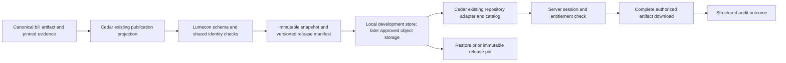

# Havala infrastructure review packet

2026-09-23. Review target: repository boundaries, maintainability, release safety,
and the incomplete local source-to-download seam. NEED adjudication is not the
reviewer's task. No production launch or completed vertical slice is claimed.

## Fixed review boundary

Cedar branch: `codex/early-access-takeover`.
Base: `b6abb374a7a40216a7648ef79fc1df9e5b471f79`.
The fixed head is the documentation commit containing this packet, reported by
`git log -1 --format=%H -- docs/HAVALA_INFRASTRUCTURE_REVIEW.md` in this review
snapshot. The final checkpoint receipt records its literal SHA and each file.
No pushes, merges, publication, AWS changes, or data relocation occurred.

Lumecon branch: `codex/cedar-press-pilot`, HEAD
`0ae36dda36d650b1b3861173fb122e7603b0dc3f`; cached origin/main matches.
Its foundation/hardening work is already merged. No remote refresh was performed
in this closure pass. A two-file Windows storage patch remains UNCOMMITTED and
NOT VERIFIED: `src/lumecon_data/storage.py`, `tests/test_storage.py`.
It is excluded from the Cedar commit range and must not be mistaken for an
installed production foundation. Exact bytes/hashes are in the checkpoint receipt.

## Outcome and blocker

Four implementation commits close the bounded NEED/identity/publication/metadata
work; this documentation commit records its limits. Legislation's bill register
is the selected local pilot, independent of the blocked R7 import and NEED.
Actual canonical input: 3,069 unique nonblank bill IDs, 4,311,205 bytes, 39 columns.
A read-only execution of the existing publication projection produced 3,069 rows,
the approved 30-column schema, no publication-held rows, and no owed fields.
Eight historical bill types have blank generated source URLs; preserve this
limitation rather than invent links or rename issued record IDs. There are 591
source rows with entity associations; blank associations do not mean exclusion.
No release, entitlement-to-full-download test, or rollback proof was completed.

**Current external blocker (Linux continuation checked 2026-09-23):** no usable
Linux runtime is installed on this machine. `wsl --list --verbose` reports
"The Windows Subsystem for Linux is not installed." `Get-Command docker` finds
no CLI; standard system and per-user executable paths do not exist, and no
Docker service or process was found. The per-user DockerDesktop directory contains
only `tmp-delete`; Docker installer logs record uninstall completion on August 28.
No WSL distribution, Docker container, or Linux-native checkout was created.

The earlier Windows storage result remains 22 passed, two fixture failures from
`WinError 1314` creating real symbolic links. That is a test-environment limitation,
not evidence of a product failure. The two-file compatibility patch is still
uncommitted. No safety test was weakened or skipped; no system component was
installed and no Windows security setting was changed. User authorization to
install a Linux runtime, or access to an existing Linux environment, is required
before the requested Linux verification and conditional storage commit.

Exact discovery commands (PowerShell):

```powershell
Get-Command wsl,docker -ErrorAction SilentlyContinue
wsl --list --verbose
Get-Service -Name '*docker*','*wsl*','LxssManager' -ErrorAction SilentlyContinue
Get-Process -Name '*docker*' -ErrorAction SilentlyContinue
Test-Path 'C:\Program Files\Docker\Docker\resources\bin\docker.exe'
Test-Path 'C:\Users\esm247\AppData\Local\Programs\DockerDesktop\resources\bin\docker.exe'
Get-ChildItem 'C:\Users\esm247\AppData\Local\Programs\DockerDesktop'
```

No Linux tests ran, so traversal, symlink escape, malformed paths, immutable
collision and rollback are not newly certified. The Legislation vertical slice
remains incomplete at the previously measured 3,069-row public projection.
NEED, R7 and architecture audits were not reopened. Production deployment is
still separately unauthorized; local Linux verification does not require AWS.

## Repository and canonical ownership

| Responsibility | Current implementation | Canonical boundary / transition |
|---|---|---|
| Acquisition, raw evidence, staging, reconciliation | Cedar `code/` and ignored data workspace | Lumecon Data after each proven transfer; current Cedar producers remain explicit transitional components |
| Immutable snapshots, typed contracts, release validation | Lumecon `contracts.py`, `pipeline.py`, `storage.py` | Lumecon; reuse existing content-addressed formats |
| Identity namespaces and existing issued registers | Cedar `cedar_ids.py`, delegated CE checksum in `503_identity.py` | One existing identity service; no copied allocator in Lumecon |
| NEED evidence admission | `1133_need_owner_v6_builder_input.py::affiliation_route_is_quarantined` | Canonical known-route exclusion; not a general affirmative-evidence certifier |
| NEED supported command | `code/build.py candidate need` | One command surface; numbered stages remain required components |
| Field publication policy | `cedar_publication.py` and `data/cedar/field_map.json` | One policy contract; do not fork per consumer |
| UI, accounts, entitlements, API and downloads | Cedar `src/`, `server/` | Cedar Press; Lumecon development bearer grants are not subscriber entitlements |
| Product release description | Five tracked files under `data/cedar/` | Cedar product contract projected from approved Lumecon releases |

Lumecon currently has manual CSV intake, local immutable storage, deterministic
normalization, validation/quarantine, comparisons, explicit promotion, catalogs,
and a read-only API. It has no production acquisition adapters, cloud store,
collection database ingestion, or full CSV download endpoint. Limits are 16 MiB
source and 128 MiB artifact, with in-memory normalization. Cedar PostgreSQL stores
accounts/codes/activity, not collection data. Lumecon's single exact IdentityBinding
does not represent plural optional bill/entity associations; do not coerce them
into a singular cedar_uid or copy another identity implementation.

## Source-to-download path



Only A-to-B was measured on real data in this pass. Remaining stages must be
proved after the storage safety blocker. The current protected endpoint
`GET /press/collections/{id}/download` enforces tier but returns the ten-row
sample through `repository.collection_csv`, with a `-sample.csv` filename.
Do not call this full access. Extend that existing seam; preserve explicit
sample/full semantics and never fall back to a sample on a failed full request.
Pin immutable release IDs, verify the actual served bytes, and retain Cedar's
citation/schema/field-map contract. No second manifest or release registry.

## Infrastructure gap table

| Area | Evidence / gap | Required local or production completion |
|---|---|---|
| Repository ownership | Producer boundary above; Cedar still performs transformations | Transfer one producer and switch its consumers before retirement |
| Object storage/versioning | Lumecon local content-addressed releases; S3 site bucket documented | Prove local release; authorized owner verifies private data store/versioning |
| Database/catalog | Existing Cedar metadata and account PostgreSQL; no data catalog database | Use existing catalog adapter; do not add a database solely for demonstration |
| Promotion | Lumecon verify/compare/promote exists | Pin reviewed real release; never follow current pointer per request |
| API | Catalog and protected sample route work in code | Full verified artifact adapter missing |
| Authentication | Signed cookie; PostgreSQL activation available | Signed expiry, revocation/current-tier validation remain missing; restart DB tests require test DB |
| Authorized download | Tier denial exists; returns sample | Exact full bytes, checksum/schema/count, no fallback; expose filename/release response headers |
| Audit | Activation/points records exist | Durable download/auth outcome log missing; log prepared/authorized, not presumed completed transfer |
| Secrets/config | Environment-based config; no AWS CLI/profile available locally | Authorized owner verifies deployment configuration without exposing values |
| CI | Shared Makefile gates; metadata checks and fixtures | Full pinned private-input release job is separate and not run by ordinary CI |
| Rollback | Immutable release model exists | Prove previous pin restores identical download; deployed service rollback untested |
| Backup/DR | Local preservation receipts exist | Independent restore test, retention and production backup verification required |
| AWS/domain/TLS | HOSTNAMES documents ACM, CloudFront, private S3 site origin, Route53 | Assets are documented, NOT reverified live; do not recreate certificate |
| Monitoring/alerts | No verified operational alert path | Add health/version/release proof and owned delivery-failure alert route before launch |

`docs/HOSTNAMES.md` names the existing cedarpress.ai assets. No AWS account was
queried. Its historical OIDC failure is not a fresh deployment diagnosis.
`deploy.yml` builds once and separates S3/CloudFront from Pages publication.
API deployed hostname/configuration remains unverified. API health lacks a release
or code stamp. Deployment artifact retention is one day; S3 sync deletes removed
assets. Bucket versioning and recoverability are unknown. Server README's blanket
in-memory claim is stale relative to `server/DATABASE.md` and PostgreSQL code.

## Required metadata

All five files were already tracked despite broad `/data/*` ignore rules. Narrow
exceptions and tracking tests now prevent accidental omission; LF attributes
stabilize generated checks on Windows. No duplicate metadata files were created.

| File | Authority / generation | Consumers / freshness |
|---|---|---|
| codebook.json | Curated schema contract; codebook-markdown generates its documentation | Client/server descriptions; check-generated + tracking tests |
| field_map.json | Curated owner publication contract | cedar_publication, docs/guides; field-map and guide --check |
| collections.manifest.json | scripts/import_cedar_manifest.py from workspace descriptors/samples | Client/server catalogs/imports; parity tests; full regeneration requires ignored inputs |
| releases.json | scripts/record-release.mjs preserves release history | Client/API release history; cannot reconstruct history from current data alone |
| samples.published.json | scripts/measure-samples.mjs from Git index and sample bytes | Sample availability/downloads; deterministic freshness check |

Full generator/consumer details remain at `data/cedar/README.md`. Fresh independent
Windows checkout plus explicit reviewed overlay passed seven generated checks,
application build, 58 JS and 43 Python checks earlier. After the owner-policy change,
the five changed metadata/document files were overlaid and both affected freshness
checks passed again. This is clone completeness, not twelve full-data rebuilds.

## Twelve-collection operating model

All source cutoffs remain unmeasured. Counts are measured local baselines, not
coverage certification. Supporting tables retain their own grains. All consume
1137 customer exports / 1135 samples through the manifest importer and Cedar
client/server adapters; the full entitled serving route is still missing.

| Collection / flagship | Producer and source | Grain / identity | 2025 / 2026 | Blocker |
|---|---|---|---|---|
| Funding / federal_funding_transactions | 24 + archive/enrichment; USAspending | Assistance transaction key; recipient CE separate | 43,254 / 18,325 action date | Refresh/attribution/additive grain |
| Federal Register / consultation_events | 96 +1089; FR | Document/participant pair; document source key | 8 / 6 notice date | Broad documents separate; discovery/parser coverage |
| Legislation / native_bills | 14 +73/890/1092; Congress/Voteview/curated sources | bill_id; separate actions, rollcalls, member votes; plural CE roles | 207 / 55 introduced | Selected bill-table pilot; storage tests blocked; ancillary release not proved |
| Deals / deals_classified | 88 +126, overlap153; reviewed source ledgers | Deal_ID, project/event distinction | 105 /103 Event_Year; 99 /102 full dates | Fresh build relies on preserved enrichment; not presumed R7-independent |
| NAGPRA / nagpra_notices | 77 +1077/1084; FR | document_number; separate party/institution tables | 900 /633 publication date | Seven undeclared joined fields, BLOCKED export |
| Advocacy / native_entity_lobbying_disclosures | LDA04/05 +65/350/1091 | Filing/attribution, source filing ID | 1,377 /672 filing_year | Amendment/attribution/source coverage |
| Prime / prime_contracts | 40 +archive/as-of/corrections; transaction extracts | Transaction key; business/owner roles distinct | 47,599 /55,014 action date | Identity history and nonadditive amounts |
| Subcontracting / subawards | 20 +121/910/911 | Subaward/report key; prime/sub CE separate | 6,306 /2,049 subaward date | Role contract and repeats |
| Native-Owned / native_owned_businesses | 330 +publication/date stages; directories | business_source_id assertion, not unique legal firm | Current register | 523 accuracy holds,19 permission unchecked; R7 blocked |
| Nonprofits / np_orgs | 17 +rulings/linkage; IRS/research | EIN organization; fiscal filings separate | Register/actual filing periods | 6,597 untiered; missing CE not automatic exclusion |
| Natural Resources / resource_revenue | 83 +scope/link; ONRR/state | Source-specific revenue observation | 505 /280 period_start;36 /24 payment_date | Mixed fiscal/calendar grains, suppression |
| NEED / need_enterprises | build candidate need;1072/1102/1177/1130 | Stable enterprise and relationship IDs | Register | Systemic affiliation hold, BLOCKED |

No collection is READY here. Data status NOT TESTED except explicit NEED and
Native-Owned blockers; NAGPRA has a reproduced delivery blocker. Delivery is
NOT TESTED for the other collections. Legislation currently previews bills and
Advocacy disclosures; old mismatch claims are stale. Gaming is Grove only;
Recognition is scrapped. Native-Owned storefront alias `owned` is explicit.
Validation uses existing `build.py plan <collection>` then declared stages;
1137 plan now exercises actual publication joins. Do not run the historical
entire command chains as if they were twelve validated release jobs.

## Consolidation within the touched scope

- Canonical identity owner: cedar_ids delegates CE checksum to 503; 1072 now
  calls that shared service. Shared validators do not certify every legacy caller.
- Canonical known-route admission: 1133 helper. 1130 classifies source evidence;
  1072's broad staged-OWNERV6 hold is a separate defense against legacy bypass,
  not another list of individually approved relationships.
- Canonical NEED entry: build.py candidate need. 1072/1102/1177/1130 are required
  components, not falsely declared wrappers. No duplicate implementation was
  retired without fresh-build/consumer proof; no new numbered production script.
- Transitional 770 FLAGSHIP literal is parsed by import_cedar_manifest.py.
  Switch that importer to cedar_publication's existing contract, then retire the
  compatibility block after parity and fresh-clone checks.
- 1135 independently shapes flagship samples while 1137 shapes customer exports.
  Future cutover derives samples from approved exports; remove duplicate transforms
  only after privacy/schema/count parity and application tests.
- Deals153 versus88 overlap requires caller and unique-evidence reconciliation.
  Existing 521/465/287/502 inventories are diagnostics, not authority; 465 and
  ordinary521 also write. No safe archive candidates newly proved.

Deferred risks: generic 503 stamp can blank existing CEs;1137 shared-name joins
lack semantic-role checking; browser/plural-publication checks remain shape-only;
NEED's historical hub/name allocation must not mint replacement IDs after changes.
These were not expanded into a repository-wide refactor. R7 gates remain blocked;
503 code changes invalidate prior fingerprints by design, not by auto-approval.

## NEED bounds and R7

Pre-hold candidate-c/d preserved 5,820 enterprises,8,690 relationships,6,089
bindings (269 historical-only),367 dual-role rows,zero minted IDs. Outputs were
byte-identical between fixed-context runs. Hub-diagnostic correction changed
1,096 rows in five diagnostic fields; it did not approve affiliations.

Controlled admission comparison: 18,110 source observations; before four-route
guard 5,761 emissions/12,349 refusals; after 1,256/16,854. 4,701 source observations
were quarantined (4,505 net fewer emissions). Later newspaper guard adds 45
formerly surviving admissions to its route exclusion; full proof was not rerun,
so 1,211 is not reported as a reproduced final admission result. The 29-record
survivor diagnostic is purposive, not a statistical precision estimate.
All OWNERV6 formal observations (4,901 across4,714 enterprise IDs) remain held.
No IDs or evidence deleted; no replacement affiliation promoted; active review
and browser decisions preserved. Actual owner CSV import remains pending.

R7 existing local audit bundle f37240f77e40bf5e390219ae: recorded integrity PASS,
17,282 issued CBs,17,279 active,83 unresolved proposals,G03-G06 blocked.
No redesign/import, no new gate decisions. Generated bundle/pointer/locks excluded.

## Storage and retention

Read-only Windows discovery: C NTFS 506,332,180,480 bytes total,
15,121,911,808 free; D NTFS 1,000,186,310,656 total,904,739,921,920 free.
C is NVMe SSD; other reported device WDC WD10EALX SATA, media unspecified.
D is reported fixed, not removable; confirm enclosure externally rather than
asserting USB/removability. Sequential archive suitability is plausible, not
benchmarked throughput. No write benchmark or movement was performed.
D root has Archive and _migration_logs; Archive contains tero and other projects.
tero has code/data/graveyard/output/scripts/src. No Cedar/Lumecon-named checkout
was observed at these inspected levels; no unrelated personal-tree scan occurred.

Proposed retention: Git holds code/contracts/small fixtures/product metadata and
release manifests. Lumecon owns canonical processing and version references.
Private versioned object storage holds immutable raw/release artifacts. Database
holds operational accounts/entitlements/catalog indexes, never competing facts.
Internal SSD holds active environments and bounded scratch. D may hold verified
backup/archive copies, never the sole canonical or production store. Every archive
requires relative-path manifest, SHA256,size,source/as-of,rights,producer/release
version,restore instructions and a verified restore sample. Retain issued identity
history and decisions permanently; retain prior releases while citations depend
on them. Do not remove active copies until two independently recoverable copies
and a restore test exist. Cache disposal and retention expiry remain separately
scoped actions; no automatic deletion or migration is authorized here.

## Reproduction and test evidence

Run from Cedar worktree (Windows py -3; Linux python equivalent):

```powershell
py -3 -B -m unittest discover -s server/tests -p test_id_contracts.py
py -3 -B code/1072_migration_test.py
py -3 -B code/1130_need_owner_v6_reconcile_test.py
py -3 -B code/1170_dependency_contract_test.py
py -3 -B code/build_test.py
py -3 -B -m unittest discover -s server/tests -p test_need_review_import.py
py -3 -B -m unittest discover -s server/tests -p test_field_map.py
py -3 -B -m unittest discover -s server/tests -t server -p test_collection.py
node --test src/features/grove/pressDownload.test.js
node --test src/features/grove/handoff.test.js
node scripts/field-map-markdown.mjs --check
node scripts/guides-markdown.mjs --check
git diff --check
```

Focused results: 14 ID,16 migration,51 reconciliation,6 dependency,2 runner,
4 review-import,21 publication,43 collection,9 download tests passed.
Initial sandbox failures were fixture/subprocess permissions; actual reruns passed.
An initial collection invocation without `-t server` failed import and was corrected.
Full application suite/coverage was NOT rerun in this closure pass; earlier clone
build/check evidence is described above, not substituted for a fresh full suite.

Blocked continuation from Lumecon root:

```powershell
.venv\Scripts\python.exe -m pytest tests/test_storage.py --no-cov -q
```

Then use existing `lumecon-data snapshot`, `build`, `verify`, `compare`, `catalog`
with a reviewed bill-table DatasetContract, and the existing Cedar repository
adapter. Do not run promote or change production pins. No successful end-to-end
reproduction command is supplied because the path is not implemented yet.
Required acceptance: same release on rerun; exact public columns and held-field
absence; shared CE namespace/membership checks on aligned arrays; anonymous/wrong
tier refusal before artifact access; entitled full bytes; audit prepared outcome;
corrupt artifact refusal; restoring prior pin restores exact bytes. Existing sample
API tests do not prove these properties.

## Review order and questions

1. Is the producer/product boundary correct, with one identity authority during transfer?
2. Does the Windows storage patch preserve refusal behavior before any real intake?
3. Is the bounded bill-register scope honest about missing URLs and ancillary tables?
4. Does the proposed existing download seam preserve entitlements and fail closed?
5. Are publication holds independent of field removal and legacy staging bypass?
6. Are namespace/grain validation and known legacy gaps clearly bounded?
7. Are metadata tracking and freshness gates sufficient across Windows/Linux clones?
8. Are consumer-cutover and retirement conditions concrete enough to prevent permanent duplicates?
9. Which deployment/session/backup gaps must be closed before attendee access?
10. Are excluded generated/private artifacts and the fixed review boundary unambiguous?

## Exact changed paths by commit

### A. Shared identity

`77fa7c086431f838d50ff7fd7648e67bdfd56465`

```text
code/503_identity.py
code/cedar_ids.py
docs/CEDAR_IDENTITY_SYSTEM_2026-09-13.md
server/tests/test_id_contracts.py
```

### B. NEED admission and migration

`746d3e267f2f45618a47b01d77690fe299a268ba`

```text
code/1072_migration_test.py
code/1072_tribally_owned_enterprises.py
code/1102_need_corroboration_adjudication.py
code/1130_need_owner_v6_reconcile.py
code/1130_need_owner_v6_reconcile_test.py
code/1133_need_owner_v6_builder_input.py
code/1170_dependency_contract_test.py
code/1177_retire_handle_column.py
code/build.py
code/build_test.py
docs/NEED_BUILD_LOG.md
docs/NEED_RENAME_2026-09-10.md
requirements.txt
```

### C. Consumers, review and publication

`d7b25d1670e7223da3581c06db268095f59ff0e9`

```text
code/08_build_review_page.py
code/09_import_rulings.py
code/1137_customer_dataset_combine.py
code/cedar_publication.py
data/cedar/field_map.json
docs/FIELD_MAP_2026-09-05.md
docs/IDENTIFIER_RETIREMENT_2026-09-05.md
docs/PUBLICATION_POLICY.md
docs/guides/need.md
scripts/field-map-markdown.mjs
server/tests/test_field_map.py
server/tests/test_need_review_import.py
```

### D. Metadata

`d88709d451345f4c049b9f61292fe41aed646797`

```text
.gitattributes
.gitignore
data/cedar/README.md
server/tests/test_collection.py
src/features/grove/pressDownload.test.js
```

### E. Canonical documentation

These paths explain the architecture, commands, exclusions and continuation:

```text
docs/ARCHITECTURE_DECISIONS.md
docs/SHIPPING_RUNBOOK.md
docs/TERMINAL_HANDOFF.md
docs/HAVALA_INFRASTRUCTURE_REVIEW.md
```

Remaining uncommitted Cedar paths are deliberately excluded:

```text
data/spine/cedar_entity_types.csv
docs/NEED_CORROBORATION.json
docs/imports/r7_audit/CURRENT.json
docs/imports/r7_audit/.lock
docs/imports/r7_audit/.lock.owner.json
docs/imports/r7_audit/bundles/f37240f77e40bf5e390219ae/
review/OWNER_DECISION_QUEUE.md
```

Ignored candidates, copied inputs, review HTML/evidence, caches and machine receipts
remain outside the commit range. Original 14 preserved source/test files rehash
identically; tracked dist/customer, dist/review/samples and public assets unchanged.
No remote or deployed outputs were changed. Weekly usage is unavailable to this
session; no remaining quota is invented. 16 GiB RAM and roughly14 GiB free internal
disk constrain builds to one at a time; read-only agent lanes have completed.
