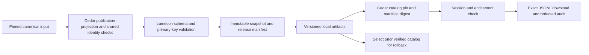

# Havala infrastructure review packet

<!-- BEGIN CURRENT-LAUNCH-DASHBOARD -->
## Read this first: thirteen-profile foundation, September 25

**Scope:** twelve Cedar Press profiles plus Gaming for Cedar Grove. This is an
executable code-foundation review, not certification of thirteen datasets.
Six Press adapters build flagship candidates, six stop at explicit tested gates,
and Gaming builds a multi-component rehearsal with proposed identity bindings.
No production deployment, release promotion, identity issuance or R7 import occurred.

### One operational authority

The diagram is the target lifecycle; this batch proves the pinned-source-to-download segment. Legacy acquisition callers remain transitional.

```text
registered source + immutable evidence + versioned decisions
  -> Lumecon intake / collection-specific producer
  -> validated component + keyed held-row receipt
  -> immutable release + catalog/manifest pin
  -> development release index / versioned storage
  -> Cedar Press or Grove adapter -> entitlement -> exact JSONL download
  -> redacted audit + verified prior-version rollback
```

| Responsibility | Canonical owner / path |
|---|---|
| Intake, source registry, acquisition receipts | Lumecon `intake.py`, `intake/profiles/`; authoritative [data-intake.md](https://github.com/teim-team/Lumecon-data/blob/codex/collection-release-closure/docs/data-intake.md) |
| Schema, rights, exact identity references | Lumecon `contracts.py`; existing issued registers and human rulings remain immutable inputs |
| Press transforms and admission gates | Lumecon `collections/legislation.py`, `natural_resources.py`, `press_candidates.py`, `press_blocked.py`; shared `projection.py` |
| Gaming transforms | Existing Lumecon `gaming/` package integrated from `68e6c81`; not copied into Cedar Press |
| Immutable releases/storage/validation | Lumecon `pipeline.py`, `storage.py`, `collection.py`; one CLI `lumecon-data` |
| Development catalog/database index | Lumecon `catalog.py`; idempotent SQLite metadata indexing, not a claim of deployed Postgres |
| Presentation, sessions, entitlement, download | Cedar application `server/cedar_press/repository.py`; Grove's separate multi-component adapter |
| Operator dispatch | Cedar `code/build.py release-pilot` delegates all twelve to Lumecon; Gaming uses `lumecon-data gaming` |

The shared intake implementation comes from the existing `76b22a8` work. The
prior competing `SourceIntakeProfile`/`SourceIntakeRecord` code and
`schemas/source-intake.v1.json` are retired, not left as another live authority.
The thirteen typed profiles inventory 108 sources; an inventoried source is not
proof of an executed live refresh. Source acquisitions not yet migrated remain
explicit transitional dependencies. No canonical dataset was committed to Cedar.

### Measured profile outcomes

Counts below are source -> projected flagship / held. Annual counts use the
stated source date; directories are nonannual. These are private candidates.
`Implemented/gated` means an executable receipt-producing pipeline, not a
completed customer transform. All remaining engineering work belongs to Codex.

| Profile | Producer / command suffix | Source -> output / held | 2025 / 2026 basis | Pipeline and exact remaining gate |
|---|---|---:|---|---|
| Federal Funding | `press_blocked`; `collection-build funding` | 701,955 -> 0 / 701,955 | 43,254 / 18,325 action dates | **BLOCKED**; implemented admission gate: recipient-type vocabulary and attribution conflict projection |
| Federal Register | `press_blocked`; `collection-build federal-register` | 11,402 -> 0 / 11,402 | 8 / 6 consultation rows, not broad documents | **BLOCKED**; implemented admission gate: participant grain/key and date precision |
| Legislation | `legislation`; `collection-build legislation` | 3,069 -> 3,058 / 11 | 130 / 24 introductions | **READY WITH DISCLOSED GAPS** flagship candidate; bills only, votes/actions separately unproved |
| Indian Country Deals | `press_blocked`; `collection-build deals` | 1,073 -> 0 / 1,073 | 104 / 103 dated years (2025: 99 day + 5 month); 105 / 103 reported years | **BLOCKED**; implemented admission gate: public type/status/substantive-note projection |
| NAGPRA | `press_candidates`; `collection-build nagpra` | 6,792 -> 6,792 / 0 | 900 / 633 publication dates | **READY WITH DISCLOSED GAPS** flagship candidate; notice count does not mean completed repatriations |
| Advocacy & Engagement | `press_candidates`; `collection-build lobbying` | 27,825 -> 27,825 / 0 | 1,377 / 672 reporting years; 1,343 / 1,041 posting years | **READY WITH DISCLOSED GAPS** disclosure candidate only; other promised engagement components unproved |
| Prime Contracting | `press_blocked`; `collection-build contractors` | 1,217,768 -> 0 / 1,217,768 | 47,599 / 55,014 action dates | **BLOCKED**; implemented admission gate: transaction key/grain, sector and source-qualified attribution |
| Subcontracting | `press_candidates`; `collection-build subcontracting` | 89,809 -> 70,054 / 19,755 | 6,080 / 1,974 eligible action dates | **READY WITH DISCLOSED GAPS** flagship candidate; prime/sub roles distinct; third-party redistribution holds |
| Native-Owned | `press_candidates`; `collection-build owned` | 4,273 -> 3,725 / 548 | Nonannual source-dated register | **READY WITH DISCLOSED GAPS** flagship candidate; 523 accuracy, 6 non-firm, 19 unchecked-permission holds |
| Native Nonprofits | `press_blocked`; `collection-build nonprofits` | 12,764 -> 0 / 12,764 | Nonannual organization register | **BLOCKED**; implemented admission gate: versioned ruling propagation and object mapping |
| Natural Resources | `natural_resources`; `collection-build natural-resources` | 11,305 -> 11,120 / 185 | 496 / 280 period starts | **READY WITH DISCLOSED GAPS** flagship candidate; ANCSA source qualification remains held |
| Cedar NEED | `press_blocked`; `collection-build need` | 5,820 -> 0 / 5,820 | Nonannual enterprise register | **BLOCKED**; implemented admission gate: publication hold; enterprise and relationship identities preserved |
| Cedar Grove Gaming | `gaming/`; `gaming build`, `gaming release` | 97,693 -> 69,335 downloadable / 28,358 held | Different component periods, deliberately bounded scopes | **BLOCKED** for production; candidate/rehearsal reproduced, proposed IDs, source/field rights and component download restrictions remain |

**Conservation:** Legislation holds eleven source keys: five treaty documents
and six reservation-name false inclusions. The earlier five-record shorthand
was incomplete. Natural Resources holds exactly 185 keyed ANCSA records; none
were silently dropped. Subcontracting holds 18,366 repeated reports, 846
superseded versions and 543 HigherGov-primary records. Native-Owned's field gate
label `publishable` is not the substantive reason for its final 25 holds: six
are non-firm artifacts and nineteen lack checked permission.

Deals' extra 2025 reported-year record is `FA-HUD-9002`: fiscal-year allocation
only, no event date. Five other 2025 records are month-precise; the scanner reports 99 day-precise 2025 records, not 104. PDF creation date is not substituted. The gated scanner's
case-sensitive date selector was corrected to `Event_Date`; earlier receipts
reporting all Deals dates missing are superseded by the frozen run.

### Consolidation result and remaining debt

Existing scripts-only census: **684 files = 76 active producers + 8 validation/
review utilities + 7 consumers/shared services + 5 test/fixture files + 588
unresolved**. Historical and safe-to-retire counts are zero *established by this
census*, not a claim that no historical code exists. It also identifies 124
embedded self-tests and 570 undeclared/unresolved files that are not authorized
production writers. These overlapping diagnostics must not be added to 684.

Twelve former full/sample projection routes now refuse before writing and direct
operators to Lumecon. No numbered Python file was physically deleted. Ancillary
legacy acquisition and research code remains; this is not twelve complete
source-acquisition migrations. Removal requires caller/output/recovery proof.
The former duplicate intake implementation and generated schema were removed.
No new numbered production script was added.

The census was regenerated with the declared Python 3.12 runtime. Its AST-based
writer signatures differ under Python 3.14; unsupported-runtime output must not
be mistaken for changed producer code. CI must use the declared runtime.

### Reproduction and boundaries

Use the Lumecon locked environment (`uv sync --locked --extra api --group dev`).
`lumecon-data intake-check` validates all thirteen profiles. Each Press command:

```text
lumecon-data collection-build <profile> --source <pinned-source.csv>
  --field-map <reviewed-map.json> --register <pinned-register.json>
  --scopes <pinned-scopes.json> --policy <pinned-publication-policy.json>
  --legacy-crosswalk <pinned-crosswalk.json> --as-of 2026-09-25
  --code-sha <full-producer-commit> --root <outside-Git-candidate-store>
```

Legislation requires `--actions <native_bill_actions.csv>` and omits `--legacy-crosswalk`; its exact native IDs are not crosswalked.
Six gated profiles return nonzero with an immutable candidate manifest and
keyed withheld receipt, never a release/catalog/current pointer. Funding and
Prime use bounded-memory two-pass CSV/SQLite indexing rather than loading their
662 MB / 1.60 GB sources into RAM. Partial parsing remains an explicit failure.
The six successful flagships use a measured 128 MiB source/256 MiB artifact cap;
Subcontracting's exact JSONL is about 139.5 MiB. Oversize refusal remains tested.

```text
python -B server/tests/release_download_rehearsal.py --store <store> --catalog <exact-catalog.json>
```

Run from the owned Cedar checkout with both packages and Cedar server dependencies
available. The exact Windows environment used was:

```powershell
$env:PYTHONPATH = 'C:\Users\esm247\Desktop\lumecon-release-closure\src;C:\Users\esm247\Desktop\cedar-press-codex\server'
& 'C:\Users\esm247\Desktop\Lumecon-data\.venv\Scripts\python.exe' -B server/tests/release_download_rehearsal.py --store '<store>' --catalog '<catalog>'
```

For a fresh development environment use the existing `make cedar-setup
CEDAR_CHECKOUT=<exact-checkout>` after Lumecon `make setup`; this installs the
Cedar server's declared development dependencies. Keep production database
variables absent: the rehearsal refuses inherited database configuration.

This runs local Lumecon API -> real Cedar subscriber login -> 401/403/200 ->
exact pinned JSONL -> redacted audit -> idempotent metadata import -> prior-pin
rollback. **JSONL is both immutable transport and current full customer format**;
CSV samples do not establish a verified full-CSV download. No production account,
AWS or Postgres rehearsal is claimed. No raw snapshot or candidate is in Git.
Gaming uses `gaming build --previous <prior-candidate>`, `gaming release --class
rehearsal`, and its Grove collection catalog. Proposed IDs never become issued.
A bounded snapshot can pass with disclosed gaps; unexpected truncation, lost
pagination, partial retrieval, changed schema or missing partitions fail closed.

### Fixed review pair and final verification

- [Lumecon draft PR #9](https://github.com/teim-team/Lumecon-data/pull/9),
  branch `codex/collection-release-closure`, current producer head
  `9f4cc210b5b32ca17b620be668eb754eba7024e4`; today?s range
  `88ba2b6232c8064fce91e7c17fe5c011b06d569d..9f4cc210b5b32ca17b620be668eb754eba7024e4`.
  It remains stacked on PR #8 (`f882fb14ab9179b287222b27b33cb6462378e6e1`).
- [Cedar draft PR #122](https://github.com/teim-team/cedar-press/pull/122),
  branch `codex/legislation-release-consumer`, tested consumer runtime
  `6464f0e7e14b5c05225517b698df2a562ea040a2`; today?s runtime range
  `567d280fce5f6f1d7695663e09991446dd32ca41..6464f0e7e14b5c05225517b698df2a562ea040a2`.
  This packet/runbook update follows as documentation only; the consumer code
  stays exactly at the CI pin.
- **Final Ubuntu [36164566828](https://github.com/teim-team/Lumecon-data/actions/runs/36164566828)
  is green:** Python 3.12 and 3.13, 878 tests, measured Python 3.13 coverage
  **88.23%**, unchanged 88% floor; lint, types, schema freshness, dependency audit
  and isolated offline wheel verification passed. Exact pinned Press and Grove
  compatibility jobs passed. Real symlink containment tests ran on Ubuntu.
- Local Cedar: 89 passed, one unchanged Windows symlink skip. Six real flagship
  download/metadata-version rollback rehearsals passed. Gaming real candidate
  and immutable rehearsal passed; Grove application compatibility uses fixtures.

No production collection certification is claimed. The remaining Cedar frontend
fixture mismatch below still prevents calling the entire application PR green.
Windows offline socketpair and symlink limitations remain recorded, not bypassed.

### Current cross-repository check evidence

Cedar runtime `6464f0e7e14b5c05225517b698df2a562ea040a2` passed 89 focused
checks locally with one unchanged Windows symlink skip. Its Ubuntu subscriber
storage workflow [36162583750](https://github.com/teim-team/cedar-press/actions/runs/36162583750)
is green. Application [36162583660](https://github.com/teim-team/cedar-press/actions/runs/36162583660)
passed lint and generated checks, then failed one of 399 JavaScript tests:
`src/features/grove/explore.test.js:598`, Deals source/sample header assertion.
The map now includes internal `Candidate_Status`, `Caveat`, `research_note`; the
frontend fixture omits them. Claude's frontend owner must distinguish full
source contract from published sample fields; adding these internal fields to
public samples would be the wrong fix. No frontend file was edited here.
Later application steps were skipped, not passed.

Initial Lumecon [36162342880](https://github.com/teim-team/Lumecon-data/actions/runs/36162342880)
passed all 808 tests and pinned Press/Grove consumer jobs. Its unchanged 88%
coverage floor failed at 83.47% after importing Gaming. Meaningful source,
identity and rights boundary tests are being added; this initial run is not green.
One negative control exposed and fixed a `.gov/` URL-path false-positive in
Gaming's official-source classifier. Only validated host suffixes qualify.

### Human review and merge limits

No new evidence-complete ambiguous linkage cards were produced by this engineering
batch. The retained R7 83-pair queue and prior NEED decisions remain their existing
authorities, not thirteen datasets' readiness status. Do not re-ask recorded
rulings or infer approval from notes. Remaining source, schema, rights and
projection work stays with Codex; Havala reviews implementation and boundaries.
Gaming proposed facility/CE/CB links remain held until evidence/issuance permits
use; a rehearsal does not resolve them.

Review order: (1) single intake authority and bounded/partial distinction;
(2) keyed conservation and rights filtering; (3) twelve dispatch cutovers and
remaining writer risks; (4) exact-release entitlement and rollback;
(5) Gaming proposed-binding and component restrictions; (6) paired CI evidence.

Do not merge either side alone. Review the Lumecon PR #8 dependency, then the
paired Lumecon PR #9/Cedar PR #122 changes, with exact consumer commits in CI.
Rollback selects a verified prior immutable release/catalog; it never rewrites
artifact contents. Source and decision backups remain checksum-pinned outside
Git. AWS, production storage/versioning, secret provisioning, Postgres migration,
alerts, restore rehearsal and deployment require separate authorized work.
<!-- END CURRENT-LAUNCH-DASHBOARD -->


## Historical checkpoint: September 24 (superseded by the current table)
### Release closure and repository cutover (2026-09-24)

Current coordinated review surfaces:
[Cedar PR #122](https://github.com/teim-team/cedar-press/pull/122), producer
cutover `6aa8eb395715289a90c4cbe9984361ace9c14935..52fe0d8f34989f954f2ad9ece1084d97b58a16be`,
and [Lumecon draft PR #9](https://github.com/teim-team/Lumecon-data/pull/9),
stacked on storage PR #8,
`f882fb14ab9179b287222b27b33cb6462378e6e1..88ba2b6232c8064fce91e7c17fe5c011b06d569d`.

| Commit | Bounded responsibility / exact file group |
|---|---|
| Lumecon `122060d` | `collections/{__init__,projection,legislation}.py`, `tests/test_legislation.py`: shared projection primitives and bill producer/admission |
| Lumecon `1c7a342` | `collections/natural_resources.py`, `tests/test_natural_resources.py`: revenue qualifications and evidence-backed attribution mask |
| Lumecon `16244b6` | Existing `contracts.py`, `pipeline.py`, `catalog.py`, `cli.py`; intake schema/export; three runtime test files; Makefile/CI; intake/developer/index/glossary/README/guidance documentation |
| Lumecon `88ba2b6` | `tests/test_catalog_database.py`: explicitly close SQLite test connections after Python 3.13 warnings-as-errors caught fixture leaks |
| Cedar `52fe0d8` | Existing `build.py`, `1135`, `1137`, `cedar_pipeline.py`, `cedar_publication.py`; generated inventory; candidate/field-map/registration tests; download rehearsal; shipping runbook and this packet |

No canonical source tables, released datasets, frontend, active owner-review
artifact or R7 bundle were committed. Cedar's pre-existing NEED corroboration,
terminal handoff, R7 pointer/locks/bundle, owner queue and entity-types work remain
excluded and untouched. Lumecon's isolated review worktree was clean after the
implementation commits; Claude's original worktree was not changed.

Verification commands: Lumecon `uv run pytest tests/test_intake.py
tests/test_legislation.py tests/test_natural_resources.py
tests/test_collection_build.py tests/test_catalog_database.py tests/test_docs.py -q`
passed **118**; `ruff check .`, `ruff format --check .`, `mypy src` and
`python scripts/export_schemas.py --check` passed. Cedar
`python -B -m unittest server.tests.test_candidate_review
server.tests.test_field_map server.tests.test_pipeline_registration
server.tests.test_release_download` passed **87, one Windows symlink skip**.
The full Windows suite was stopped after reproducing the known offline guard
failure in `asyncio`'s local socketpair setup; no protection was weakened.
Authoritative Ubuntu full-suite/coverage and pinned-consumer validation run:
[36071687852](https://github.com/teim-team/Lumecon-data/actions/runs/36071687852)
passed Python 3.12 and pinned Cedar compatibility; Python 3.13 caught SQLite
fixture cleanup, fixed in `88ba2b6`. The new run is
[36071980826](https://github.com/teim-team/Lumecon-data/actions/runs/36071980826).
The rerun is **green on Python 3.12 and 3.13**, including the full 575-test suite,
90.93% measured Python 3.13 coverage, dependency audit, wheel packaging and pinned
Cedar compatibility. Linux exercises the real storage/symlink safety tests.

**Shared intake authority:** Lumecon Data's `docs/data-intake.md`, on
`codex/collection-release-closure`, synthesizes the existing source registries,
acquisition paths and build logs. Gaming uses that same framework through its
Cedar Grove profile; it is not a thirteenth Cedar Press collection. The typed
source profile and acquisition observation extend Lumecon's existing dataset
contract and schema export, without changing the immutable release format.
Remaining risks are migration of legacy acquisition callers, independently
proved pagination completeness, source-specific rights and live cadence
enforcement. Located source packages and offline fixtures do not certify a live
refresh. The full contract belongs only in Lumecon Data.

The shared intake suite passed 29 offline tests. The actual CT Gaming package
has 171 distinct licensee-month observations (36 from 2025, 18 from 2026), but
its fixed-limit retrieval does not prove the source universe. The typed guard
refused it as partial; no Gaming release was created. Its immutable validation
receipt is
`C:/Users/esm247/cedar-takeover-checkpoint/intake-ct-validation/bd1ad644b1d830df2a3942ca34bebc501fece6a1a678d4b9e04eb3a9afeab5ba.json`.
The filename matches its SHA256. Revalidating the embedded `SourceIntakeRecord`
against the original raw bytes reproduces the refusal. Complete Gaming/federal
and incremental-window tests use explicitly synthetic fixtures, not invented
production completeness evidence.

**Lumecon-owned flagship rehearsals, September 24:**

| Flagship | Exact local release ID | Download rows / held | Download SHA256 |
|---|---|---|---|
| Legislation bills | `2aa7ee2a86e82e962fa2cad70a364c70c09a46415b8b86488740944a04f05eaf` | 3,058 / 11 unsupported inclusions | `e5f8672190ab801370d4cf001baa30ea066253cbef12e7d7e15d6d245f57f650` |
| Natural Resources revenue | `bd254496b977351ca7fe1bcdef8d336d7ed3f48cff3ef9ff24615b56003eefc0` | 11,120 / 185 pending source qualification | `16e95935e7e7849230bba959bc551bcea2b4f9179b36be1dcca224fc1a30aeae` |

Both used Lumecon's canonical projection and existing immutable release format.
Public manifest pins are Legislation
`abff4e868691bec87434656eeddb7c73ad205a6ac7bca7153d60a36c8ea558ae`
and Natural Resources
`b6607b0c94770d280ee8aa8a5e88f8459c4c8bcdfb34d38801b882aae2296c4a`.
Release rows measure 130/24 bills by introduction date and 496/280 revenue
observations by period-start year for 2025/2026. Natural Resources retains 586
populated recipient CE links; unknown/suppressed recipients remain unlinked.
Local Cedar login, anonymous 401, wrong-entitlement 403, authorized exact bytes,
redacted audit events, malformed/missing/stale release refusal and two-version
rollback passed. Development SQLite catalog import was repeated without a
duplicate, and pin rollback retained original artifacts. PostgreSQL, production
access and advertised ancillary tables are not certified. Receipts are
`C:/Users/esm247/cedar-takeover-checkpoint/lumecon-legislation-locked-final-2026-09-24/rehearsal-result.json`
and `C:/Users/esm247/cedar-takeover-checkpoint/lumecon-resources-final-2026-09-24/rehearsal-result.json`.

Cedar checkpoint `6aa8eb3` passed subscriber storage CI run
[36068685079](https://github.com/teim-team/cedar-press/actions/runs/36068685079).
Application CI [36068685097](https://github.com/teim-team/cedar-press/actions/runs/36068685097)
failed the existing frontend sample-header equality assertion at
`src/features/grove/explore.test.js:598`: Deals' declared `Candidate_Status`,
`Caveat` and `research_note` are absent from the older sample. Claude owns that
frontend reconciliation; no frontend file was changed by this cutover.

The user has reaffirmed **Lumecon-data as the authoritative producer, schema,
identity-binding, validation, storage and release repository for exactly the
twelve Cedar Press collections below**. Cedar owns presentation, product catalog,
entitlements and pinned-release consumption. Gaming is excluded. Current Cedar
producer code is transitional, not a permanent second data platform. No canonical
datasets are being committed to either repository or copied into the application.

Preserved checkpoint: Cedar PR #122 `f66f85370983ead93c5bf57ff9bd18d42e74bd35`.
An isolated Lumecon code worktree at `Desktop/lumecon-release-closure`, branch
`codex/collection-release-closure`, starts at PR #8 head
`f882fb14ab9179b287222b27b33cb6462378e6e1`. Claude's dirty original Lumecon
worktree, semantic work and Cedar frontend remain untouched.

**New measured Legislation proof:** 108 erroneous introduction dates were
corrected against unique official introduction actions; 11 unsupported bill
inclusions and 33 vote-route selections are held. The corrected bill projection
contains **3,058 rows, 130 / 24 introduced in 2025 / 2026**. Source rows and IDs
remain unchanged. Local release
`2d9190263939d5293bf214d9fb12774b95a59fcf103313791af383f2a361f4c7`
passed real local login/API, anonymous 401, wrong entitlement 403, authorized
200, exact JSONL bytes, eight redacted audit events, invalid/stale/missing refusal,
and rollback from `3ade173422020a3cc1aa997b5ff9bbb2b9bca932899b6c2b23ae85f90d1fd0e7`.
Downloaded SHA-256:
`e5f8672190ab801370d4cf001baa30ea066253cbef12e7d7e15d6d245f57f650`.
Receipt: `C:/Users/esm247/cedar-takeover-checkpoint/closure-legislation-corrected-2026-09-24/rehearsal-result.json`.
This certifies neither the advertised supporting tables nor completed producer
migration; it is the corrected transport regression reference for cutover.

**Natural Resources correction:** one surviving resolver error attached Arctic
Village to a $26.7 million payment to Northwest Arctic Borough. The candidate
mask preserves the payment, source recipient name and NANA payer, and removes
only unsupported recipient attribution. The implicated historical containment
route produced 127 tier-A proposals; 126 no longer carry those recipient links.
Source-specific public qualifications are being repaired without overriding the
existing Native-entity-own-publication ruling. Ancillary party key
`PL-RAS-LEASE-00034-LESSOR` represents two different lessors and must not be
deduplicated away. The old 11,305-row pilot is not a new certification.

Current-to-target path:
`pinned sources -> transitional Cedar projection -> Lumecon immutable release -> Cedar entitlement/download`
becomes
`pinned sources -> Lumecon collection producer + bindings -> validated components -> immutable release + manifest hash -> Lumecon catalog/storage import -> Cedar pinned consumer -> entitlement/download -> audited rollback`.
Producer cutover requires cell-level comparison and removal/delegation of the
old implementation in the same reviewed migration. No independent handwritten
consumer schema is introduced. JSONL is presently both immutable transport and
the full customer payload; public samples are separately declared CSV views.

| Shared responsibility | Authoritative home / current implementation | Cutover boundary |
|---|---|---|
| Sources, transforms, component schemas and identity bindings | Lumecon-data; Cedar registered producers remain transitional | Move bounded producers with pinned inputs; remove old writable authority after parity |
| Release contracts, manifests, hashes and immutable files | Lumecon `contracts.py`, `pipeline.py`, `storage.py` | Existing formats retained |
| Release catalog and storage/database metadata | Lumecon `catalog.py` | Metadata references immutable payloads; no duplicate canonical row store |
| Product descriptions and display configuration | Cedar `data/cedar` and product code | Validate against versioned producer schema |
| Entitlement, API/download response and audit | Cedar server | Explicit release pin; mismatches fail closed |
| Frontend implementation | Claude-owned Cedar frontend | No edits in this pass |

Production database ingestion, S3 deployment, persistent production login,
monitoring and operational restore remain unexecuted. Local fixtures and Ubuntu
contracts must not be described as a production rehearsal. No new owner cases
were identified by these engineering corrections.

The table below retains the previous twelve-collection scan; the corrected
Legislation counts above supersede its old date and five-hold measurements.
Updated 2026-09-24 22:18 UTC. All twelve full scans completed. These are internal QA results, not tasks for Elijah. No release is certified by a preview or a passing field map. Release-eligible counts remain **not certified** until evidence, rights, whole-product and delivery gates pass; prior Legislation/Natural Resources local transport proofs remain valid infrastructure evidence.

| Collection | Input -> projected candidate rows | Row-policy withheld | 2025 / 2026 | Validation / remaining blocker | Next Codex action | New owner cards |
|---|---:|---|---|---|---|---:|
| Federal Funding | 701,955 -> 0 | 0 | 43,254 / 18,325 | REFUSED: Attribution vocabulary and recipient-type derivation; refresh/transport unproved | Recode public status conservatively; implement source-backed recipient dictionary | 0 |
| Federal Register | 11,402 -> 0 | 0 | 8 / 6 | REFUSED: Date precision owed; 1,006 blank participant keys need grain treatment; current discovery gap | Separate document release from participant series and derive documented precision | 0 |
| Legislation | 3,069 -> 3,064 | 5: treaty inclusion hold | 207 / 55 | FIELD_MAP_AND_KEY_PASS: Five treaty rows held; 34 reservation-only votes need reconciliation; three remaining missing URLs; actions/votes delivery unproved | Trace vote-only inclusion route; validate source evidence and supporting tables | 0 |
| Deals | 1,073 -> 0 | 0 | 105 / 103 | REFUSED: deal_type/status/structure and substantive Notes derivation owed | Complete canonical taxonomy projection and preserve source qualifications | 0 |
| NAGPRA | 6,792 -> 6,792 | 0 | 900 / 633 | FIELD_MAP_AND_KEY_PASS: Historical bridge classification/link evidence not fully validated; new release path not rehearsed | Rebuild isolated party bridge with negative controls and source stratification | 0 |
| Advocacy & Engagement | 27,825 -> 27,825 | 0 | 1,377 / 672 | FIELD_MAP_AND_KEY_PASS: Disclosures only; other promised Advocacy components unproved; intake size limit | Validate all promised components; adapt bounded release intake without weakening limits | 0 |
| Prime Contracting | 1,217,768 -> 0 | 0 | 47,599 / 55,014 | REFUSED: Competition mapping passes; sector derivation and 639,544 blank composite keys remain | Rerun projection; resolve transaction-versus-award grain before release | 0 |
| Subcontracting | 89,809 -> 70,597 | 19,212: duplicate_status=exact_repeat_within_source, duplicate_status=superseded_by_primary_source | 6,306 / 2,049 | FIELD_MAP_AND_KEY_PASS: Projection passes; source rights and per-route affiliation evidence/entitled path remain unproved | Verify source rights and route evidence; rehearse generic release-to-download | 0 |
| Native-Owned | 4,273 -> 3,725 | 548: publishable | Current register; not annual | FIELD_MAP_AND_KEY_PASS: rights, source assertions and entitled delivery remain unproved | Validate rights and source assertions; rehearse generic entitled-download path | 0 |
| Native Nonprofits | 12,764 -> 0 | 75: disposition=NATIVE_PROPOSED_AWAITING_OWNER_RULING, disposition=CONFLICT_EXCLUDED_AND_RULED_NATIVE | Current register; not annual | REFUSED: entity_id legal-object semantics; ruling propagation pending isolated validation | Validate EIN/ruling propagation and distinguish entity identity from organization membership | 0 |
| Natural Resources | 11,305 -> 11,305 | 0 | 505 / 280 | FIELD_MAP_AND_KEY_PASS: Flagship local path proved; mixed scope/periods and supporting-table completeness unproved | Validate public aggregation/suppression semantics and ancillary delivery | 0 |
| Cedar NEED | 5,820 -> 0 | 0; entire 5,820-row candidate publication-held | Current register; not annual | REFUSED: Collection publication hold; affiliation evidence quarantine | Preserve hold/issued IDs and validate bounded surviving-evidence assessment | 0 |

**Interpretation:** withheld counts are whole-row policy exclusions, separate from attribution masks and collection holds. Subcontracting excludes 18,366 exact repeats and 846 superseded reports. Native-Owned excludes 548 publishability holds. Nonprofits excludes 73 legacy pending rulings and two conflicts; these are not automatically 75 qualified owner cards. Natural Resources has 9,840 publisher-suppressed attribution rows retained at their permitted aggregate grain. Federal Register counts above refer to consultation rows; its separate broad document table has 156,897 rows, including 5,283/3,899 in 2025/2026. Advocacy counts cover disclosures only, not its full product scope.

**Concrete corrections:** shared row-policy execution now serves both 1135 and 1137; two obsolete Funding dispatch edges (335/336) were removed from the existing generated contract and build consumer. No historical script was deleted. Deals purchase-allocation wording corrected 14 published-view classifications without changing source rows. Subcontracting public contract/codebook no longer assert ownership. The NEID instrument-description false positive is narrowly fixed while genuine retired IDs still refuse. Prime competition uses the existing DAIMS dictionary: all 1,217,768 rows checked, zero undefined codes and zero disagreements with stored normalization.

**Internal validation receipts:** `C:/Users/esm247/cedar-takeover-checkpoint/launch-candidates-2026-09-24/measurements.json` and `launch-candidates-2026-09-24-repaired/measurements.json`. All twelve source SHA-256 values match before/after. Subcontracting now produces 70,597 rows, SHA-256 `712b724ac3beabf2832b4d026bc5b9acdbfb4e583d97aff091044e47ff74a979`. The initial Legislation scan matched the prior 3,069-row pinned projection (`d38902f...`); Natural Resources matches prior 11,305-row projection (`b66526a...`). Neither equality proves source relevance or completeness.

**Additional content checks:** Legislation: 591 linked bills, 3,061 source URLs, zero duplicate bill IDs; eight missing URLs need repair, including five treaty-shaped records. NAGPRA: 6,169 linked notices, all 6,792 source URLs, zero duplicate document IDs; identity bridge evidence still requires validation. Advocacy disclosures: 26,513 linked rows, all 27,825 source URLs; 1,312 unlinked rows are not automatically erroneous. Missing NAGPRA item counts remain unknown, never zero.

**Verification:** 80 focused tests pass (`python -B -m unittest server.tests.test_candidate_review server.tests.test_field_map server.tests.test_need_review_import server.tests.test_id_contracts server.tests.test_np_ruling_precedence`). Prime rerun and registration baseline refresh completed. Registration: 25/25 pass. Release-download suite: 22 passed, one existing Windows symlink skip; protections were not weakened. Total focused execution: 127 passed, one skipped. Ubuntu [Subscriber storage contracts](https://github.com/teim-team/cedar-press/actions/runs/36065924825) passed at `ff43ed3`. [Checks](https://github.com/teim-team/cedar-press/actions/runs/36065924842) failed on stale generated guides; the guides were regenerated and all seven generated checks now pass locally. Latest follow-up: 41 field-map/candidate tests pass. No deployment occurred.

**Measured operational inventory:** 684 Python files: 76 active producers, eight validator/migration/review utilities, seven product-consumer/shared-service files, five standalone tests/fixtures, 588 unresolved. These are static evidence categories, not runtime certification. No new production script was added; zero files retired. The unresolved count is reported as measured, not reduced by relabeling.

### CI result and frontend ownership boundary

At `1ac3272434532aaedef90bdb5720046e637cbcb2`, Ubuntu [storage contracts](https://github.com/teim-team/cedar-press/actions/runs/36066198711) passed. [Checks](https://github.com/teim-team/cedar-press/actions/runs/36066198590) passed lint and all generated checks, then failed the existing `src/features/grove/explore.test.js:575` assertion that every full-data field declaration must equal the old sample header. The same test also explicitly requires the now-disproved `nation_id` adjudication disposition near line 650. These are consumer-contract assertions to update in coordination with Claude's frontend ownership; neither canonical data nor metadata should be falsified to satisfy them. No frontend file was edited. Havala should review this compatibility boundary; this is not an Elijah adjudication.

Required test correction: all sample columns must have decisions; additional full-data/internal or declared generated fields require explicit dispositions rather than equality to the sample header. `nation_id` must remain internal source context, with no certifier/CE substitution, as the new Python negative tests demonstrate. Keep unknown columns, undeclared public targets and unsupported identity promotion rejected.

Latest local checks: 106 focused tests passed; release-download suite 22 passed and one existing Windows symlink test skipped. `ruff check server` passes after formatting only takeover-owned tests; all seven generated checks pass. Ubuntu storage coverage exercises Linux containment. The broad application suite is **not green**; later steps were skipped after the contract-test failure.

### Current bounded commit range and exclusions

Implementation commits after `fcde1c693bb30f96174e7ddec112878f9d4daa9a` (all on PR #122): `e1bf39d` removes obsolete Funding dispatch edges; `4604851` consolidates row policy and adds candidate validation, publication safeguards and public-contract corrections. Use `git diff --stat fcde1c6..4604851` and `git show --name-only` for exact files. `ff43ed3` records all twelve candidate measurements; `1ac3272` resolves Native-Owned source-context semantics and refreshes generated guides. A test-lint/documentation follow-up completes this checkpoint.

Excluded and unchanged by these commits: pre-existing `data/spine/cedar_entity_types.csv`, `docs/NEED_CORROBORATION.json`, `docs/TERMINAL_HANDOFF.md`, `docs/imports/r7_audit/CURRENT.json`, `review/OWNER_DECISION_QUEUE.md`, R7 locks and bundle `f37240f77e40bf5e390219ae`. Candidate CSV/HTML/receipts remain outside Git. No frontend, production release pointer, AWS resource, source row or issued ID was committed.

Reproduce isolated candidates with `python -B code/1135_full_dataset_review_bundle.py candidate --input-root "C:/Users/esm247/Desktop/Cedar Press" --output-root "<new directory outside Git>" --queue review/launch_control.json --need-root "C:/Users/esm247/cedar-takeover-checkpoint/need-candidate-d"`. Optional repeated `--collection` selects a bounded rerun. Run the 80-test command above, `python -B -m unittest server.tests.test_pipeline_registration`, and the existing release-download command in this packet. Never reuse an output directory or interpret a `.partial` file as a candidate.

### Latest bounded corrections and internal receipts

The Prime rerun completed on all 1,217,768 rows: competition passes; `supersector` still lacks its public `sector` derivation, and the declared mixed-grain key has 639,544 incomplete rows. No zero-byte candidate survives completion. Future in-progress files use `.csv.partial`, and successful runs pin code/configuration hashes in `run-context.json`.

Legislation now projects **3,064** rows, withholding five source-preserved treaty records under a named inclusion hold. The old 3,069-row artifact remains unchanged and is transport evidence only, not the current approved content. New candidate SHA-256: `1ae0dfa33112fe6ab6a7b2e3c8c3318a26e85a6b59a51504269cb25b0906edb8`. Upstream `votingpatterns/44_classify_senate_tribal_votes.py` matched generic treaty reservations: 34 of 141 selected Senate votes depend only on that pattern, across 12 bill IDs and 22 bill-less votes. White Earth is a genuine counterexample: no blanket deletion. Codex must reconcile the remaining route and related tables. Primary checks include [NATO treaty document](https://www.congress.gov/117/cdoc/tdoc3/CDOC-117tdoc3.pdf) and [Spain tax protocol](https://www.govinfo.gov/app/details/CDOC-113tdoc4).

Native-Owned: 19 fields traced to 615/953/1001/1100 are now explicitly internal. The 548 withheld rows split into **523 explicit accuracy holds plus 25 other publishability holds**; `publish_hold=Y` overrides stale `publishable=Y`. No candidate identifiers become customer identities. The initial `nation_id` refusal was traced and corrected: it is source-association context, not the certifier. All 4,001 populated source values (3,453 eligible rows) remain internal, without CE substitution. The final projection passes on 3,725 rows; SHA-256 `4c1bc38818bc268ce906dfb3018764354d9f0dcd0e496e0d8d21cc48b23aef1c`. The final receipt is `launch-candidates-2026-09-24-owned-context/measurements.json`. Receipt: `C:/Users/esm247/cedar-takeover-checkpoint/launch-candidates-2026-09-24-admission/measurements.json`.

Protected original inputs rechecked: 19 NEED, 12 NAGPRA and two publication-manifest files match their preservation hashes. No issued IDs, original source rows, active owner-review artifact or published datasets were intentionally written by these commands.

### Every currently identified blocker and its owner
Engineering checks marked not run remain launch blockers, not passed gates. Havala reviews the resulting difficult engineering choices; routine repairs are Codex-owned. No unqualified identity case is assigned to Elijah.

**Federal Funding**
- **Codex - engineering defect:** Recipient-type derivation and attribution-status public contract; transaction-grain/additive totals; bounded release transport.
- **Codex - missing-source / research task:** Refresh 2025/2026 partitions and measure source cutoff/omissions.
- **Codex - linkage research, not yet a qualified owner decision:** Review high-impact attribution evidence; 155197 rows without CE are not automatically owner cases.
- **Codex - engineering / verification:** immutable release, catalog pin, entitled-download denial/success, audit and rollback remain unproved for this collection.
- **Codex - engineering / verification:** source-rights enforcement, all promised supporting tables, representative sample and actual full-product behavior must pass the complete release gates; no whole-collection readiness is inferred from row counts.

**Federal Register**
- **Codex - engineering defect:** Source discovery and post-2022 parser/observability; event-date precision and source-grain contract.
- **Codex - missing-source / research task:** Acquire supported current document universe; distinguish generic consultation from named participants.
- **Codex - linkage research, not yet a qualified owner decision:** Only affirmative participant mentions support links; unobservability is not zero.
- **Codex - engineering / verification:** immutable release, catalog pin, entitled-download denial/success, audit and rollback remain unproved for this collection.
- **Codex - engineering / verification:** source-rights enforcement, all promised supporting tables, representative sample and actual full-product behavior must pass the complete release gates; no whole-collection readiness is inferred from row counts.

**Legislation**
- **Codex - engineering defect:** Ancillary action/vote contracts and consumer coverage; production/full-download UI remains untested.
- **Codex - missing-source / research task:** Refresh actions/votes; resolve 8 historical source URLs or disclose absence.
- **Codex - linkage research, not yet a qualified owner decision:** Multi-entity measures may validly lack singular CE; no new owner batch identified.
- **Codex - engineering / verification:** source-rights enforcement, all promised supporting tables, representative sample and actual full-product behavior must pass the complete release gates; no whole-collection readiness is inferred from row counts.

**Deals**
- **Codex - engineering defect:** Caveat/Candidate_Status presentation versus approved field map; owed type/structure/status crosswalks; substantive Notes editorial mapping.
- **Codex - missing-source / research task:** Resolve date-basis coverage and primary-source gaps; qualification evidence must survive.
- **Codex - linkage research, not yet a qualified owner decision:** R7-dependent business links and existing unmatched parties require exact-object evidence, not blanket approval.
- **Codex - engineering / verification:** immutable release, catalog pin, entitled-download denial/success, audit and rollback remain unproved for this collection.
- **Codex - engineering / verification:** source-rights enforcement, all promised supporting tables, representative sample and actual full-product behavior must pass the complete release gates; no whole-collection readiness is inferred from row counts.

**NAGPRA**
- **Codex - engineering defect:** Candidate-class and alias errors in the entity bridge; immutable release and entitled-download proof still not run.
- **Codex - missing-source / research task:** Verify current notice discovery/corrections against supported cutoff.
- **Codex - linkage research, not yet a qualified owner decision:** Keep notice, institution, affiliation and consultation roles separate; no new owner batch qualified.
- **Codex - engineering / verification:** immutable release, catalog pin, entitled-download denial/success, audit and rollback remain unproved for this collection.
- **Codex - engineering / verification:** source-rights enforcement, all promised supporting tables, representative sample and actual full-product behavior must pass the complete release gates; no whole-collection readiness is inferred from row counts.

**Advocacy & Engagement**
- **Codex - engineering defect:** Disclosure transport cap; component-specific contracts and samples; product is Native Advocacy and Engagement.
- **Codex - missing-source / research task:** Measure all promised meetings/calendars/testimony/comments/consultation sources; disclosure rows are only one component.
- **Codex - linkage research, not yet a qualified owner decision:** 1312 disclosure rows lack CE; source roles must be resolved before proposing linkages.
- **Codex - engineering / verification:** immutable release, catalog pin, entitled-download denial/success, audit and rollback remain unproved for this collection.
- **Codex - engineering / verification:** source-rights enforcement, all promised supporting tables, representative sample and actual full-product behavior must pass the complete release gates; no whole-collection readiness is inferred from row counts.

**Prime Contracting**
- **Codex - engineering defect:** Mixed transaction/aggregate grain, composite keys, protected transport and financial nonadditivity.
- **Codex - missing-source / research task:** Refresh action/revision coverage and dated contractor/parent evidence.
- **Codex - linkage research, not yet a qualified owner decision:** Business versus parent UEI/CAGE conflicts including R7; preserve disputed or withdrawn attribution.
- **Codex - engineering / verification:** immutable release, catalog pin, entitled-download denial/success, audit and rollback remain unproved for this collection.
- **Codex - engineering / verification:** source-rights enforcement, all promised supporting tables, representative sample and actual full-product behavior must pass the complete release gates; no whole-collection readiness is inferred from row counts.

**Subcontracting**
- **Codex - engineering defect:** Expose prime/subcontractor roles; generic CE mapping discrepancies; composite subaward key and amount filters.
- **Codex - missing-source / research task:** Refresh reports and source lineage; repeated source IDs alone are not duplicates.
- **Codex - linkage research, not yet a qualified owner decision:** 117 populated generic/prime disagreements need role diagnosis; account separately for null asymmetry in the earlier 654-row comparison.
- **Codex - engineering / verification:** immutable release, catalog pin, entitled-download denial/success, audit and rollback remain unproved for this collection.
- **Codex - engineering / verification:** source-rights enforcement, all promised supporting tables, representative sample and actual full-product behavior must pass the complete release gates; no whole-collection readiness is inferred from row counts.

**Native-Owned**
- **Codex - engineering defect:** Publication filters and sample omission; current approved register versus pending R7 importer/cutover.
- **Codex - missing-source / research task:** 523 accuracy holds and 19 unchecked terms flags need source-level evidence/policy application.
- **Codex - linkage research, not yet a qualified owner decision:** R7 exact-object bindings and unresolved business inclusion; 83 proposals are not automatically 83 owner questions.
- **Elijah - existing product-policy / application gate:** Existing R7 G04 CB-format, G05 name-publication and G06 ship-bar decisions are absent from the frozen canonical decision record. Preserve these gates; this is not a new policy-waiver request or an identity card..
- **Codex - engineering / verification:** immutable release, catalog pin, entitled-download denial/success, audit and rollback remain unproved for this collection.
- **Codex - engineering / verification:** source-rights enforcement, all promised supporting tables, representative sample and actual full-product behavior must pass the complete release gates; no whole-collection readiness is inferred from row counts.

**Native Nonprofits**
- **Codex - engineering defect:** Automated-exclusion versus research precedence; published legacy-ID fields; preserve EIN object grain.
- **Codex - missing-source / research task:** Research 73 inclusion proposals and verify current control evidence for two conflicting automated exclusions.
- **Codex - linkage research, not yet a qualified owner decision:** 6597 blank linkage-tier rows are research backlog, not owner decisions; exact EIN/CE evidence required.
- **Codex - engineering / verification:** immutable release, catalog pin, entitled-download denial/success, audit and rollback remain unproved for this collection.
- **Codex - engineering / verification:** source-rights enforcement, all promised supporting tables, representative sample and actual full-product behavior must pass the complete release gates; no whole-collection readiness is inferred from row counts.

**Natural Resources**
- **Codex - engineering defect:** Full-product frontend and supporting-table integration remain; flagship download path already proved.
- **Codex - missing-source / research task:** Refresh source-observable periods; preserve suppressed recipients and reporting lag.
- **Codex - linkage research, not yet a qualified owner decision:** 705 CE references retained; missing recipients may be publisher-suppressed, not match defects.
- **Codex - engineering / verification:** source-rights enforcement, all promised supporting tables, representative sample and actual full-product behavior must pass the complete release gates; no whole-collection readiness is inferred from row counts.

**Cedar NEED**
- **Codex - engineering defect:** Apply recorded INTERNAL_ONLY/publication hold; migration and relationship evidence-admission contract.
- **Codex - missing-source / research task:** Finish quarantined-route evidence reconciliation; keep original inclusion sources.
- **Codex - linkage research, not yet a qualified owner decision:** Remaining affiliations and CE/business same-object distinctions; no automatic promotion from surviving quarantine.
- **Elijah - existing product-policy / application gate:** Existing R7 G04 CB-format, G05 name-publication and G06 ship-bar decisions are absent from the frozen canonical decision record. Preserve these gates; this is not a new policy-waiver request or an identity card..
- **Codex - engineering / verification:** immutable release, catalog pin, entitled-download denial/success, audit and rollback remain unproved for this collection.
- **Codex - engineering / verification:** source-rights enforcement, all promised supporting tables, representative sample and actual full-product behavior must pass the complete release gates; no whole-collection readiness is inferred from row counts.

**Shared gates:** Codex owns staging/production configuration and operational checks, but production mutation remains unauthorized. Credential/source access failures belong to **external-source limitation** when demonstrated; no current unknown is relabeled as a human decision. **External-source limitation:** FR unnamed participants, Natural Resources suppressed recipients and nonprofit reporting lag cannot be filled by inferred facts. **Resolved:** the narrow Legislation/Natural Resources local flagship download proofs and NAGPRA seven-field plan defect and historical source-ID validation defect; none establishes production release. The source-backed NAGPRA candidate-class selftest also passes; it does not certify the complete bridge.

### One qualified owner-review queue, grouped by collection
First-batch result: **No owner decisions ready**. This is a researched screening result, not completion of the engineering or source work. No 10-20-card batch has been manufactured from stale rulings, parser defects or missing evidence. The existing local review menu retains its empty state and prior decision history.

| Collection | Qualified decisions | Why zero; who works next |
|---|---:|---|
| Federal Funding | 0 | Omaha Housing Authority: 5,024 current records already excluded with blank CE. Stale queue item resolved; other attribution research remains Codex-owned. **Next owner: Codex.** |
| Federal Register | 0 | All 1,006 blank CE rows explicitly lack named participants. No identity can be invented from generic consultation. **Next owner: Codex.** |
| Legislation | 0 | Plural/general measures do not require a single tribal identity. No researched residual legal-object ambiguity identified. **Next owner: Codex.** |
| Deals | 0 | 114 blank CE records are not 114 decisions. SFIS and AFN single-parent questions were already ruled by Elijah on August 6; preserve those rulings. **Next owner: Codex.** |
| NAGPRA | 0 | 222 ambiguous-method rows/110 strings need candidate-class and alias repair. San Carlos notice names the tribe; generic Hawaiian Civic Club needs source research. **Next owner: Codex.** |
| Advocacy & Engagement | 0 | 515 unmatched clients include acquisition noise; 166 single-token flags are method buckets. Research Lytton/Mille Lacs filings and aliases before any owner card. **Next owner: Codex.** |
| Prime Contracting | 0 | Separate contractor, establishment and parent identities. Current candidates require source-row/identifier reconciliation, not blanket owner ratification. **Next owner: Codex.** |
| Subcontracting | 0 | 117 populated generic/prime disagreements plus null asymmetry require engineering reconciliation; 6,000 API rows are discovery candidates, not owner cases. **Next owner: Codex.** |
| Native-Owned | 0 | R7 has 83 researched proposals; exact-object source gaps/conflicts remain. No batch of unresearched or automatically approved equivalences is eligible. **Next owner: Codex.** |
| Native Nonprofits | 0 | 73 stored awaiting-owner labels are not 73 qualified decisions. AITRC is distinct from its corporate member; current control evidence for two other nonprofits remains Codex research. **Next owner: Codex.** |
| Natural Resources | 0 | 9,840 publisher-suppressed plus 508 class-recipient observations are not missing tribe matches; 252 resource-party-only observations need correct grain. **Next owner: Codex.** |
| Cedar NEED | 0 | Recovered 20 decision events across 19 cards are preserved, including INTERNAL_ONLY and 18 affiliation rejections. Do not ask those questions again. **Next owner: Codex.** |

Existing R7 name-publication/ship-bar policy gates are separately recorded above; they are not 83 new identity questions. A future owner linkage card must contain evidence, proposed linkage, recommendation, one-sentence reason, strongest source, what becomes unblocked, and Confirm / Reject / Keep Separate.
### Latest completed engineering and research checks

- **NAGPRA:** seven joined acquisition/diagnostic fields now have explicit internal dispositions; public schema stays at 52 fields. The supported plan returns 6,792 rows. All 6,792 original source keys validate, including 619 historical forms; no identifiers were renamed. Twelve protected input hashes remain unchanged.
- **Native Nonprofits:** 13 fixtures pass for consolidated-ruling precedence through script70 matching and script167 hub/fallback. The AITRC case is an existing unresolved-identity ruling being overwritten by code, not a new owner ambiguity. There are 353 currently CE-linked organizations overlapping settled unresolved-EIN rulings (345 containment matches); this is the potentially affected population, not 353 proven false inclusions. Across all consolidated hold actions, the read-only measurement is 1,250 held EIN rows and 464 currently CE-linked rows; these include exclusions, conflicts and class-only rulings as well as unresolved identities. Role-preservation and malformed-EIN controls pass. Downstream candidate application remains pending.
- **Native-Owned:** `PROP-NBID-CONFLICT-016` / `TBD-079:155` is evidence-resolved, application pending. [Kaiva's current roster](https://kaivacorp.com/our-companies/) confirms Kaiva Services LLC, UEI `CDBFJXPN7KL5`, CAGE `8N8Q5`; its [current capability sheet](https://kaivacorp.com/wp-content/uploads/2026/04/KAI.Infrastructure-Technology.pdf) explains the Ivins/Tulsa locations. The retained MCN workbook row156 columnB names Shivwits. Muscogee certification and Shivwits affiliation are distinct facts. Codex must correct source propagation while preserving the historical refusal, private fields and exact business object. No owner card or canonical promotion is warranted from this finding alone.
- Combined focused command: `python -B -m unittest server.tests.test_np_ruling_precedence server.tests.test_id_contracts server.tests.test_field_map server.tests.test_need_review_import -q`: **67 PASS**. These are local fixture/contract checks, not new Ubuntu CI or a published release.

Final verification for this bounded update: **67 focused tests +22 producer-registration tests PASS**; `python -B code/1104_nagpra_affiliation_rule_audit.py selftest` PASS; `python -B code/521_inventory.py check-scripts` PASS; `git diff --check` PASS. Existing writer risks remain pending, not authorized by census refresh. The 19 NEED,12 NAGPRA and2 publication input hashes still match, as does the original nonprofit flagship hash and active NEED HTML. R7 package/entity-type hashes match; its pre-existing lock-owner metadata differs from the older baseline and is dated September23 23:06 UTC. It was neither edited nor removed in this update.

The two nonprofit conflicts are automated filters, not individual Elijah rulings: `NPEXCL-03925` / EIN860928837 and `NPEXCL-02937` / EIN731014291. [Navajo Language Academy's history](https://www.navajolanguageacademy.org/nla_history.htm) supports independent incorporation and funding for its1999 institute, not present identity/control by Navajo Nation. The Cheyenne Cultural Center's specific government relationship still needs charter/governance evidence; a redirected historical NPS link is not a retrieved source. Codex owns this research and authority correction. Neither becomes an invented owner decision.

Current changes remain uncommitted on `codex/legislation-release-consumer` at `3195e7069d8717f81a33849f592b65b16f293e84`; no new CI run is claimed. No frontend, rounding, canonical producer execution or publication was performed in this update. Remaining immediate work: isolated nonprofit/bridge comparisons, Native-Owned source-column correction, and researched linkage backlog across the other collections.


## Historical reading guide (superseded by the September 25 section)

### Owner-review boundary ? correction

> Elijah is only reviewing genuinely ambiguous identity, affiliation, or legal-object linkages where human judgment is required. Never place code defects, schemas, missing fields, tests, source refreshes, documentation, infrastructure, or other engineering work in his adjudication queue. Codex is a frontier coding model and must diagnose and fix those issues itself, validate the fix, and keep working. Only escalate when the repository and available authoritative sources cannot determine a linkage or when an actual product-policy choice belongs to the owner. A queue that asks Elijah to resolve engineering problems is a failed deliverable.

The owner menu now omits engineering, recorded and unresearched cards entirely.
The 17-item implementation record remains in the existing launch-control input;
it is not a 17-decision request to Elijah. R7's 83 proposals remain preserved but
are not asserted to be owner-ready before source triage. Existing browser history,
exports and receipt recovery remain available; no decision or evidence is deleted.


### Current owner menu and work ownership ? September 24

[Local review menu](http://127.0.0.1:8765/cedar_review_menu.html): **No owner decisions ready**.
The 17 implementation items and 83 frozen R7 proposals are not 100 human decisions.
Engineering, source retrieval and unresearched linkages are excluded. No receipt commands,
schemas, rounding choice or engineering holds appear on the owner page. Existing saved
histories are retained; Codex imports returned exports. No canonical decisions were invented.

Claude owns rounding. Codex's verified uncommitted rounding changes were removed,
with recovery copies and before/after hashes outside the repositories at
`C:\Users\esm247\cedar-takeover-checkpoint\rounding-removal-2026-09-24`.
The Cedar priorities implementation and test files match HEAD again. The remaining
non-rounding Lumecon semantic/documentation checks pass: **68 passed**. This is a
cleanup check, not a claim that Claude's rounding implementation was tested here.

All **83 unique R7 pairs** now have a recorded first-pass research outcome in the
existing `review/r7_launch_review.json` input. No owner card is qualified yet.
Thirteen retrieved USAspending API snapshots support exact corporate parent UEI/name
bindings and preserve distinct contractor identifiers. The response bytes and SHA256
receipts are outside Git at `C:\Users\esm247\cedar-takeover-checkpoint\r7-primary-evidence`.
Seven pairs carry explicit conflicts requiring reconciliation: Shee Atika's exclusion,
UIC and Tikigaq's mixed-object evidence, Aleknagik and Bering Straits' federal parent
labels, and Minto Development and Natives of Kodiak's classifications. Other missing
registrations and historical-status questions remain conservative research holds.
Source support is not an owner ruling, current ownership certification or gate approval.
Search-index-only evidence is marked as such; it is not represented as a captured record.

Current blocker ownership is maintained once, in the dashboard above.

The active NEED HTML hash remains
`418c01b931cf5e57d9fca34b079b8f35e2f4c1393bd9e67c9a71b18d1e54dfc7`.
The owner menu's empty state was exercised in installed Edge; the underlying review
engine's earlier save/reload/export/idempotent-import checks remain separate evidence.
Current work is uncommitted; draft heads remain Cedar `3195e70`, Lumecon `f882fb1`.
No new Ubuntu CI is claimed for this batch. No canonical data, issued IDs, frozen R7
bundle, publication hold, frontend or published output was changed by this cleanup.

Two real flagships, Legislation and Natural Resources, pass authorized download
and rollback through the same release-pinned adapter. The shared build preserves
rows, IDs and nullable existing references. Review the infrastructure, ownership
and maintainability; twelve-collection readiness, production deployment and full
frontend delivery remain incomplete. NEED adjudication is supporting evidence.

| What to review | Current measured position |
|---|---|
| Review branches | Cedar [draft PR #122](https://github.com/teim-team/cedar-press/pull/122), `codex/legislation-release-consumer`; Lumecon [draft PR #8](https://github.com/teim-team/Lumecon-data/pull/8), `codex/legislation-storage-safety` |
| Real release proof | Legislation: 3,069 bill IDs/30 fields. Natural Resources: 11,305 source-observation record IDs/38 fields, 705 existing CE references/17 distinct IDs, qualifications preserved. Both: exact JSONL, real login, 401/403/200, redacted audit and immutable rollback |
| CI foundation | Cedar `c0263d8`: application and disposable-Postgres workflows pass, including 77 database-backed checks with no skips and stale-account denial. Lumecon `505a42d`: 464 Ubuntu tests on Python3.12/3.13, 90.8% coverage, real symlink checks; exact receipts below |
| Current batch | Cedar baseline `1c2d1d9`; two frozen-runtime proofs pass with catalog-bound manifest digests, 16 registration/provenance checks and exact source-byte projection. Runtime changes are committed and pushed; no real candidate data is in Git |
| Product boundary | Full API download is exact JSONL; UI/download samples remain CSV. Full-download frontend control and a CSV representation of the pinned release are not implemented; real mobile behavior is untested |
| Holds | NEED publication and R7 G03-G06 stay blocked. Owner decisions are preserved receipts; canonical inputs, issued IDs and published outputs unchanged |

### One authority for each responsibility

| Responsibility | Canonical implementation now | What still must move or close |
|---|---|---|
| Acquisition and collection transforms | Existing Cedar collection stages under `code/`; supported command surface `code/build.py` | Transitional producer ownership transfers to Lumecon only with pinned rebuild, consumer cutover and actual retirement |
| Identity | `code/cedar_ids.py`, CE checksum delegated to `503_identity.py`; existing issued registers | No copied allocator or new cross-repository identity registry; namespace gaps remain explicitly held |
| Publication/evidence decisions | `code/cedar_publication.py`, `data/cedar/field_map.json`; NEED route guard in `1133_need_owner_v6_builder_input.py` | A route surviving exclusion does not earn evidence approval; 1072 and publication hold remain separate safeguards |
| Governed releases/storage | Lumecon `contracts.py`, `pipeline.py`, `storage.py`, `catalog.py` and read-only `api.py`; `catalog.manifest_metadata` is the single public manifest projection | Local immutable storage works; production object-store adapter, retention and monitoring are not deployed |
| Product metadata | Five tracked `data/cedar/` contracts, using their existing curated/import/history generators | Additive `fullRelease` metadata comes from a reviewed Lumecon catalog; it does not replace these contracts |
| Entitlements/downloads | Cedar `server/cedar_press/repository.py` and `app.py`; existing account/activation database | Server grants are separate from subscriber entitlements. Full downloads recheck the current subscriber tier; signed expiry and session revocation remain launch work |
| Frontend | Existing Cedar product UI, owned by the concurrent frontend workstream | Connect the approved full-release affordance without relabeling a sample as full data |



### Operating surface and what remains complicated

| Task | Supported entry point / boundary |
|---|---|
| Inspect/check execution ownership | `python code/build.py plan <collection>` and `python code/521_inventory.py check-scripts`; plans do not certify rebuilds, and discovered writers do not authorize themselves |
| Build a registered release pilot | `python code/build.py release-pilot <legislation or natural-resources> --source <canonical-flagship.csv> --output-root <isolated-store> --as-of <date>`; configuration in `cedar_pipeline.RELEASE_PILOTS`, existing table keys/grain/field map |
| Prove a pinned release through Cedar | `python server/tests/release_download_rehearsal.py --store <store> --catalog <catalog.json>`; local credentials only |
| Verify storage / explicitly select a version | Existing Lumecon `verify`, `compare`, `catalog`, `promote` commands; publication is a separate authorization |
| Add the next collection | [One-page procedure](../data/cedar/README.md#add-a-collection-to-the-governed-release-path); same catalog, field map, release format and adapter |

The existing inventory/contract/reference scan measures **684 Python files under
`code/`**, with mutually exclusive observed roles: **78 active producers,
7 validators/migration/review components, 7 product-consumer/shared components,
5 identified test/fixture components, and 587 unresolved operational roles**.
These static roles are not runtime certification. Mixed tools with self-tests
remain operational components. Inventory coverage increased from 577 to 684 files,
preserving old data-table measurements. Its separate authorization axis has
116 declared dependencies/568 `unresolved_not_authorized` files; it does not measure
the same thing as 587 unresolved roles. No historical/safely removable file was proved.
Tests, comments and generated reports remain recorded references but cannot alone
promote a file into an active runtime classification. Among the 78 producers,
36 still have unresolved I/O literals; these are declared routes, not fully traced builds.

One copied normalizer was removed: 1130 now delegates to 1072 while preserving its
public `norm` API. All 1,916 register-name outputs match. Existing numbered NEED
stages remain required components; **one duplicate-logic cutover, zero whole-file
retirements** is the measured result, not a repository cleanup claim. The public
manifest projection also moved from the API to its catalog owner; API and catalog
now call that one implementation, with the old API definition removed.

Only approved flagships are served; ancillary tables are excluded. Natural
Resources preserves source qualifications verbatim in `research_note`, refusing
conflicts. Suppression, uncertain links and mixed measures remain visible. Two
delivery proofs do not certify source completeness or twelve launch-ready products.

## Evidence appendix: fixed review ranges and CI

| Repository | Fixed verified range | Evidence |
|---|---|---|
| Cedar Press foundation | `6d445f460357581981a4b096d5bd53dd0d8d668c..cdc3b31dc703fd951b64529c4d2075d0987fb920` | [Application CI35948194088](https://github.com/teim-team/cedar-press/actions/runs/35948194088): 398 Node passes/1 skip, 180 Playwright passes, 309 Python tests (277 passed/32 DB skips), 80% coverage, lint/generated/dependency checks. [Postgres CI35948193898](https://github.com/teim-team/cedar-press/actions/runs/35948193898): 71 tests, zero skips, including real subscriber login/cookie to pinned download |
| Lumecon Data verified foundation | `0ae36dda36d650b1b3861173fb122e7603b0dc3f..59026aafe16c50ebc38cb0f4a07b558aa78d5431` | [Ubuntu CI35946422118](https://github.com/teim-team/Lumecon-data/actions/runs/35946422118), Python 3.12/3.13; 434 tests; Python 3.12 coverage 90.12% against 88% floor; schemas/types/dependencies/package pass |
| Earlier Cedar continuation | `1c2d1d9e232e727b60505debaa517f6a5139860b..0678a5013870aeea0d8a26f71c11656d771fc130` | [Application CI35951178975](https://github.com/teim-team/cedar-press/actions/runs/35951178975): 398 Node passes/1 skip, 180 Playwright passes/26 skips, 330 Python checks (298 passed/32 database skips), 80% coverage; lint/generated/dependency gates pass. [Postgres CI35951178969](https://github.com/teim-team/cedar-press/actions/runs/35951178969): 74 tests, zero skips, including both collections through real subscriber login and entitlement checks |
| Earlier Lumecon runtime | `59026aafe16c50ebc38cb0f4a07b558aa78d5431..185802b631a3289597278c77bbd4d34a51f5285a` | [Ubuntu CI35949981368](https://github.com/teim-team/Lumecon-data/actions/runs/35949981368) passed Python3.12/3.13, 456 tests and 90.8% coverage, including nullable `registered_reference`, v4 builds and v3 verification. Earlier stale-version-reference failures were corrected, not skipped |
| Lumecon documentation continuation | `185802b631a3289597278c77bbd4d34a51f5285a..5e7ad162a89ba8f7f172a9c15d0efa9f1d849169` | [Ubuntu CI35950758323](https://github.com/teim-team/Lumecon-data/actions/runs/35950758323) passed all gates on Python 3.12/3.13: 456 tests, 90.8% coverage. Existing README/data-contracts docs explain preservation versus crosswalk approval; no runtime change |
| Earlier digest-bound Cedar runtime | `6d445f460357581981a4b096d5bd53dd0d8d668c..3cf2583af9cd07e52dd1605659a319c242b54a61` | [Application CI35953021899](https://github.com/teim-team/cedar-press/actions/runs/35953021899) and [Postgres CI35953021926](https://github.com/teim-team/cedar-press/actions/runs/35953021926) pass. Local full suite: 337 tests, 305 passed/32 DB skips, 80% coverage; Ubuntu Postgres: 76 passed, no skips. Includes coherent upstream-tampering denial, both collection namespaces and exact bytes |
| Final Cedar runtime | `6d445f460357581981a4b096d5bd53dd0d8d668c..c0263d8fbed32121207c40499ea601abba4d7194` | [Application CI35954050177](https://github.com/teim-team/cedar-press/actions/runs/35954050177) and [Postgres CI35954050274](https://github.com/teim-team/cedar-press/actions/runs/35954050274) pass. Local full suite: 338 tests, 306 passed/32 DB skips, 80% coverage. Ubuntu Postgres: 77 passed, no skips; same-cookie downgrade/deletion denied before fetching data |
| Cedar review documentation | `c0263d8fbed32121207c40499ea601abba4d7194..8f2797797f0f5f3949a4fa73b02e8dd5e41ac3fe` | [Application CI35954460096](https://github.com/teim-team/cedar-press/actions/runs/35954460096) and [Postgres CI35954460047](https://github.com/teim-team/cedar-press/actions/runs/35954460047) pass for the packet and one-page onboarding procedure; runtime unchanged |
| Earlier digest-bound Lumecon runtime | `0ae36dda36d650b1b3861173fb122e7603b0dc3f..2ce2f9a884cb08a013d6a800e1fd34f6547be360` | [Ubuntu CI35952919244](https://github.com/teim-team/Lumecon-data/actions/runs/35952919244), both Python versions: 460 passed, 90.8% coverage, catalog/API projection digest agreement, real storage containment and immutable rollback; all supported gates pass |
| Final Lumecon documentation | `505a42dd1f60d66af7cfbf05b295c4c3b03ce57f..f882fb14ab9179b287222b27b33cb6462378e6e1` | [Ubuntu CI35955263405](https://github.com/teim-team/Lumecon-data/actions/runs/35955263405) passes all gates on both Python versions for the clarified candidate/production README; runtime unchanged |
| Final Lumecon runtime | `0ae36dda36d650b1b3861173fb122e7603b0dc3f..505a42dd1f60d66af7cfbf05b295c4c3b03ce57f` | [Ubuntu CI35954993991](https://github.com/teim-team/Lumecon-data/actions/runs/35954993991), Python3.12/3.13: 464 passed, 90.8% coverage; portable Windows drive/stream refusal added, real symlink tests unchanged |
| Cedar shipping documentation | `8f2797797f0f5f3949a4fa73b02e8dd5e41ac3fe..8d8ab26120bdd940861ac35b84cb7d15b69fda63` | [Application CI35954806347](https://github.com/teim-team/cedar-press/actions/runs/35954806347) and [Postgres CI35954806363](https://github.com/teim-team/cedar-press/actions/runs/35954806363) pass; operating instructions now match the two proofs |

The earlier Cedar foundation at `cb0e9f11627f790ee756655703a16baecb5253b2`
was merged through [PR #121](https://github.com/teim-team/cedar-press/pull/121)
outside this implementation session. Neither current draft PR was merged by this
work. Ubuntu supplies real symlink tests: Windows WinError 1314 and the network
fixture's local asyncio socket limitation were not bypassed. No WSL, Docker, Developer Mode or privileged system installation was performed.
The unintended user-managed Python/virtual-environment change is disclosed below;
it was not a system security-setting change.

Application CI skips database tests when no database is configured; the separate
Postgres workflow is their evidence, not a reinterpretation of skips as passes.
It uses a disposable Postgres 16 service, fixture credentials and no production
secrets or deployment permission. It tests existing persistence contracts; it does
not implement session expiry/revocation or certify production backups. Full downloads now
recheck the existing subscriber store: a deleted account is refused, a downgraded
account cannot use its old tier, and a store failure returns 503 before any artifact
fetch. Both the cookie tier and current tier must allow access, so an upgraded
subscriber signs in again. Other routes retain their existing session behavior.

### Review questions, in priority order

1. Does the producer/product boundary leave one authority for each fact and ID?
2. Are explicit pins, schema/identity checks and exact-byte verification sufficient?
3. Do entitlement denial, stale-pin refusal and audit events fail closed?
4. Are immutable storage, real symlink tests, rollback and restore proof adequate?
5. Does the flagship/ancillary and JSONL/sample-CSV boundary tell the truth?
6. Do the execution guards and consumer cutovers reduce competing write routes?
7. Are the remaining session, deployment, monitoring and recovery gaps concrete?
8. Can the next collection follow the documented procedure without another runner?
9. Are NEED/R7 publication holds independent of passing infrastructure tests?
10. Are excluded data, preserved decisions and the fixed review range unambiguous?

## Evidence appendix: real collection proofs

### Legislation: shared registry-driven flagship (v4)

The pilot uses the existing canonical 3,069-row bill artifact, existing approved
30-column field map, shared CE checksum/register validation and unchanged bill IDs.
The supported `code/build.py release-pilot legislation` command invokes Lumecon's
existing DatasetContract, ingest_csv, build_release, verify_release and build_catalog.
The current proof uses the shared registry-driven command and v4 transform,
including declared record namespaces, minting authorities and pinned source keys.
The delivered JSONL checksum remains identical to the prior v3 artifact. Lumecon
also retains verification compatibility for the prior immutable v3 release.
It does not promote a pointer. Source/register/policy/code hashes are retained in
contract provenance. Cedar's source snapshot is read-only; the small derived
public projection is retained under the isolated local release store.

The existing Cedar repository adapter consumes Lumecon's release-pinned HTTP
manifest and exact `records.jsonl` download contract. It validates catalog integrity,
product schema, publication policy, rights, release identity, primary keys, row count
and complete artifact checksum. It returns the pinned bytes without reserialization.
The authenticated catalog exposes `fullRelease` separately from public samples.
`/press/collections/{collection_id}/full-download?release_id=<digest>` performs
session/tier checks before reading an artifact. The same adapter supports every
declared collection with one approved compatible flagship pin; ancillary tables are
explicitly excluded from this adapter scope. It has no Legislation-specific
paths. Unpinned releases and NEED under its independent hold fail closed.

The real rehearsal runs a Lumecon loopback API with a random development-only
service grant and Cedar's real login/session/entitlement routes. It refuses inherited
`DATABASE_URL` or `CEDAR_PRESS_DB` before starting, so a configured operational
database cannot be touched accidentally. It proves 401,
403, full 3,069-row 200 response, API catalog/version agreement, exact JSONL checksum,
structured audit record, switching to a second valid immutable metadata-version
release and back, byte-identical restored artifact, and unchanged original release
files. Current-run auditing requires exactly eight events with the expected ordered
outcomes, excluding previous-run lines, and checks that credentials and account
identifiers are absent. No current release pointer, production account, production
credential, canonical source, or published output is modified. Audit means authorized/prepared,
not proof of completed network transfer. Persistent production log collection
and production session/entitlement lifecycle remain launch gates.

Eight historical bill records have no generated source URL; no URLs or IDs were
invented. Names-as-published are null without source excerpts. Votes/actions and
other ancillary tables are excluded explicitly. This validates one local
infrastructure path, not full Legislation coverage or all twelve collections.

Reproduction (PowerShell, existing environments only). The Cedar checkout needs
the pinned ignored entity-name and identity-register inputs; a clean Git clone
does not contain all raw data. `--as-of` is an operator-supplied check date, not
the source cutoff. The environment below imports both repositories' packages:

```powershell
Set-Location 'C:\Users\esm247\Desktop\cedar-press-codex'
$env:PYTHONPATH='C:\Users\esm247\Desktop\Lumecon-data\src;C:\Users\esm247\Desktop\cedar-press-codex\server'
& 'C:\Users\esm247\Desktop\Lumecon-data\.venv\Scripts\python.exe' -B code/build.py release-pilot legislation --source 'C:\Users\esm247\Desktop\Cedar Press\data\clean\native_bills.csv' --output-root 'C:\Users\esm247\cedar-takeover-checkpoint\legislation-release-store' --as-of 2026-09-23
# Use the exact catalog path printed above:
& 'C:\Users\esm247\Desktop\Lumecon-data\.venv\Scripts\python.exe' -B server/tests/release_download_rehearsal.py --store 'C:\Users\esm247\cedar-takeover-checkpoint\legislation-release-store' --catalog '<printed-catalog-path>'
& 'C:\Users\esm247\Desktop\Lumecon-data\.venv\Scripts\python.exe' -B -m unittest discover -s server/tests -t server -p test_release_download.py
```

The local rehearsal receipt and audit log stay beside the actual artifacts under
`cedar-takeover-checkpoint/legislation-release-store/`; real data is not uploaded
to CI or committed. CI runs redistributable fictional consumer fixtures, while
Lumecon's Ubuntu suite tests actual filesystem containment and immutable storage.


| Legislation fact | Before / after proof |
|---|---|
| Canonical source | 3,069 rows and 3,069 unique issued bill IDs preserved; SHA256 `2c6e451cebdd05cc955730c7e7cc67016bb6ac454513feeee16ab33bbed7c060` |
| Projection | 39 source columns to 30 existing approved fields; excluded columns follow the field map |
| Date coverage | 207 introduced2025 and55 introduced2026; no refresh/completeness claim |
| Snapshot | `d38902f72f7bdc42f096bbee87c1fa8051021027c1c2ca2960c91946a50f7552` |
| Selected release | `6714cee5257c18b4e6fbc6ded0ff8ebce1a9913b9381e42a42d157de5ba58961` |
| Catalog | `9abb3d35b8f4ecf2efa009b525b7b10a008ef7e76405ed0d86bc7d1ee2708a60` |
| Exact artifact | 3,742,181 JSONL bytes; SHA256 `fa1df255ebd304b622386b59004c843fe6375de4f94dd39c6532eebfbf78ef5b`, unchanged from prior v3 proof |
| Rollback exercise | Select valid `a4f8a773ab534b411e252476c5b77718f07cc150c85c919570f35a4e2957c966`, then restore selected release; original release files unchanged |
| Access/audit | Anonymous401, wrong-tier403, authorized200; explicit stale pin503; redacted timestamped audit events |
| Remaining scope | Eight historic source URLs missing; actions, votes and ancillary tables not included in this bill-table proof |

The local receipt is `C:/Users/esm247/cedar-takeover-checkpoint/legislation-release-store/rehearsal-result.json`.
The store and all real artifacts remain ignored and are not in either PR. Projection
intake now uses `intake/legislation/<content-sha>.csv`, so a second source snapshot
does not overwrite the first. Duplicate immutable releases are verified, not replaced.


### Natural Resources: second real proof using the same adapter

The existing `resource_revenue` flagship passed the shared build and exact-download
path. `resource_revenue_event_id` is the existing source-observation primary key;
its name does not imply that national aggregates, per-headright rates and individual
payments are interchangeable events. No new IDs, identity
matches or affiliation claims were introduced. The existing pro-tier shelf is
respected; the rehearsal authorizes the appropriate pro subscriber.

| Fact | Measured result |
|---|---|
| Rows and fields | 11,305 source rows/keys preserved; 38 approved fields; exact key-set comparison passed |
| Canonical input SHA256 | `9967a3de568cb9d730d0b56323cfad62183510d3f3fd9f591af1d0f25b7af258` |
| Source/identity coverage | 11,305 source URLs; 705 existing CE references covering 17 distinct registered entities; other links remain blank |
| Source qualifications | `beneficiary_note` copied verbatim to approved `research_note`; conflicting nonblank values fail. All 11,305 notes and CE references compared to actual JSONL with zero changes |
| CSV intake | 12,553,172 bytes; internal projection only, not a promised full customer CSV |
| Source snapshot | `b66526ac85755846d13ddca23a291a9d5998913480a646a5a7620bf82a8d6c63` |
| Release | `2309f1097a3a4fab3bdcaab66fac5792426d8826d95ba51fdc6765e7c7b59836` |
| Catalog | `2a82c64231ef0cc6098500ed4677835f6b7b00494c17e62b5317c9757daee013` |
| Exact JSONL | 21,767,478 bytes; SHA256 `d05530d6785d31902261c44b4bab77f93d392f58bd26bb244545c14a7b58b4ef` |
| Rollback | Select valid `4d652d34659a0e5e82ea4bbbf0334af57e6e9d67250167584ab185f7f53c5c1d`, restore selected release; original files unchanged |
| Real consumer proof | Lumecon loopback API, real Cedar login/cookie, anonymous401, wrong-tier403, authorized200, audit and rollback passed |
| Date/scope limits | 505/280 rows by 2025/2026 `period_start`, versus 36/24 by `payment_date`; mixed periods/measures and suppression remain, source cutoff unmeasured |

Receipt: `C:/Users/esm247/cedar-takeover-checkpoint/natural-resources-release-store/rehearsal-result.json`.
This proves another flagship delivery path; it does not refresh the source, prove
its completeness, make incompatible financial measures additive or release its
ancillary tables. The output is an unpublished local candidate.

Populated `period_start` dates span 1880-01-01 through 2026-07-01 (10,813 rows).
Payment dates span 2008-09-22 through 2026-08-21 (495 rows); retrieval dates span
2026-08-05 through 2026-09-01. The maximum period endpoint, 2026-09-30, does not
establish observed activity through that date. Grains include 9,791 national
aggregates, 508 per-headright rates, 167 state aggregates, 779 entity-specific
observations and 60 components. They cannot be summed as one financial total.

```powershell
Set-Location 'C:\Users\esm247\Desktop\cedar-press-codex'
$env:PYTHONPATH='C:\Users\esm247\Desktop\Lumecon-data\src;C:\Users\esm247\Desktop\cedar-press-codex\server'
& 'C:\Users\esm247\Desktop\Lumecon-data\.venv\Scripts\python.exe' -B code/build.py release-pilot natural-resources --source 'C:\Users\esm247\Desktop\Cedar Press\data\clean\resource_revenue.csv' --output-root 'C:\Users\esm247\cedar-takeover-checkpoint\natural-resources-release-store' --as-of 2026-09-23
& 'C:\Users\esm247\Desktop\Lumecon-data\.venv\Scripts\python.exe' -B server/tests/release_download_rehearsal.py --store 'C:\Users\esm247\cedar-takeover-checkpoint\natural-resources-release-store' --catalog 'C:\Users\esm247\cedar-takeover-checkpoint\natural-resources-release-store\catalogs\2a82c64231ef0cc6098500ed4677835f6b7b00494c17e62b5317c9757daee013.json'
```

The pilot now has two entries in `code/cedar_pipeline.py::RELEASE_PILOTS`.
`build.py` reads the existing dataset-contract primary key/grain and publication
field map; no collection-specific endpoint or competing manifest was introduced.
The measured Natural Resources onboarding surface is **9 configuration lines** in
`RELEASE_PILOTS` and **19 lines** in one canonical publication qualification branch:
zero new configuration files, zero endpoints and zero collection-specific branches
in the shared server adapter. These counts exclude the separately reviewed shared
build, guard and Lumecon nullable-reference changes; they are not a claim that the
entire second-collection implementation required only 28 lines.

Scalar preexisting IDs use Lumecon's nullable `registered_reference` mode: exact
registered references are validated without matching or remapping, null remains
null, and unknown references fail. This is reference integrity, not new evidence
of ownership or affiliation. Plural bill/entity arrays retain their distinct
Cedar validation path rather than being coerced into one entity ID.

**Reference-binding provenance corrected and verified:** `approved_on` no longer
uses the operator's `args.as_of` check date. `cedar_pipeline.REFERENCE_PRESERVATION_AUTHORITY`
records the existing **2026-09-23 owner execution directive to preserve canonical
rows and issued IDs**, once, with this exact limited attribution:

> Owner execution directive: preserve existing issued IDs; reference validation
> only, no identity or affiliation adjudication.

The fixed date authorizes preservation/reference validation. It is neither the
original approval date of an entity nor a new ownership, equivalence or affiliation
ruling. The final Natural Resources manifest contains that date and text, with the
separate full-register hash
`68e3dd6e19870d7ff5e500512a4bc725802bfededa44f68f24758b4af20fb8d3`.
Acquisition/source cutoff remains separate. The rebuilt frozen-runtime candidate
and real download/rollback proof passed. Strict conservation additionally rejects
filling previously null CE links or reassigning existing ones, and the input filename
must match the declared flagship. No new human ruling or identity policy was created.

### Other candidates and concrete refusal boundaries

- **Native Advocacy and Engagement disclosure component:** 27,825 rows/38 fields,
  unique filing keys and all source URLs; 26,513 populated CE references and 1,312
  unresolved links. Its 20,053,457-byte projection exceeds the existing 16,777,216-byte
  source cap. Nullable registered-reference validation now exists in Lumecon, but
  the size gate remains and this component is not a release of the broader product.
  Prior projection SHA256: `5044ee3d2f50985e7b0537ed8937ea9232a8c47da29f42261c040932bf469d3f`.
- **NAGPRA:** 6,792 notices; 52 standalone approved fields, 900/633 publication-year
  rows. The original pilot was blocked by seven undeclared joined columns and 619
  historical source-ID formats. Both defects now pass focused checks using explicit internal
  field dispositions and unchanged publisher-issued identifiers. Bridge evidence quality and
  the collection release/download rehearsal remain unproved; no publication occurred.
- **Deals:** current projection refuses undeclared `Caveat`/`Candidate_Status`;
  preserve source qualifications and resolve the declared contract before another
  attempt. Do not assume R7 independence or remove those fields to force success.
- **Federal Register / nonprofits:** projection checks refused owed date-precision
  fields and unadjudicated identifiers respectively. These are bounded refusal
  results, not new broad audits. NEED stays excluded under its publication hold.

## Evidence appendix: twelve-collection operating model

All source cutoffs remain unmeasured. Counts are measured local baselines, not
coverage certification. Supporting tables retain their own grains. All consume
1137 customer exports / 1135 samples through the manifest importer and Cedar
client/server adapters. The generic full entitled route has real local Legislation
and Natural Resources proofs; this does not certify every component table.

| Collection / flagship | Producer and source | Grain / identity | 2025 / 2026 | Blocker |
|---|---|---|---|---|
| Funding / federal_funding_transactions | 24 + archive/enrichment; USAspending | Assistance transaction key; recipient CE separate | 43,254 / 18,325 action date | Refresh/attribution/additive grain |
| Federal Register / consultation_events | 96 +1089; FR | Document/participant pair; document source key | 8 / 6 notice date | Broad documents separate; discovery/parser coverage |
| Legislation / native_bills | 14 +73/890/1092; Congress/Voteview/curated sources | bill_id; separate actions, rollcalls, member votes; plural CE roles | 207 / 55 introduced | Bill-table local vertical slice passed; ancillary release not proved |
| Deals / deals_classified | 88 +126, overlap153; reviewed source ledgers | Deal_ID, project/event distinction | 105 /103 Event_Year; 99 /102 full dates | Fresh build relies on preserved enrichment; not presumed R7-independent |
| NAGPRA / nagpra_notices | 77 +1077/1084; FR | document_number; separate party/institution tables | 900 /633 publication date | Seven undeclared joined fields, BLOCKED export |
| Native Advocacy and Engagement / native_entity_lobbying_disclosures (one component) | LDA04/05 +65/350/1091 | Filing/attribution, source filing ID | 1,377 /672 filing_year | Broader promised components unvalidated; intake size and component contracts block next release (nullable reference preservation is now implemented) |
| Prime / prime_contracts | 40 +archive/as-of/corrections; transaction extracts | Transaction key; business/owner roles distinct | 47,599 /55,014 action date | Identity history and nonadditive amounts |
| Subcontracting / subawards | 20 +121/910/911 | Subaward/report key; prime/sub CE separate | 6,306 /2,049 subaward date | Role contract and repeats |
| Native-Owned / native_owned_businesses | 330 +publication/date stages; directories | business_source_id assertion, not unique legal firm | Current register | 523 accuracy holds,19 permission unchecked; R7 blocked |
| Nonprofits / np_orgs | 17 +rulings/linkage; IRS/research | EIN organization; fiscal filings separate | Register/actual filing periods | 6,597 untiered; missing CE not automatic exclusion |
| Natural Resources / resource_revenue | 83 +scope/link; ONRR/state | Source-specific revenue observation; resource_revenue_event_id, optional existing CE | 505 /280 period_start;36 /24 payment_date | Flagship local delivery passed; mixed grains, suppression and source completeness still limit release claims |
| NEED / need_enterprises | build candidate need;1072/1102/1177/1130 | Stable enterprise and relationship IDs | Register | Systemic affiliation hold, BLOCKED |

No collection is READY here. Data status NOT TESTED except explicit NEED and
Native-Owned blockers; NAGPRA has a reproduced delivery blocker. Delivery is
NOT TESTED for the other collections; the Legislation and Natural Resources
flagship delivery seams are locally verified with disclosed limitations. Legislation currently previews bills and
Advocacy disclosures; old mismatch claims are stale. Gaming is Grove only;
Recognition is scrapped. Native-Owned storefront alias `owned` is explicit.
Validation uses existing `build.py plan <collection>` then declared stages;
1137 plan now exercises actual publication joins. Do not run the historical
entire command chains as if they were twelve validated release jobs.

## Evidence appendix: consolidation and execution ownership

The operational scan reuses existing 521 inventory, collection contracts,
`KNOWN_ORDERINGS` and AST/CLI-reference extraction. Denominator: current
`code/**/*.py`, 684 files. Producer classification requires an existing contract
or declared ordering; all 78 identified producers meet that static criterion and
no named stage file is missing. Static references may include tests; runtime
candidates require non-test Python imports or literal dispatch evidence. The 587
unresolved classifications require bounded future investigation; lack of a
recognized caller is not deletion authority. The measurement stays with its
existing canonical inventory at `docs/schema/inventory.json`, under `script_census`
and each script's operational role, collection/output entry points, static consumers
and unknown I/O literals. Reproduce it with `python code/521_inventory.py scripts-only`;
that command rewrites the script census while preserving dated data-table evidence.
`check-scripts` is the read-only guard. No new inventory system or status document.
The final correction removed activity classifications supported only by filenames,
comments, arbitrary strings, tests or generated report references. Dynamic targets,
non-Python dispatch and unproved call reachability remain limitations, not implicit
authority. A count of unresolved files is not a count of obsolete files.

All 78 producer records have explicit collection/output/entry-point mappings.
The parser detects read paths for 74 and write paths for 77; empty detection does
not prove no I/O. Thirty-six retain literals whose read/write direction is
unresolved. Actual runtime consumer candidates are recorded for 8; the remaining
70 still have declared runner dispatch rather than a proven Python import/literal
call chain. Their contract outputs and static consumers are review evidence, not
a complete runtime generator/consumer trace. This is an explicit remainder of
the operating-surface work; it was not closed by relabeling the historical files.

The refreshed 521 script section now measures 684 files, replacing 577 stale records.
Its 116 strict declared dependencies cover all existing collection declarations,
not just the 78 launch-producer classification; 568 remain `unresolved_not_authorized`.
The data-table portion remains byte-equivalent under canonical serialization,
SHA256 `c46a1097785af2a92ee0d50d35858f75f7c4f3cf1c40a0c31f3c96fcdb9e49ee`;
its 2026-09-02 measurement date was not presented as refreshed. Script census has
its own date. `521_inventory.py check-scripts` passes, including a fresh Git
archive checkout without `data/`. Adding an unregistered builder to that isolated
checkout produces exit 1 `UNINVENTORIED_DATA_CODE`.

Sixteen registration/provenance tests pass, including strict CSV header/row-shape checks,
isolated release roots outside every Git checkout and unchanged/null entity-link
conservation. The latest full local suite ran 338 tests: 306 passed and 32
database-dependent skips, with 80% coverage. The separate Ubuntu run passed all
77 database-backed checks. Supported dispatch rejects undeclared stages and
outputs, parallel runner registration, path escapes and `NEVER_RUN` entries.
These are registry/dispatch checks, not proof that arbitrary shell jobs or dynamic
code cannot write outside the graph. In particular, an inventoried helper invoked
inside a registered stage is not yet a proven transitive write boundary. Isolated runtime write-boundary checks remain
required for each production transfer. Existing Makefile unittest discovery includes
the registration checks; no new parallel runner was added.

Release-pilot input guards reject duplicate CSV headers and ragged records before
projection, reject symlink/reparse escape before resolving the target, and require
the release store outside every Git checkout. Existing publication and ID checks
remain in the same supported producer path.

Projection now reads the exact bytes hashed before publication. A regression test
refuses any reopen of a mutable source while pinned bytes are supplied. Sixteen
existing authority paths are hashed, including translation maps, denial ledger,
domain policy and delegated CE validator; absent optional inputs are explicit.
Checks before output construction and after the build refuse changed authorities.
These files must remain frozen during the run; boundary checks are not an OS lock
against an edit that is changed and restored between observations.

The catalog now pins SHA256 of the exact safe API manifest projection. Previously,
changing an upstream artifact together with its manifest hash could pass Cedar
while retaining the approved release ID. Regression tests now reject that case
for every fixture collection; missing digest pins also fail before upstream access.
Existing catalog schema 1 is extended additively; full-download consumers require
the digest. Regenerate old catalogs from verified releases, without rewriting the
releases themselves. Private identity maps stay out of the public projection.

Committed bounded consolidation (`42e04ae0748e56db9a5f015057558b9e8e927613`):
`1130_need_owner_v6_reconcile.py` imports and
aliases `1072_tribally_owned_enterprises.py::norm` instead of maintaining its copied normalizer
and suffix pattern. 1133 already uses that same owner. The 1130 public API is
unchanged; all 1,916 register-name results match the prior implementation, SHA256
`ba026bc000294b3ea3ab6f926ddb4e3ed515056acfc8267356cbe553d9828f54`.
Focused checks: 59 reconciliation, 16 migration and 6 dependency tests passed.
No canonical rows, issued IDs or publication holds changed. No exact duplicate
tracked script or unused touched entry point was proved removable. These stages
remain required until their candidate-build consumers, schemas, outputs and
historical command contracts are transferred and validated together.

- Canonical identity owner: cedar_ids delegates CE checksum to 503; 1072 now
  calls that shared service. Shared validators do not certify every legacy caller.
- Canonical known-route admission: 1133 helper. 1130 classifies source evidence;
  1072's broad staged-OWNERV6 hold is a separate defense against legacy bypass,
  not another list of individually approved relationships.
- Canonical NEED entry: build.py candidate need. 1072/1102/1177/1130 are required
  components, not falsely declared wrappers. No duplicate implementation was
  retired without fresh-build/consumer proof; no new numbered production script.
- Transitional 770 FLAGSHIP literal is parsed by import_cedar_manifest.py.
  Switch that importer to cedar_publication's existing contract, then retire the
  compatibility block after parity and fresh-clone checks.
- 1135 independently shapes flagship samples while 1137 shapes customer exports.
  Future cutover derives samples from approved exports; remove duplicate transforms
  only after privacy/schema/count parity and application tests.
- Deals153 versus88 overlap requires caller and unique-evidence reconciliation.
  Existing 521/465/287/502 inventories are diagnostics, not authority; 465 and
  ordinary521 also write. No safe archive candidates newly proved.

Deferred risks: generic 503 stamp can blank existing CEs;1137 shared-name joins
lack semantic-role checking; browser/plural-publication checks remain shape-only;
NEED's historical hub/name allocation must not mint replacement IDs after changes.
These were not expanded into a repository-wide refactor. R7 gates remain blocked;
503 code changes invalidate prior fingerprints by design, not by auto-approval.

## Evidence appendix: required metadata

All five files were already tracked despite broad `/data/*` ignore rules. Narrow
exceptions and tracking tests now prevent accidental omission; LF attributes
stabilize generated checks on Windows. No duplicate metadata files were created.

| File | Authority / generation | Consumers / freshness |
|---|---|---|
| codebook.json | Curated schema contract; codebook-markdown generates its documentation | Client/server descriptions; check-generated + tracking tests |
| field_map.json | Curated owner publication contract | cedar_publication, docs/guides; field-map and guide --check |
| collections.manifest.json | scripts/import_cedar_manifest.py from workspace descriptors/samples | Client/server catalogs/imports; parity tests; full regeneration requires ignored inputs |
| releases.json | scripts/record-release.mjs preserves release history | Client/API release history; cannot reconstruct history from current data alone |
| samples.published.json | scripts/measure-samples.mjs from Git index and sample bytes | Sample availability/downloads; deterministic freshness check |

Full generator/consumer details remain at `data/cedar/README.md`. Fresh independent
Windows checkout plus explicit reviewed overlay passed seven generated checks,
application build, 58 JS and 43 Python checks earlier. After the owner-policy change,
the five changed metadata/document files were overlaid and both affected freshness
checks passed again. This is clone completeness, not twelve full-data rebuilds.

## Evidence appendix: infrastructure gaps

| Area | Evidence / gap | Required local or production completion |
|---|---|---|
| Repository ownership | Producer boundary above; Cedar still performs transformations | Transfer one producer and switch its consumers before retirement |
| Object storage/versioning | Local immutable release and portable key/restore tests pass | S3 backend/versioning remain specified, not deployed; site bucket is not the data store |
| Database/catalog | Existing Cedar metadata and account PostgreSQL; no data catalog database | Use existing catalog adapter; do not add a database solely for demonstration |
| Promotion | Lumecon verify/compare/promote exists | Pin reviewed real release; never follow current pointer per request |
| API | Generic explicit-release adapter and exact-artifact endpoint tested | Real Legislation and Natural Resources flagships verified; ancillary/other collections pending |
| Scale bounds | 16 MiB source intake, 128 MiB artifact, in-memory normalization | Streaming/larger-source work needs a bounded implementation; caps remain enforced |
| Authentication | Signed cookie; PostgreSQL activation available | Full downloads reject removed/downgraded accounts and fail closed on lookup errors; signed expiry and session revocation remain missing; restart DB tests now run in disposable Ubuntu CI; production persistence unverified |
| Authorized download | Existing sample route retained; additive full route returns exact pinned JSONL | Anonymous401, wrong-tier403, authorized200 and stale-pin503 pass locally |
| Audit | Structured release-created/reused/selection and download-denial/success/failure events tested | Central retention, monitoring and alerts not deployed; success means prepared, not confirmed transfer |
| Secrets/config | Environment-based config; no AWS CLI/profile available locally | Authorized owner verifies deployment configuration without exposing values |
| CI | Shared Makefile gates; metadata checks and fixtures | Full pinned private-input release job is separate and not run by ordinary CI |
| Rollback | Immutable release model exists | Local valid-pin rollback passed; deployed service rollback untested |
| Backup/DR | Fixture source/release backup restored and hashes verified; missing/corrupt restores refused | Production backup, retention and disaster-recovery rehearsal remain unverified |
| AWS/domain/TLS | HOSTNAMES documents ACM, CloudFront, private S3 site origin, Route53 | Assets are documented, NOT reverified live; do not recreate certificate |
| Monitoring/alerts | No verified operational alert path | Add health/version/release proof and owned delivery-failure alert route before launch |

`docs/HOSTNAMES.md` names the existing cedarpress.ai assets. No AWS account was
queried. Its historical OIDC failure is not a fresh deployment diagnosis.
`deploy.yml` builds once and separates S3/CloudFront from Pages publication.
API deployed hostname/configuration remains unverified. API health lacks a release
or code stamp. Deployment artifact retention is one day; S3 sync deletes removed
assets. Bucket versioning and recoverability are unknown. Server README's blanket
in-memory claim is stale relative to `server/DATABASE.md` and PostgreSQL code.

The final storage correction rejects colon-bearing components before filesystem
probing, covering Windows drive-relative names and NTFS alternate streams on every
platform. Three regression inputs were accepted by the old helper; a fourth
failed only in the later filesystem probe. All four now fail at the component
boundary. Existing release dataset/digest validation already rejected these names,
so this is helper hardening, not a claimed prior customer-download exploit.
Local focused storage checks: 7 passed; documentation checks: 7 passed. Ubuntu
runs all 464 tests, including real symlinks, without a weakened safety gate.
Valid release semantics and transform version are unchanged.

## Evidence appendix: storage and retention

Read-only Windows discovery: C NTFS 506,332,180,480 bytes total,
15,121,911,808 free; D NTFS 1,000,186,310,656 total,904,739,921,920 free.
C is NVMe SSD; other reported device WDC WD10EALX SATA, media unspecified.
D is reported fixed, not removable; confirm enclosure externally rather than
asserting USB/removability. Sequential archive suitability is plausible, not
benchmarked throughput. No write benchmark or movement was performed.
D root has Archive and _migration_logs; Archive contains tero and other projects.
tero has code/data/graveyard/output/scripts/src. No Cedar/Lumecon-named checkout
was observed at these inspected levels; no unrelated personal-tree scan occurred.

Proposed retention: Git holds code/contracts/small fixtures/product metadata and
release manifests. Lumecon owns canonical processing and version references.
Private versioned object storage holds immutable raw/release artifacts. Database
holds operational accounts/entitlements/catalog indexes, never competing facts.
Internal SSD holds active environments and bounded scratch. D may hold verified
backup/archive copies, never the sole canonical or production store. Every archive
requires relative-path manifest, SHA256,size,source/as-of,rights,producer/release
version,restore instructions and a verified restore sample. Retain issued identity
history and decisions permanently; retain prior releases while citations depend
on them. Do not remove active copies until two independently recoverable copies
and a restore test exist. Cache disposal and retention expiry remain separately
scoped actions; no automatic deletion or migration is authorized here.

## Evidence appendix: preserved NEED decisions and R7 boundary

Pre-hold candidate-c/d preserved 5,820 enterprises,8,690 relationships,6,089
bindings (269 historical-only),367 dual-role rows,zero minted IDs. Outputs were
byte-identical between fixed-context runs. Hub-diagnostic correction changed
1,096 rows in five diagnostic fields; it did not approve affiliations.

Controlled admission comparison: 18,110 source observations; before four-route
guard 5,761 emissions/12,349 refusals; after 1,256/16,854. 4,701 source observations
were quarantined (4,505 net fewer emissions). Later newspaper guard adds 45
formerly surviving admissions to its route exclusion; full proof was not rerun,
so 1,211 is not reported as a reproduced final admission result. The 29-record
survivor diagnostic is purposive, not a statistical precision estimate.
All OWNERV6 formal observations (4,901 across4,714 enterprise IDs) remain held.
No IDs or evidence deleted; no replacement affiliation promoted; active review
and browser decisions preserved.

The browser decision state was recovered from the scoped Edge review storage,
not reconstructed from conversation. It contains 20 events across 19 cards:
one INTERNAL_ONLY decision and 19 REJECT events covering 18 distinct affiliation
cases, including a revision. Notes, drafts and history were preserved. The existing
importer recorded 20 `RECORDED_PENDING_APPLICATION` receipts; a repeat returned
20 `ALREADY_RECORDED` with byte-identical receipt ledger. Canonical relationship
application remains pending; no affirmative replacement information was promoted.

Recovery location: `C:/Users/esm247/cedar-takeover-checkpoint/recovered-browser-decisions/`.
CSV `cedar_need_decisions_recovered.csv` SHA256:
`b0231e8824996eb3aeae6a79ce148627e4445a759798384187ab000cd849fa9c`.
The review generator now supports visible saved/exported counts, completion export,
recovery-state export/import, pending-export warnings and retained revision history.
Five tests and a real Chromium reload/export/recovery exercise passed. The active
`review/cedar_review.html` was deliberately not regenerated while the owner was
reviewing it; new controls take effect upon a deliberate later regeneration.

R7 existing local audit bundle f37240f77e40bf5e390219ae: recorded integrity PASS,
17,282 issued CBs,17,279 active,83 unresolved proposals,G03-G06 blocked.
No redesign/import, no new gate decisions. Generated bundle/pointer/locks excluded.

Safe boundary now: preserve/stage immutable material without serving or adopting
it canonically. Preserve all 17,282 issued CBs, three retired-to-survivor links,
3,350 legacy crosswalks, 19,080 identifier assertions, 8,760 registration pairs,
1,084 Native-business links and 20 business-parent links. Staging is not approval
of these assertions. G03 requires supported dispositions for 83 equivalence cases;
G04 format, G05 name-publication and G06 shipping criteria remain blocked. Merely
excluding the 83 does not authorize a partial canonical import under current gates.
1188 is still an audit, not an importer.

Consumer cutover order: preserve bundle/lineage; satisfy existing gate schemas;
review a transactional importer with typed references and rollback; cut over
business/identifier/relationship consumers; rebuild isolated affected collections;
then publish only approved exports/catalog/API releases. A partial-import contract
change requires explicit review. Downstream routes include NEED1072/1130,
Native-Owned330/615/575, nonprofit17/167 EIN exclusions, Deals126/57 party roles,
prime40A/40B identifier/owner attribution, and subcontracting20 prime/sub roles.
Business registration, Native affiliation and same-legal-object assertions must
remain separate throughout.

## Evidence appendix: reproduction commands

Run from Cedar worktree (Windows py -3; Linux python equivalent):

```powershell
py -3 -B -m unittest discover -s server/tests -p test_id_contracts.py
py -3 -B code/1072_migration_test.py
py -3 -B code/1130_need_owner_v6_reconcile_test.py
py -3 -B code/1170_dependency_contract_test.py
py -3 -B code/build_test.py
py -3 -B -m unittest discover -s server/tests -p test_need_review_import.py
py -3 -B -m unittest discover -s server/tests -p test_field_map.py
py -3 -B -m unittest discover -s server/tests -t server -p test_collection.py
node --test src/features/grove/pressDownload.test.js
node --test src/features/grove/handoff.test.js
node scripts/field-map-markdown.mjs --check
node scripts/guides-markdown.mjs --check
git diff --check
```

Foundation focused measurements: 14 ID, 16 migration, 51 reconciliation,
6 dependency, 2 runner, 4 original review-import, 21 publication, 43 collection and
9 legacy download tests passed. These are dated foundation counts. Current full
application, database and Linux safety results are the fixed CI receipts above.
New tests include controlled truncated-upstream failure, explicit release requests,
non-Legislation adapter fixtures, environment validation and actual database login.

### Reproducible gates

Cedar Ubuntu: `make check`, then the existing Playwright smoke command
`npm run test:smoke` in its configured development fixture. The current workflow
runs these same constituent gates from a clean checkout. Lumecon Ubuntu: use its
existing workflow/Makefile and declared development dependencies; focused tests:

```text
python -m pytest tests/test_storage.py tests/test_pipeline.py tests/test_api.py tests/test_cli.py
python -m unittest discover -s server/tests -t server -p test_release_download.py
python -m unittest discover -s server/tests -t server -p test_lumecon_contract.py
python -m unittest discover -s server/tests -t server -p test_need_review_import.py
```

The first command runs in Lumecon; the remaining commands run in Cedar with its
server development dependencies. Use the real-data reproduction commands earlier
only in the data-capable workspace. Set the catalog argument to the recorded
`catalogs/9abb3d35b8f4ecf2efa009b525b7b10a008ef7e76405ed0d86bc7d1ee2708a60.json`.
Neither CI nor fictional fixtures certify private-source completeness.

Preservation recheck: all 19 NEED input hashes, 2 publication input hashes and 12 NAGPRA
input hashes match their original checkpoint manifests, with zero missing files.
All 14 preserved original implementation/test files also match. No publication,
canonical-data promotion, frontend edit, AWS mutation, merge or external-drive
movement occurred. Project dependencies were installed only into existing project
environments. During this sprint an unintended `uv run ruff` auto-setup downloaded
user-managed CPython 3.12.13 under `AppData/Roaming/uv/python` and recreated the
Lumecon `.venv` (previously 3.13). Further automatic setup stopped; the declared
API/Cedar dependencies were restored using `uv pip --python .venv/Scripts/python.exe`.
No WSL, Docker, Developer Mode, Windows security change or administrator install
was performed. Subsequent local proofs used explicit Python 3.12.13; Ubuntu CI
independently passed 3.12 and 3.13. Do not use `uv run` for local checks when it
could silently replace the shared environment.


## Evidence appendix: exact current implementation paths

The Lumecon branch documentation head is
`f882fb14ab9179b287222b27b33cb6462378e6e1`; its tested runtime remains
`505a42dd1f60d66af7cfbf05b295c4c3b03ce57f`.

The current Cedar continuation is fixed through
`c0263d8fbed32121207c40499ea601abba4d7194`, pushed to draft PR #122.
Its local full suite passes 338 checks (306 passed, 32 database skips), with 80%
coverage. Both real rehearsal receipts pass again with the current-account guard.
[Postgres CI35954050274](https://github.com/teim-team/cedar-press/actions/runs/35954050274)
passes 77 checks with zero skips, including same-cookie downgrade/deletion denial.
[Application CI35954050177](https://github.com/teim-team/cedar-press/actions/runs/35954050177)
passes all gates for the same correction.

| Commit | Exact paths and purpose |
|---|---|
| `42e04ae0748e56db9a5f015057558b9e8e927613` | `code/1130_need_owner_v6_reconcile.py`, `code/1130_need_owner_v6_reconcile_test.py`: replace the copied normalizer with canonical 1072 delegation; prove identity and edge-case/register-name parity |
| `0678a5013870aeea0d8a26f71c11656d771fc130` | `code/521_inventory.py`, `code/cedar_pipeline.py`, `docs/schema/inventory.json`: existing registry/census, declared-stage guard and pilot configuration |
| same commit | `code/build.py`, `code/build_test.py`, `code/cedar_publication.py`: shared release construction, namespace/conservation/input/store guards and qualification preservation |
| same commit | `server/tests/fixtures/lumecon_release_contract.json`, `server/tests/release_download_rehearsal.py`, `server/tests/test_lumecon_contract.py`, `server/tests/test_release_download.py`: reusable contract, isolated real consumer proof, exact bytes/audit/rollback and failures |
| same commit | `server/tests/test_pipeline_registration.py`: registration/census, malformed-input, unsafe-root and conservation controls |
| same commit | `docs/ARCHITECTURE.md`, `server/tests/test_field_map.py`: current architecture reference census and publication-contract regression expectations |
| `9568358c82fbf644724b64fb1258c88f0cecddd6` | `code/1137_customer_dataset_combine.py`, `code/build.py`, `server/tests/test_field_map.py`, `docs/schema/inventory.json`: project exact hashed source bytes, preserve the publication gate and record the combiner dependency |
| `a4eac8e7745d2d9fe471921039953c6cfe7ac89b` | `code/521_inventory.py`, `code/build.py`, `docs/schema/inventory.json`, `server/tests/test_pipeline_registration.py`: distinguish runtime evidence from references; pin all identified projection authorities and reject observed drift |
| `3cf2583af9cd07e52dd1605659a319c242b54a61` | `server/cedar_press/repository.py`, `server/tests/test_release_download.py`, `server/tests/test_lumecon_contract.py`, `server/tests/fixtures/lumecon_release_contract.json`: require the catalog's manifest digest, prove coherent tampering fails, refresh only fictional catalog pins |
| `c0263d8fbed32121207c40499ea601abba4d7194` | `server/cedar_press/app.py`, `server/tests/test_release_download.py`: recheck current subscriber before artifact access, deny stale pro cookies after downgrade/removal, fail closed on lookup failure with redacted audit; real Postgres regression included |
| Lumecon `f882fb14ab9179b287222b27b33cb6462378e6e1` | `README.md`: distinguish real isolated candidate rehearsals from unapproved production releases; no runtime change |
| Lumecon `505a42dd1f60d66af7cfbf05b295c4c3b03ce57f` | `src/lumecon_data/storage.py`, `tests/test_storage.py`, `README.md`: reject drive-relative/alternate-stream components portably; regression fails before the change, passes afterward and in full Ubuntu CI |
| Lumecon `2ce2f9a884cb08a013d6a800e1fd34f6547be360` | `src/lumecon_data/catalog.py`, `src/lumecon_data/api.py`, `tests/test_catalog.py`, `tests/test_api.py`, `docs/data-contracts.md`: one safe manifest projection, catalog digest and API agreement, additive compatibility rule |

The 13-path core commit contains no candidate data or runtime credentials. This
packet and `data/cedar/README.md` were committed as
`8f2797797f0f5f3949a4fa73b02e8dd5e41ac3fe`. The shipping-runbook follow-up
aligns its operating instructions with these proofs; its exact paths are
`docs/SHIPPING_RUNBOOK.md` and this packet. The draft PR head identifies the final
packet/README receipt update while the runtime range remains independently reviewable.
The final update adds the portable-storage CI receipt and clarifies that a snapshot
pilot does not certify an acquisition rebuild when workspace inputs are missing.

## Evidence appendix: exact foundation implementation paths

**Prior Cedar implementation range (included in the fixed foundation above):** `6d445f460357581981a4b096d5bd53dd0d8d668c..8163c2a8ae4980c1b8302659001f7ba48cfd19be`.

`c1fbb72478833bb4aee312048d169a2bc5b20d0d` - Preserve review drafts and decision history through explicit recovery exports.

```text
code/08_build_review_page.py
server/tests/test_need_review_import.py
```

`c1f35ce72ee9f8fc5910c355f4b969251bf643f4` - Consume explicit governed release pins through entitled exact-artifact downloads.

```text
code/build.py
server/README.md
server/cedar_press/app.py
server/cedar_press/repository.py
server/tests/fixtures/lumecon_release_contract.json
server/tests/release_download_rehearsal.py
server/tests/test_lumecon_contract.py
server/tests/test_release_download.py
```

`ed4cdde3b8763902c0bd456d8df410e3548d9c03` - Keep inherited documentation and Python checks reproducible.

```text
docs/ARCHITECTURE.md
server/tests/test_field_map.py
```

`ef4d1ec21a7fda98d3018f2d579cff6e3860d08b` - Compare native coverage paths with canonical Git paths.

```text
scripts/coverage-gate.mjs
```

`9aabf0a6ed37ddb1c9c01849783f39ab55ca3960` - Bound environment configuration and version projection intake paths.

```text
code/build.py
server/README.md
server/cedar_press/repository.py
server/tests/test_release_download.py
```

`3546e71fdc2e016c227a0a84f34dab0e996395e0` - Audit truncated upstream release responses as controlled failures.

```text
server/cedar_press/repository.py
server/tests/test_release_download.py
```

`fd926efbd26993b62b562edc8b643c7b706e8b0c` - Exercise subscriber persistence contracts on disposable Postgres CI.

```text
.github/workflows/subscriber-storage.yml
```

`b45ef4c5fbdb96304897a5ef82adeb2e170ca72d` - Supply the optional platform identity fixture in isolated database CI.

```text
.github/workflows/subscriber-storage.yml
```

`8163c2a8ae4980c1b8302659001f7ba48cfd19be` - Verify real database subscriber login, cookie and exact pinned download through the existing adapter; no session dependency override.

```text
server/tests/test_release_download.py
```

**Lumecon Data fixed implementation range:** `0ae36dda36d650b1b3861173fb122e7603b0dc3f..59026aafe16c50ebc38cb0f4a07b558aa78d5431`.

`4752fda72aadb474d401db303fde68def432bbac` - WIP: preserve immutable storage safety across Windows and Linux.

```text
src/lumecon_data/storage.py
tests/test_storage.py
```

`9b9cddca25a2c5024663d9e3c45c034185a53cd6` - Serve exact verified release artifacts through the governed API.

```text
src/lumecon_data/api.py
tests/test_api.py
```

`c203faa1d664b7dfdcc0ee77f68b9d0ffaca3a1b` - Audit immutable release creation and version selection.

```text
src/lumecon_data/pipeline.py
tests/test_pipeline.py
```

`574416e802a11d92178582e04a3b362ecb3ce79f` - Verify portable versioned keys and hash-checked backup restoration.

```text
tests/test_pipeline.py
```

`59026aafe16c50ebc38cb0f4a07b558aa78d5431` - Validate structured audit output without weakening CLI error checks.

```text
tests/test_cli.py
```

The prior fixed documentation changes cover this packet, the existing shipping
runbook, architecture-decision note and required architecture census correction.
The current documentation batch edits this packet, the existing
`data/cedar/README.md` developer/metadata authority and `docs/SHIPPING_RUNBOOK.md`;
it adds no status document. The prior
uncommitted TERMINAL_HANDOFF edit remains outside this sprint's authoritative packet;
it must not be mistaken for the current test/branch authority. Exact exclusions
above remain uncommitted, including R7 generated state and the review queue.


## Evidence appendix: preserved foundation and exclusions

The identity/NEED/metadata foundation is already in PR121 at
`cb0e9f11627f790ee756655703a16baecb5253b2`. Its historical commits are
`77fa7c086431f838d50ff7fd7648e67bdfd56465` (identity),
`746d3e267f2f45618a47b01d77690fe299a268ba` (NEED admission),
`d7b25d1670e7223da3581c06db268095f59ff0e9` (publication/review consumers),
and `d88709d451345f4c049b9f61292fe41aed646797` (metadata).
They are background for the fixed infrastructure ranges above, not a request
to reopen NEED adjudication or re-review every historical script.

Remaining uncommitted Cedar paths are deliberately excluded:

```text
data/spine/cedar_entity_types.csv
docs/NEED_CORROBORATION.json
docs/TERMINAL_HANDOFF.md
docs/imports/r7_audit/CURRENT.json
docs/imports/r7_audit/.lock
docs/imports/r7_audit/.lock.owner.json
docs/imports/r7_audit/bundles/f37240f77e40bf5e390219ae/
review/OWNER_DECISION_QUEUE.md
```

Ignored candidates, copied inputs, review HTML/evidence, caches and machine receipts
remain outside the commit range. Original 14 preserved source/test files rehash
identically; tracked dist/customer, dist/review/samples and public assets unchanged.
No remote or deployed outputs were changed. Weekly usage is unavailable to this
session; no remaining quota is invented. 16 GiB RAM and roughly14 GiB free internal
disk constrain builds to one at a time. Read-only agent lanes do not imply parallel builds.

## Evidence appendix: Advocacy component measurements

Read-only measurement of the original Windows `data/clean` files on 2026-09-24.
This is the broader **Native Federal Advocacy and Engagement** collection, whose
existing internal collection ID remains `lobbying`. A 27,825-row lobbying release
projection does not certify the entire product. The repository descriptor promises
registered lobbying, agency meetings, tribal consultations, regulatory comments,
congressional testimony and nonprofit lobbying disclosures. The manifest has 39
table entries but `cedar.n_tables` says 35; its September 4 `READY` label and
264,478-row aggregate are not current release acceptance evidence.

The attempt to inspect `https://cedarpress.ai` returned inaccessible through the
web tool. Live wording and correspondence with this repository are **NOT VERIFIED**.

In the table, CE means a nonblank `cedar_uid`, not independently validated identity.
Dates are observed maxima, not certified source cutoffs or acquisition completeness.
Every component below is **NOT TESTED for release readiness** in this bounded
assessment. Generator numbers identify existing implementation routes, not a newly
certified execution graph. Every filename below has the `.csv` extension.

| Table | Rows; grain | Date basis: 2025 / 2026; observed through | Identity/evidence coverage | Source; existing generator |
| --- | --- | --- | --- | --- |
| admin_appeal_decisions | 15,613; decision | decision_date:70 /40;2026-07-28 | native_entity_ids566;PDF/source URL all | IBIA/IBLA;144 |
| admin_appeal_parties | 20,027; decision-party | decision_date:104 /68;2026-07-28 | CE566;PDF/source URL all | IBIA/IBLA;144 |
| admin_appeal_positions | 8; decision-party position | decision_date:0 /0;2009-02-10 | CE8;PDF/source URL8 | IBIA/IBLA;144 |
| advocacy_passthrough | 1,620; grant/recipient advocacy connection | grant_year:30 /0;2025 | funder493,recipient459,CE459;funding URL1,585,lobbying URL220,quote1,572 | Grant/IRS/LDA inputs;111,112 |
| advocacy_passthrough_2026-08-07 | 1,620; dated passthrough snapshot | grant_year:30 /0;2025 | funder493,recipient459,CE459;funding URL1,585,lobbying URL312 | Same source family; historical snapshot producer not independently established |
| agency_attention_vs_advocacy | 22; department aggregate | No event/year field | No entity ID/direct URL;derived lineage required | FR/LDA;78 |
| agency_attention_vs_advocacy_year | 698; department-year | year:22 /22;2026 | No entity ID/direct URL;derived lineage required | FR/LDA;78 |
| earmarks | 1,002; fiscal appropriation/request record | fiscal_year:203 /183;FY2027 maximum | CE1,002;URL/quote all | Congressional earmarks;99 |
| ferc_docket_filings | 102,615; docket filing | filed_date:3,476 /2,064;2026-08-26 | CE1,109;URL all;instrument quote22,818;position quote760 | FERC;133 |
| ferc_docket_parties | 11,563; docket-party | No event date;built2026-08-26 | CE217;URL all | FERC;133 |
| ferc_ex_parte_communications | 713; communication | filed_date:22 /14;2026-08-11 | CE2;quote/URL all;FR URL674 | FERC/FR;133 |
| ferc_ex_parte_parties | 4,246; communication-party | notice_date:57 /39;2026-07-28 | CE9;table-row quote/URL all | FERC/FR;133 |
| ferc_source_coverage | 9; source sweep/probe | checked_date2026-08-26;annual counts N/A | source/URL9 | FERC;133 |
| ferc_tribal_dockets | 307; discovered docket | Query window1990-2026;no observation-year count | applicant entity8;discovery quote307;URL307;seed URL306 | FERC;133 |
| fr_ex_parte_notices | 7,828; notice | publication_date:164 /147;2026-08-31 | No CE field;source/raw-text URL all | Federal Register;154 |
| fr_ex_parte_parties | 116; notice-party | publication_date:0 /8;2026-08-28 | CE0;verbatim quote/URL116 | Federal Register;154 |
| fr_ex_parte_party_entity_links | 9; party-entity link | publication_date:0 /0;2024-10-28 | CE9;source_dataset/source_row_id lineage;no direct URL | Federal Register;154 |
| hearing_appearances | 2,674; hearing-appearance | hearing_date:178 /115;2026-07-21 | CE1,782;source URL/quote all;testimony URL1,019 | Congressional hearings;98,400 |
| hearing_bill_links | 464; hearing-bill link | hearing_date:45 /30;2026-08-05 | No CE;source URL464 | Hearings/bills;98 |
| lobbying_client_attribution | 458; client attribution decision | ruled_date2026-08-06;annual event counts N/A | CE/tribe_id148;no direct URL columns | LDA client rulings;58 |
| lobbying_disclosure_verbosity_year | 27; filing-year aggregate | filing_year:1 /1;2026 | No entity ID/direct URL | LDA;78 |
| lobbying_issue_families_filing | 27,796; filing classification | filing_year:1,377 /643;2026 | filing_uuid all;CE26,484;filing lineage,not direct URL | LDA;78,353 |
| lobbying_issue_family_year | 476; issue family-year | filing_year:17 /17;2026 | No entity ID/direct URL | LDA;78 |
| lobbying_registrant_client_relationships | 1,309; registrant-client pair | first_filing_year49 /20;last_filing_year42 /316;2026 | CE1,287;first/last filing URL all | LDA;180 |
| lobbying_registrant_concentration | 36; scope-level aggregate | No event date;built2026-08-26 | No entity ID/direct URL | LDA;180 |
| lobbying_registrant_identifiers | 525; registrant-identifier assertion | No current annual observation;built2026-08-26 | Registrant ID+typed identifier;990 URL5;source assertion fields | IRS/contracting/reference crosswalks;181 |
| lobbying_registrant_native_ownership_evidence | 27; registrant relationship assertion | No source-date annual measurement;built2026-09-01 | CE27;evidence URL13;evidence_source27 | Source-attributed assertions;182 |
| lobbying_registrants | 653; registrant directory | record_updated19 /342;2026-08-05 | native_ownership_entity_id12;ownership URL10;quote13;source653 | LDA;180 |
| lobbying_target_entities | 116; government target aggregate | No date field | Government target name;no direct URL | LDA;78 |
| lobbying_unmatched_clients | 515; unresolved client | first_year20 /19;last_year14 /132;2026 | competing_entity_ids200;not accepted links;no direct URL | LDA matcher;code/lobbying_pull/05_match_filings_v2.py |
| native_entity_lobbying_disclosures | 27,825; filing | filing_year1,377 /672;2026 | filing_uuid/URL all;CE26,513;withdrawn attribution471 | LDA matcher;58,350-353 corrections |
| nonprofit_schedule_c_coverage | 10; IRS index-year coverage | index_year1 /1;2026;built2026-09-02 | source index URL10 | IRS;99 |
| nonprofit_schedule_c_lobbying | 29,149; tax filing/Schedule C | tax_year2,301 /11;tax_period202604 | CE3,627;source/object URL all | IRS;99 |
| nrc_meeting_participants | 407; meeting-participant | meeting_date5 /2;2026-06-22 | CE10;source URL407;classification quote22 | NRC;145 |
| nrc_public_meetings | 251; meeting | meeting_date17 /15;2026-08-13 | No CE;source URL251;ADAMS URL157;classification quote11 | NRC;145 |
| oira_federal_action_links | 145; meeting-federal action | meeting_date5 /3;2026-04-07 | Meeting ID/RIN/FR document number;no direct URL | OIRA/FR;98 |
| oira_meeting_participants | 1,128; meeting-participant | meeting_date70 /38;2026-05-05 | CE90;source URL/quote all | OIRA;98 |
| oira_meetings | 72; meeting | meeting_date5 /3;2026-05-05 | CE19;source URL/quote all;materials URL39 | OIRA;98 |
| tribe_year_lobbying_panel | 5,001; entity-year aggregate | filing_year201 /201;2026 | CE5,001;derived filing lineage,no direct URL | LDA;351 |

### Promised channels outside the Advocacy manifest table list

These existing canonical files must be mapped explicitly into the broader product's
release contract or disclosed as excluded. They are not missing merely because the
Advocacy manifest omits them, and cannot be counted as delivered without a consumer
path. Their release readiness is also NOT TESTED.

| File | Rows; grain | 2025 /2026 and observed cutoff | Identity/evidence and generator |
| --- | --- | --- | --- |
| regulations_gov_comments.csv | 4,659; regulatory comment record | posted_date477 /415;2026-09-01 | CE4,659;comment_id,attribution_basis,highlighted_excerpt;221_probe_regulations_gov_comments.py |
| consultation_events.csv | 11,402; consultation event/participant record | notice_date8 /6;2026-05-20 | CE10,396;participant name/role,event date basis/source quote;96,1089,1158 |
| section_106_consultation_events.csv | 1,367; Section106 consultation record | notice_date44 /47;2026-09-01 | CE237;document_number,event_class,record_type,participant_role,match_method;130 |
| dear_tribal_leader_letters.csv | 807; letter/document | letter_date47 /27;2026-08-25 | CE0;letter_id,addressed_to_basis,document_url,source_index_url;962_probe_dear_tribal_leader_letters.py |
| fr_consultation_notices.csv | 485; FR consultation notice | publication_date7 /7;2026-08-18 | No CE;document_number,consultation_signal,html_url;existing FR discovery/classification path, exact authoritative generator not reverified here |

### Source-attributed relationship copy corrections for review

These are identified corrections, not frontend edits. Change the authoritative
source descriptor and regenerate metadata through its generator when implementing.

- Prime descriptor: replace "matched to the Native entity that ultimately owns
  the awardee" with "linked to a Native entity where dated evidence supports
  affiliation; source-described ownership and verification limits are preserved."
- NEED method: replace "a STRUCTURE is ownership" with "a structure records a
  source-described organizational relationship; the customer-facing link is
  affiliation unless the approved contract supports a stronger verified claim."
- NEED sources: replace "What each owner publishes about itself" with "Official
  enterprise directories, organizational reports and other cited source assertions."
- Deals method: replace "ownership change is visible in federal contracting" with
  "a change in reported contracting parentage is observed"; require separate
  evidence before calling that a transaction or legal ownership change.
- Native-Owned method already distinguishes affiliation from ownership. Preserve
  it. Treat "Sources whose terms forbid reuse are excluded by every route" as a
  claim requiring checks on the exact release and all served surfaces.
- Registrant ownership-evidence rows must retain precise source assertions and
  observation dates without implying Cedar independently verified present control.

### Interpretation and release limits

All 39 files exist locally; existence does not establish inclusion in a pinned
release. Date counts for directories/relationships use the named first/last fields
and are not annual activity counts. Built/fetched dates do not substitute for source
cutoffs. Derived summaries require release-pinned lineage; absence of a direct URL
is not automatically missing evidence. Nonblank IDs and URLs do not establish
correct attribution or the asserted role. Docket inclusion does not prove Native
participation; a meeting is not its participants; an appeal party is not necessarily
an advocate; consultation is not lobbying. Preserve each channel and role.

The dated passthrough snapshot differs from the current table in supporting URL
coverage; it is not another independent population. FY2027 earmark records must not
be described as completed 2027 activity. Schedule C tax years differ from index and
acquisition years and may legitimately lag. Do not add filings, parties, derived
summaries and duplicate snapshots into one activity total. No source completeness,
rights, schema compatibility, sample representativeness or entitled delivery was
certified by this inventory. Missing publication/consumer contracts remain product
blockers even if the LDA projection independently passes its infrastructure tests.


## Historical September 24 batch closeout

Both frozen-runtime real releases pass actual login, denied/approved access,
malformed and nonexistent pin refusal, exact-byte download, exactly eight current-run
redacted audit events and immutable rollback. Their source rows, issued IDs and
customer artifact hashes are preserved. Registry checks and the normalizer cutover
have reproduced focused evidence; the standalone `code/build_test.py` passes
all 3 refusal tests and `code/521_inventory.py check-scripts` passes; reference-preservation provenance is corrected.

The implementation range is fixed through Cedar `c0263d8`; both Ubuntu workflows
pass, including current-account downgrade/deletion refusal. Lumecon `505a42d`
passed its full gates. Both real rehearsals passed again against this final storage
revision, with identical release IDs and artifact hashes. This documentation
closeout is separate from the fixed implementation range. Production
configuration, frontend full-download integration and remaining collection coverage
stay separate launch gates. Neither proof authorizes publication or production changes.

Checkpoint 2026-09-24 20:35 UTC: READY WITH WARNINGS - twelve-collection dashboard current; 89 focused/registration tests and NAGPRA selftest pass; no newly qualified owner batch; isolated candidate application and remaining collection gates still pending; publication hold preserved.

2026-09-24 22:18 UTC - READY WITH WARNINGS: candidate repairs committed; release and broad CI gates remain explicitly blocked.

2026-09-24 23:21 UTC - READY WITH WARNINGS: shared Lumecon intake contract and guards committed; Ubuntu Python 3.12/3.13 and pinned Cedar compatibility pass; two corrected flagship download/import/rollback rehearsals pass. Gaming source remains explicitly partial; live acquisition, ancillary components, remaining collections, frontend sample reconciliation and production remain gated. NEED hold preserved.


## September 25 frozen candidate and download receipts

Producer code pin for these Press runs: `5535323ade0ccc4039c22558c56fc176f5e2977b` (also recorded in each
`run-results.json` command and the immutable contract caveat). Later Gaming-only
rights corrections do not change these Press producer bytes. Private evidence
root: `C:/Users/esm247/cedar-takeover-checkpoint/foundation-frozen-2026-09-25/`.
`run-results.json` records exact commands, hashes, scope and process exits.

All six following candidates passed the existing real local data API and Cedar
subscriber/login rehearsal: 401 anonymous, 403 wrong entitlement, 200 exact
JSONL, malformed/missing/stale refusal, eight redacted audit events per run,
idempotent metadata import and metadata-version rollback (the second version changes the title, not data bytes). Revised-data-content rollback was not exercised here. The original release files
remained byte-identical; no production pointer was promoted. Each collection
folder contains `rehearsal-result.json` and `download-rehearsal.audit.jsonl`.

| Profile | Immutable release ID | Public manifest SHA256 | Rows / held |
|---|---|---|---:|
| legislation | `540c1607cf90373a9608a47e2e8ac0daaf3d85a81ea1191d45dc90359707fbe9` | `247575fa704a313764507e9bc1b27fb65fac147fd12e930b3bb29cf4ea22a0e7` | 3,058 / 11 |
| natural-resources | `1d5653c1b21e81377e38c8befbfbdc09e08585f65f007f588af5e23735fcdabe` | `67d29c25024cea2adbb229509de57bedcc009ac8de23993565e7e4c73f8697f4` | 11,120 / 185 |
| nagpra | `20633d7eccdedac4894a3bb6cbe483dc07f2048a107639754e2de3dc662c1970` | `60d40d703062371a2e7bb6cbddb980f5ab29b62687c84f13cfe2b0beccaf2d7d` | 6,792 / 0 |
| lobbying | `18cc49c047f8465e88590934610eb7e8c895880d6e5bfa42e0e01b8b10dd5f0d` | `5ed75b03429d05cad51a5f79771eb26972ead35982ff2a4bb1713f2e9b388c02` | 27,825 / 0 |
| subcontracting | `391b780143cc985eddfdde129583772cdb35b272ad3a931b77446b24a4d97a36` | `6d1bd97a4e97b75af183e61a2621eb2c47aed469445fa59b58dd75ab083f3dec` | 70,054 / 19,755 |
| owned | `07b3665438bbc0ab5131bb93b1772d04399e41dfc4e07331192a9d9d55e6b291` | `ebf395f6508cb5f554e05e366e526413f46515102912cd7be1d1d9d8b189c056` | 3,725 / 548 |

Keyed receipt locations use each result's `receipt_sha256` under
`<profile>/review/<profile>-governed-source/<receipt_sha256>.json`.

| Profile | Receipt SHA256 |
|---|---|
| legislation | `d710cdb2410a817b131a620095909521d76e29977c929ce794674064386afc01` |
| natural-resources | `ff831ea83e58837e5afbfbcb7aeec1ac5c3907b0a36c8ac17b58f82939ca4cf7` |
| nagpra | `7234d9c525d4d2a66e29366b8b8f2da30f713554cd34e2119aceab5320a82ca1` |
| lobbying | `4e45fb522a588ce677663dd4dc1dc8c05c8213e4001ab527f33231694db03651` |
| subcontracting | `d4b6ebc7cdb691d5b9768a85c5e6636f1b76ee8b68be065c094fe492c951af8f` |
| owned | `cc8136e65f482d4cb3c6cda55ff8871bcc552269b56a7033c7f0654502094753` |

For the six blocked profiles, `<profile>/candidates/<profile>/<candidate_id>/`
contains the immutable manifest, versioned small inputs and `withheld.jsonl`.
Source bytes are hash-referenced in place; raw data was not duplicated into Git.
Each source hash matches the earlier run. `source_complete=true` certifies that
the supplied CSV was parsed completely, not that its source universe is complete.

| Profile | Immutable blocked candidate ID | Source / held |
|---|---|---:|
| funding | `eee7b91a74034514a888238e5ba5a0e52c1afb79832c9feb8f2622402b370dc3` | 701,955 / 701,955 |
| federal-register | `aa2ecc0e01acb464874bbd5acbaef0fffaa58e607a8d136cfbb217aed7092c59` | 11,402 / 11,402 |
| deals | `3069fb52cf91a01cf3d6c6c994571aa303266e9085a4d182c4db82b9c9725a3e` | 1,073 / 1,073 |
| contractors | `472245a201a72117354f4099c74836048a8b3e0f55aeceedd7ac13c97f0ab6a1` | 1,217,768 / 1,217,768 |
| nonprofits | `0bdc7434fada5d5aa536995e1725a86158605144b8d56685b311c60dd999f183` | 12,764 / 12,764 |
| need | `5e3cc7cfce14d55b962cdd955bd7af21a9d1f035853c7223153737245776e5c6` | 5,820 / 5,820 |

**Stage distinction:** all twelve Press admission/build paths executed. Six usable
flagship candidates reproduced and integrated through the actual local consumer;
six produced held candidates only. No whole collection is newly certified for
production here. Component coverage, source qualification, operational production
checks and existing identity/publication holds remain as shown in the current
table. No engineering gate creates an Elijah adjudication task.

## September 25 Gaming receipt

Gaming remains Cedar Grove. All 27 component/reference CSVs match the prior
`lumecon-cand-1` bytes exactly after the URL-host fix and count regression repair.
The 25 non-runner component tables conserve **97,693 rows = 69,335
component-download-eligible + 28,358 held**. These are not distinct events.
24 components enter the rehearsal manifest, nine with download permission; the
remaining source component is wholly held. No otherwise-eligible component was
omitted for size or missing-identity-binding reasons.

Held rows comprise 10,395 row/field-rights exclusions and 17,963 rows present in
restricted projections but not downloadable (13,439 internal; 4,524 in
`source_limited` components). Component scope and row rights are separate. This
batch keeps existing conservative component-download restrictions unchanged;
reviewing independently public-qualified bounded subsets is remaining engineering
work, not permission to publish secondary/vendor evidence.

The private receipt contains 28,358 unique table/source-index records, with exact
keys/reasons and zero conservation errors. Public attestations contain only
hashes and aggregate counts, never held keys or private paths. **93,824 bindings
remain PROPOSED; no issued snapshot or production certification exists.**

- Rehearsal release: `621d32fb13475672fc4b0c0f7fb96dac4424d8ffbbed244a65aa4742b34202df`.
- Public manifest SHA256: `f3b150483e7c291376b3dcf155ea0ead940064c986997955e1d87d3fcdbd62a0`.
- Full private manifest file SHA256: `ca2fa2ee6e75468c64559da4fc98eb5f859add4dd2a49bcf593eb4cab4ae31b9`.
- Private held receipt SHA256: `eb60f78dded0d4d8acfe2b0edf7bb65af29eab63743573b018c67790e09da6ac`.

Exact reproduction uses the committed CLI, no new runner:

```text
lumecon-data gaming build --input-root <preserved-Cedar-input-root>
  --output-root <empty-candidate-root> --as-of 2026-09-24
  --online-sports-root <delivered-tribal_sports-package>
  --fourwheeler-root <vendor-internal-QA-package>
  --decisions-root <Lumecon-checkout> --previous <lumecon-cand-1>
lumecon-data gaming release --candidate <candidate-root>
  --store <outside-Git-Gaming-store> --class rehearsal
```

Current private paths: `foundation-frozen-2026-09-25/gaming-candidate-final` and
`gaming-store-final` under the checkpoint root above. Final receipts are
`gaming-release-final.stdout.json` and the release's attestation-pinned receipt.
Grove's exact public consumer commit `136255fbb14e401e9c3ca8139f9e82b1865de16f`
is tested in Ubuntu with synthetic fixtures. This is consumer-contract
integration, not a real-data production entitlement rehearsal. Ongoing uncommitted
Claude Gaming work was not imported over this pinned implementation and must be
reconciled deliberately before merge.

## September 25 bounded commits, exclusions and review instructions

Lumecon `6ad0d26` integrates the existing intake/Gaming work, six Press candidate
adapters and six blocking adapters as one dependent runtime batch; the current
profile table maps each collection to its exact owner. `e7af3be` contains the
single intake contract and Grove CI; `5535323` pins the Cedar cutover; `a4ce295`
fixes the official-source URL false positive; `46eea33` and `9f4cc21` add negative
source/identity/field-contract tests. Cedar `6464f0e` contains the twelve dispatch
cutovers, size contract, generated writer inventory and matching tests.

Exact changed paths follow; these commands reproduce the full review ranges:

```text
git -C <Lumecon> diff --stat 88ba2b6..9f4cc21
git -C <Lumecon> diff --check 88ba2b6..9f4cc21
git -C <Cedar> diff --stat 567d280..6464f0e
git -C <Cedar> diff --check 567d280..6464f0e
uv run pytest tests/test_intake.py tests/test_collection_build.py tests/test_press_candidates.py tests/test_press_blocked.py tests/gaming tests/test_collection.py
make check
make package
make cedar-setup CEDAR_CHECKOUT=<pinned-Cedar-checkout>
make cedar-check CEDAR_CHECKOUT=<pinned-Cedar-checkout>
make grove-setup GROVE_CHECKOUT=<pinned-Grove-consumer-checkout>
make grove-check GROVE_CHECKOUT=<pinned-Grove-consumer-checkout>
python -B code/521_inventory.py check-scripts
python -B -m unittest server.tests.test_candidate_review server.tests.test_field_map server.tests.test_pipeline_registration server.tests.test_release_download
```

Use Python 3.12 for Cedar writer inventory. `make check` is fully authoritative on
Ubuntu; Windows does not substitute weakened tests. All source/candidate evidence
is outside Git. Lumecon's review worktree is clean at the listed head. Cedar's
pre-existing excluded changes remain untouched: entity-types CSV, NEED
corroboration, terminal handoff, R7 CURRENT/locks/bundle, and owner-decision queue.
No published files, issued-ID registers, active review HTML, frontend or rounding
implementation was edited by this batch. The source hashes in both rounds agree.

Prioritized Havala questions (implementation review, not Elijah adjudication):

1. Is the single intake authority and typed thirteen-profile dispatch clear, including transitional acquisitions?
2. Are blocking-gate receipts conservative and complete, without confusing whole-product readiness with a flagship?
3. Do the 11/185 and other keyed hold receipts establish conservation and appropriate privacy boundaries?
4. Are exact catalog/manifest pins, rights checks and entitlement refusal sufficient before staging?
5. Does the metadata-only catalog database boundary and tested rollback need changes before a real Postgres migration?
6. Are Gaming proposed-binding restrictions and source-limited component restrictions correctly preserved?
7. Which of the 588 unresolved legacy files should be reviewed next, without retiring unproved acquisition/recovery paths?
8. What additional production restore, monitoring and account-persistence rehearsal is needed before authorization?

<details>
<summary>Exact changed paths per bounded commit</summary>

```text
6ad0d266d3b85c13b8e371aa32065d67746f0310 Unify thirteen intake profiles and governed collection adapters

.gitattributes
.gitignore
decisions/gaming/GAMING_VP_DISPOSITIONS_2026-09-24.csv
intake/contracts/federal-register-bia-documents.json
intake/existing-material.csv
intake/profiles/contractors.json
intake/profiles/deals.json
intake/profiles/federal-register.json
intake/profiles/funding.json
intake/profiles/gaming.json
intake/profiles/legislation.json
intake/profiles/lobbying.json
intake/profiles/nagpra.json
intake/profiles/natural-resources.json
intake/profiles/need.json
intake/profiles/nonprofits.json
intake/profiles/owned.json
intake/profiles/subcontracting.json
schemas/acquisition-receipt.v1.json
schemas/dataset-contract.v1.json
schemas/gaming/contracts.json
schemas/source-intake.v1.json
schemas/source-profile.v1.json
scripts/export_schemas.py
src/lumecon_data/api.py
src/lumecon_data/cli.py
src/lumecon_data/collection.py
src/lumecon_data/collections/press_blocked.py
src/lumecon_data/collections/press_candidates.py
src/lumecon_data/collections/projection.py
src/lumecon_data/contracts.py
src/lumecon_data/gaming/__init__.py
src/lumecon_data/gaming/candidate.py
src/lumecon_data/gaming/cli.py
src/lumecon_data/gaming/compacts_regulatory.py
src/lumecon_data/gaming/contract.py
src/lumecon_data/gaming/export.py
src/lumecon_data/gaming/facilities.py
src/lumecon_data/gaming/fixtures/components/gaming_compacts.csv
src/lumecon_data/gaming/fixtures/components/gaming_facility_history.csv
src/lumecon_data/gaming/fixtures/components/gaming_regional_revenue.csv
src/lumecon_data/gaming/fixtures/identity/data/spine/cedar_identity_register.csv
src/lumecon_data/gaming/fixtures/identity/data/spine/cedar_nest_id_register.csv
src/lumecon_data/gaming/fixtures/identity/data/spine/cedar_place_id_register.csv
src/lumecon_data/gaming/fixtures/identity/data/spine/cedar_retired_neid_crosswalk.csv
src/lumecon_data/gaming/labor_advocacy.py
src/lumecon_data/gaming/leak_gate.py
src/lumecon_data/gaming/online_sports.py
src/lumecon_data/gaming/release.py
src/lumecon_data/gaming/revenue.py
src/lumecon_data/intake.py
src/lumecon_data/pipeline.py
tests/fixtures/intake/README.md
tests/fixtures/intake/federal_register_next_window.json
tests/fixtures/intake/federal_register_page1.json
tests/fixtures/intake/federal_register_page2.json
tests/fixtures/intake/online_sports_delivery/_DELIVERED_MANIFEST.csv
tests/fixtures/intake/online_sports_delivery/monthly_SYNTHETIC.csv
tests/fixtures/intake/online_sports_delivery/review_SYNTHETIC.md
tests/gaming/__init__.py
tests/gaming/conftest.py
tests/gaming/test_candidate.py
tests/gaming/test_compacts_regulatory.py
tests/gaming/test_end_to_end.py
tests/gaming/test_facilities.py
tests/gaming/test_labor_advocacy.py
tests/gaming/test_online_sports.py
tests/gaming/test_release.py
tests/gaming/test_revenue.py
tests/test_api.py
tests/test_collection.py
tests/test_collection_build.py
tests/test_intake.py
tests/test_press_blocked.py
tests/test_press_candidates.py
```

```text
e7af3be965cfe01371c14481039b57b2408fb50c Document shared intake authority and pin Grove consumer CI

.github/workflows/ci.yml
AGENTS.md
Makefile
docs/README.md
docs/data-contracts.md
docs/data-intake.md
docs/developer-guide.md
docs/gaming-contract.md
docs/glossary.md
```

```text
5535323ade0ccc4039c22558c56fc176f5e2977b Pin twelve-profile Cedar consumer in paired compatibility checks

.github/workflows/ci.yml
```

```text
a4ce295d4ac01aea73bc3901dcb5d4bad3b76ce8 Reject government-looking URL paths as official Gaming evidence

src/lumecon_data/gaming/facilities.py
tests/gaming/test_facilities.py
```

```text
46eea33c45122997c553c7b3c6b461d580f7c6d4 Exercise source boundaries and all Press CLI admission routes

tests/gaming/test_compacts_regulatory.py
tests/gaming/test_labor_advocacy.py
tests/gaming/test_revenue.py
tests/test_cli.py
```

```text
9f4cc210b5b32ca17b620be668eb754eba7024e4 Verify Press field derivations preserve identity roles and source evidence

tests/test_press_candidates.py
```

```text
6464f0e7e14b5c05225517b698df2a562ea040a2 Delegate all twelve Press projection routes to governed Lumecon adapters

code/build.py
code/cedar_pipeline.py
docs/schema/inventory.json
server/cedar_press/repository.py
server/tests/test_candidate_review.py
server/tests/test_field_map.py
server/tests/test_pipeline_registration.py
```

</details>

2026-09-25T13:07-04:00 ? READY WITH WARNINGS: thirteen executable profiles, six real Press consumer rehearsals, Gaming rehearsal only; production, held collections, legacy acquisition cutover and the frontend fixture mismatch remain open.
